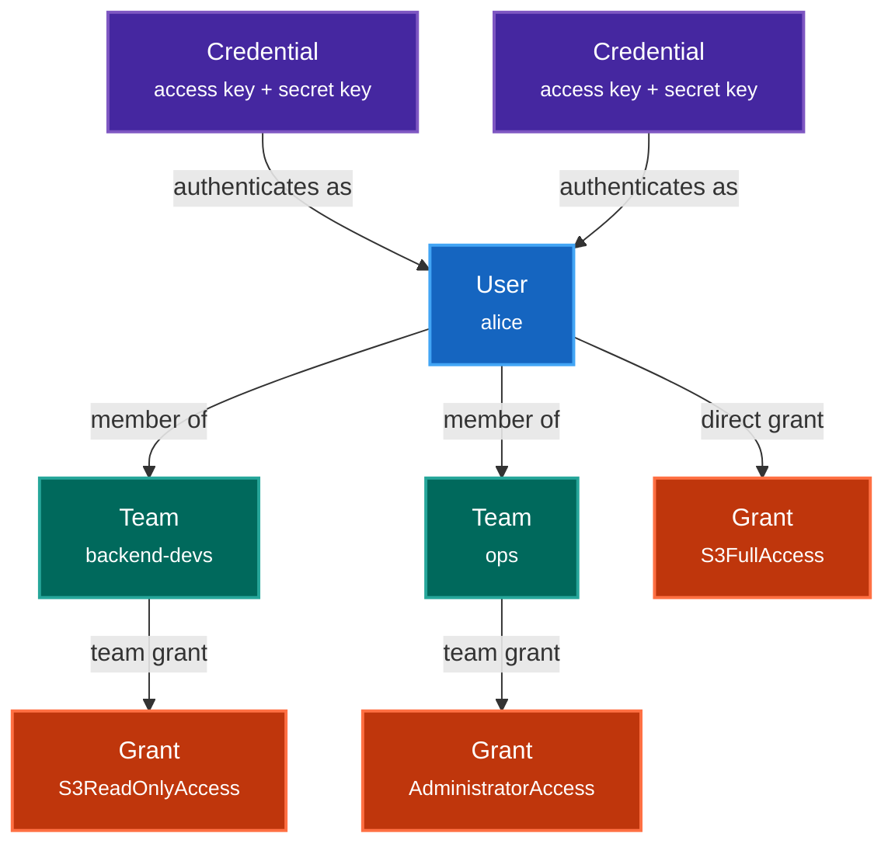
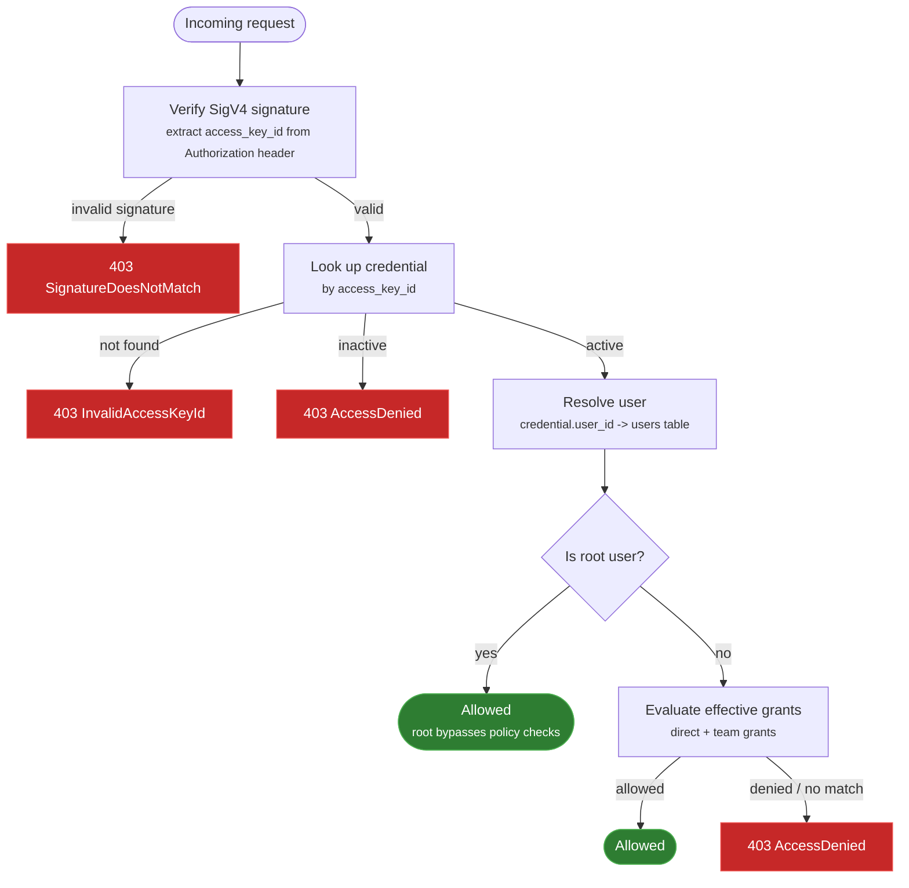
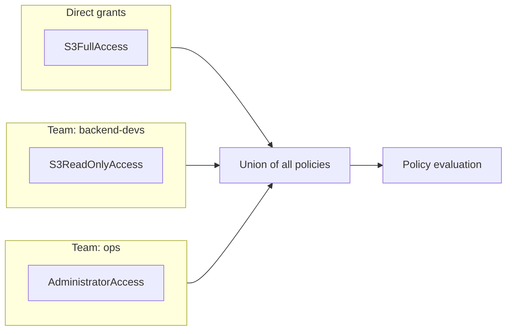

# Access Control

Arca implements a role-based access control (RBAC) system inspired by AWS IAM. This page explains the identity model, how authentication works, and how permissions are granted to users.

## Identity Model

The access control system is built around four entities: **users**, **credentials**, **teams**, and **grants**.



### Users

A **user** represents an identity in the system. Users have a unique `username` and an optional description. Users don't have passwords: authentication is handled through credentials.

A special **root** user is created automatically at database initialization. The root user has `AdministratorAccess` and cannot be modified or deleted.

### Credentials

A **credential** is an access key / secret key pair used to authenticate S3 and Admin API requests via AWS SigV4 signatures. Each credential belongs to exactly one user, but a user can have multiple credentials.

This design is intentional: a single user might need separate credentials for different contexts (CLI usage, an application, a CI/CD pipeline) without creating separate user identities for each.

Each credential also has:

- **`active`** flag: disabled credentials are rejected at authentication time without deleting them.
- **`admin`** flag: only admin credentials can access the `/admin/*` API endpoints and the web console.

### Teams

A **team** is a named group of users. Teams have no permissions of their own, they serve as a way to assign the same set of grants to multiple users at once. A user can belong to any number of teams.

### Grants

A **grant** is a named policy that defines what actions are allowed (or denied). Each grant contains a JSON **policy document** following the AWS IAM policy syntax:

```json
{
  "Version": "2012-10-17",
  "Statement": [
    {
      "Effect": "Allow",
      "Action": ["s3:GetObject", "s3:ListBucket"],
      "Resource": ["*"]
    }
  ]
}
```

Grants can be attached directly to users or to teams. Three built-in grants are created at database initialization:

| Grant | Description |
|-------|-------------|
| **AdministratorAccess** | Full access to all operations (S3 + Admin API) |
| **S3FullAccess** | Full access to all S3 operations |
| **S3ReadOnlyAccess** | Read-only access to S3 (GetObject, ListBucket, ListAllMyBuckets, GetBucketLocation, GetBucketEncryption) |

Built-in grants cannot be modified or deleted.

## Authentication Flow

Every S3 and Admin API request goes through this authentication flow:



The SigV4 signature is verified against the credential's secret key. If valid, the credential resolves to a user, and the user's effective permissions determine whether the request is allowed.

## Effective Grants

A user's **effective grants** are the union of:

1. **Direct grants** attached to the user via `user_grants`
2. **Team grants** from all teams the user belongs to, via `team_members` + `team_grants`



Policy evaluation follows the standard IAM logic:

1. Collect all `Statement` entries from all effective grants
2. If **any** statement explicitly **denies** the action, the request is denied
3. If **any** statement explicitly **allows** the action, the request is allowed
4. Otherwise, the request is denied (default deny)

!!! note
    The root user bypasses policy evaluation entirely. All requests from the root user are allowed regardless of grant configuration.

## Managing Access Control

Access control can be managed through three interfaces:

- **CLI** (`arca user`, `arca credential`) for offline administration
- **Admin API** (`/admin/users`, `/admin/teams`, `/admin/grants`) for programmatic access
- **Web Console** for visual management

### CLI

The CLI operates directly on the database and works even when the server is stopped.

```bash
# Create a user
arca user create alice --description "Backend developer"

# Create a credential for the user
arca credential add --user alice --description "Alice's CLI key" --admin

# List users and credentials
arca user list
arca credential list
```

!!! warning
    The `arca credential add --user` flag links the credential to a user. If omitted, it defaults to `root`.

### Admin API

The Admin API provides full CRUD for users, teams, grants, and their relationships. All endpoints require SigV4 authentication with an admin credential.

**Users**: `GET/POST /admin/users`, `GET/PUT/DELETE /admin/users/{id}`

**Teams**: `GET/POST /admin/teams`, `GET/PUT/DELETE /admin/teams/{id}`

**Grants**: `GET/POST /admin/grants`, `GET/PUT/DELETE /admin/grants/{id}`

**Credentials**: `GET/POST /admin/users/{id}/credentials`

**Memberships**: `PUT/DELETE /admin/teams/{team_id}/members/{user_id}`

**Grant attachments**: `PUT/DELETE /admin/users/{user_id}/grants/{grant_id}`, `PUT/DELETE /admin/teams/{team_id}/grants/{grant_id}`

**Effective grants**: `GET /admin/users/{user_id}/effective-grants`

### Web Console

The web console provides a visual interface for managing users, teams, and grants. Use the sidebar navigation to access each section. The console uses dual-list shuttle components for managing team memberships and grant attachments, allowing drag-and-drop or click-based assignment.

## Example Setup

Here's a typical setup for a team with different access levels:

```bash
# 1. Create users
arca user create alice --description "Backend developer"
arca user create bob --description "Data analyst"

# 2. Create credentials (admin for alice, regular for bob)
arca credential add --user alice --description "Alice CLI" --admin
arca credential add --user bob --description "Bob CLI"
```

Then, using the Admin API or web console:

1. Create a team called `data-team`
2. Add both `alice` and `bob` to `data-team`
3. Attach `S3ReadOnlyAccess` to `data-team` (both users can read)
4. Attach `S3FullAccess` directly to `alice` (alice can also write)

The result:

| User | Direct Grants | Team Grants (via data-team) | Effective Access |
|------|---------------|----------------------------|------------------|
| alice | S3FullAccess | S3ReadOnlyAccess | Full S3 read/write |
| bob | (none) | S3ReadOnlyAccess | S3 read only |

## Ownership

When a user creates a bucket or uploads an object, their `user_id` is recorded in the `owner` field. Ownership is informational at this stage, it does not affect access control (grants govern all permission checks).
