# Web Console

Arca includes a browser-based web console for managing buckets, objects, and access control. The console is a **separate application** that communicates with Arca exclusively via the S3 API and Admin API — it's just another API client.

## Overview

- **Technology**: single-file Alpine.js + Tailwind CSS application, served by nginx:alpine
- **Docker image**: `arca-console`, ~40 MB
- **Port**: 80 (mapped to 9080 on the host by default), 443 for TLS
- **Theme**: "The Vault" — dark glassmorphism design

The console is intentionally not embedded in the Arca binary. This keeps the server binary small (~8.6 MB), allows independent release cycles, and supports split deployment (Arca on a hardened VM, console on a separate host).

## Starting the Console

=== "HTTP"

    ```bash
    bin/console start -d --build
    ```

    This starts the console on [http://localhost:9080](http://localhost:9080).

=== "HTTPS"

    ```bash
    bin/console start -d --build --tls
    ```

    This starts the console on port **9443** with TLS, using certificates from the `certs/` directory. Enter the Arca HTTPS endpoint at the login screen.

!!! tip
    Drop the `-d` flag to run in the foreground and see container logs in real time. Press ++ctrl+c++ to stop.

The `ARCA_ENDPOINT` environment variable controls which Arca server the console connects to. In the default Docker Compose setup, it's set to `http://localhost:9000` so the browser (running on the host) can reach Arca directly. With `--tls`, the endpoint is not preset — enter it at the login screen.

## Login

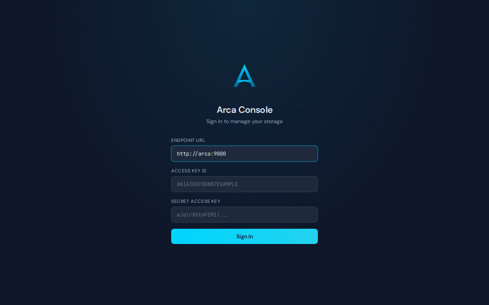

Enter the Arca endpoint URL and your credentials:

- **Endpoint**: the URL of your Arca server (e.g., `http://localhost:9000`)
- **Access Key**: your S3 access key ID
- **Secret Key**: your S3 secret access key

!!! tip
    When `ARCA_ENDPOINT` is set in the Docker environment, the endpoint field is pre-filled and hidden. You only need to enter your credentials.

The console determines your role after connecting. Admin credentials unlock the sidebar sections for **Dashboard**, **Users**, **Teams**, and **Grants**. Non-admin credentials only see the **Buckets** section.

## Dashboard

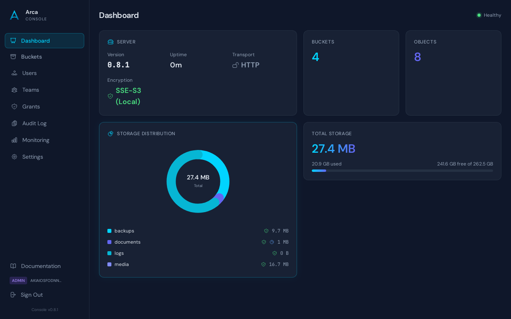

The dashboard is available to **admin credentials only**. It shows:

- **Server info**: version, uptime
- **Storage stats**: bucket count, object count, total storage size
- **Storage distribution**: SVG donut chart showing size per bucket
- **Encryption status**: whether server-side encryption is active (SSE-S3 with local key or Vault/OpenBAO KMS)
- **Topology**: a dedicated card showing the deployment topology. On a single node it shows that one node ("Single node", Writable); in a [cluster](ha.md) it shows the consistency mode, write-quorum status, and a live node list (online/offline, "this node", endpoints, last-seen, and config-mismatch flags)
- **Health indicator**: real-time server health status with auto-refresh

## Bucket Management

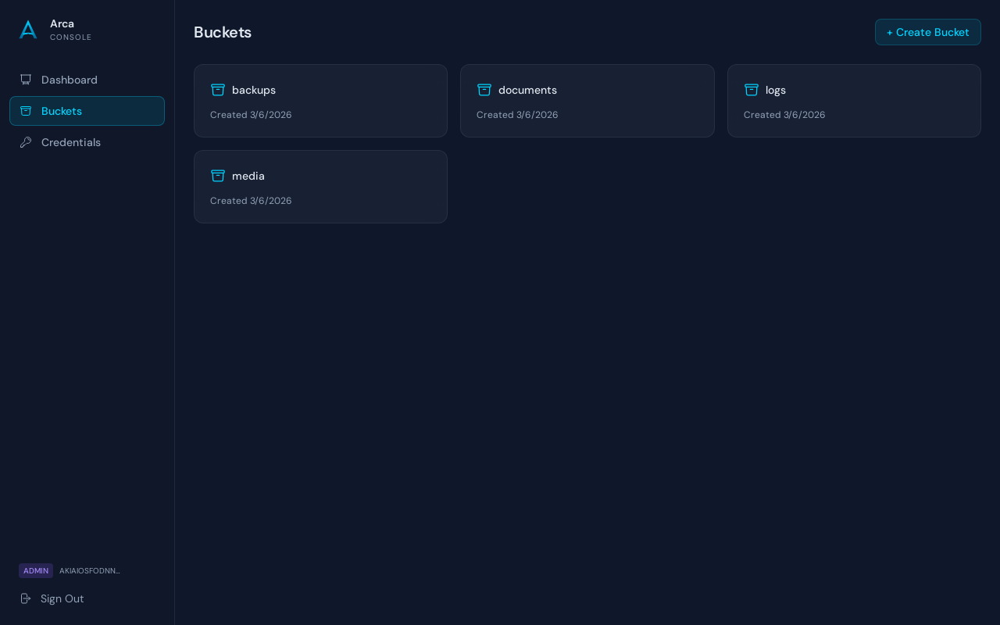

The Buckets view shows all buckets as cards. Each card carries the creation date on its own line plus capability badges for the features currently enabled on that bucket: green shield for encryption, blue clock (or amber pause) for versioning, orange padlock for Object Lock, cyan stack for compression. The badge row wraps so a bucket with every feature on still fits within the card.

- **Create** a new bucket (click the "+" button). The create dialog accepts an optional **Enable Object Lock** checkbox; ticking it sends `x-amz-bucket-object-lock-enabled: true` so Object Lock and versioning are turned on atomically with the bucket.
- **Delete** an empty bucket
- **Browse** a bucket by clicking its card
- **Open settings** via the gear icon on each card

## Object Browser

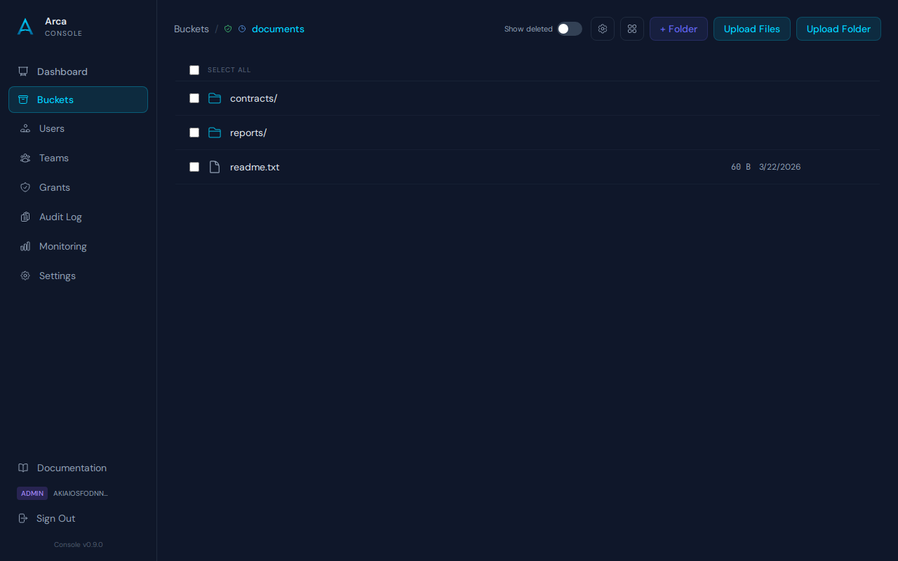

Inside a bucket, the object browser provides:

- **Breadcrumb navigation** — click any path segment to navigate up. When encryption is active, a green shield icon appears next to the bucket name.
- **Folder browsing** — click folders to navigate into them
- **Create folder** — creates an S3 directory marker (zero-byte object with trailing `/`)
- **Upload Files** — click to select files, or drag-and-drop onto the browser
- **Upload Folder** — upload an entire directory tree preserving its structure
- **Download** — download individual objects
- **Share** — generate a presigned URL for any object (see [Sharing Objects](#sharing-objects) below)
- **Delete** — delete objects or folders (with their contents)

### Object Detail

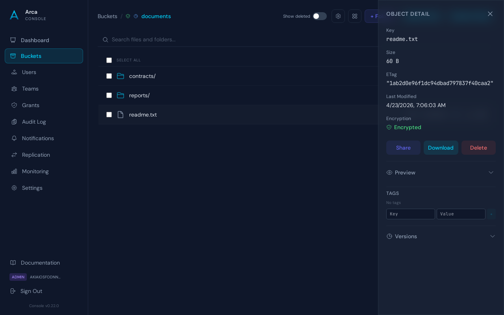

Click any object to open the detail panel, which shows:

- Key, size, content type
- ETag and last modified timestamp
- Encryption status (when encryption is active)
- **Share**, **Download**, and **Delete** actions

When a file is selected, its row in the list is highlighted with an accent ring so you always know where you are.

### Preview & Slideshow

The detail panel includes a collapsible **Preview** section that renders the file in place: images, videos, PDFs, HTML, Markdown and a wide range of text and source formats (with syntax highlighting). Click the expand icon next to *Preview* to open a fullscreen view of the same content.

The browser is keyboard-driven once a file is selected, turning the preview into a slideshow:

| Where | Keys | Action |
|---|---|---|
| File list, side panel open | <kbd>↑</kbd> / <kbd>↓</kbd> | Select previous / next file. The inline preview reloads automatically if it was open. |
| Fullscreen preview modal | <kbd>←</kbd> / <kbd>→</kbd> | Show previous / next file in the same folder. |
| Fullscreen preview modal | <kbd>Esc</kbd> | Close the modal. |

The fullscreen modal also shows a `position / total` counter in its header and semitransparent ‹ / › arrows on the left and right edges for mouse navigation. The two adjacent images (or videos, within the configured preview size limit) are prefetched in the background so navigating between photos feels instant.

Arrow keys keep their native behaviour inside the search box, the tag editor and any other editable field, so typing in those controls is unaffected.

### Sharing Objects

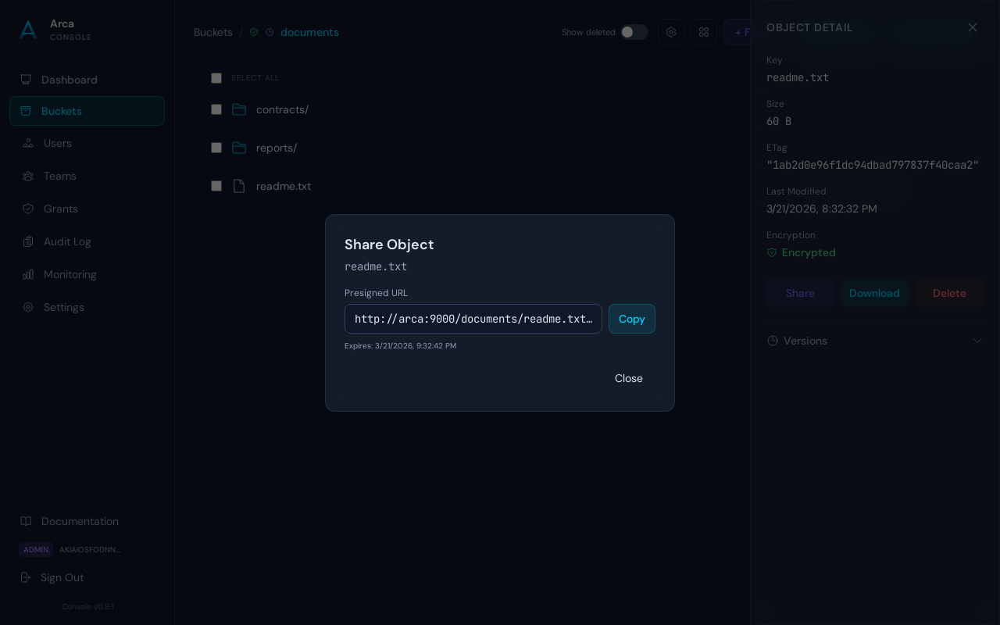

Click the **Share** button on any object (either inline or in the detail panel) to generate a presigned URL. The share modal lets you:

1. Choose an expiry duration: **1 hour**, **6 hours**, **1 day**, or **7 days**
2. Click **Generate Link** to create the presigned URL
3. **Copy** the URL to share with anyone, no credentials required

The generated URL provides time-limited, read-only access to the object. It expires automatically after the chosen duration.

!!! note
    Presigned URLs are generated via the Admin API (`/admin/presign`). This feature requires admin credentials.

### Batch Operations

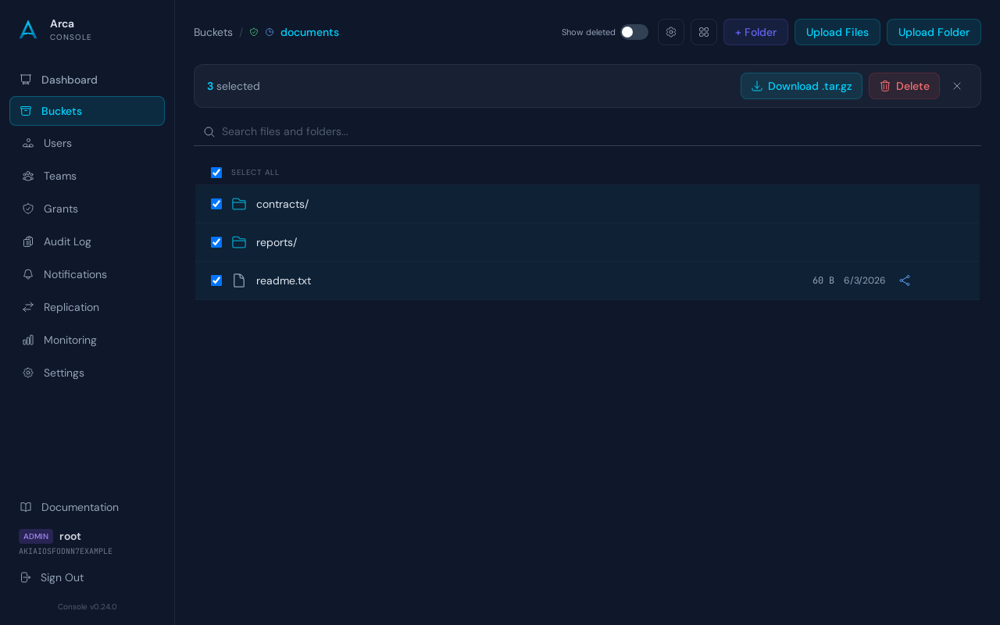

Select multiple objects and folders using the checkboxes next to each item. When items are selected, an action bar appears with:

- **Download .tar.gz** — streams a compressed archive of all selected objects
- **Delete** — batch-delete all selected items (with confirmation dialog)
- **Clear selection** — deselect all items

For folder selections, deletion is recursive: all objects under the selected folders are removed.

### Treemap Visualization

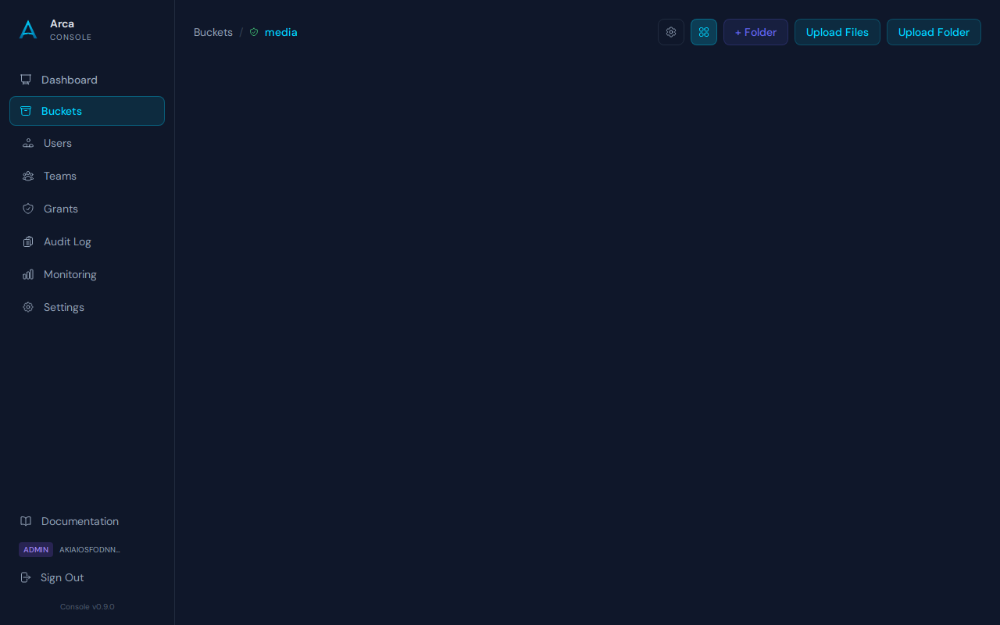

Toggle the treemap view to see a visual representation of object sizes within a bucket. Larger objects appear as larger rectangles, making it easy to spot storage-heavy files.

## Bucket Settings

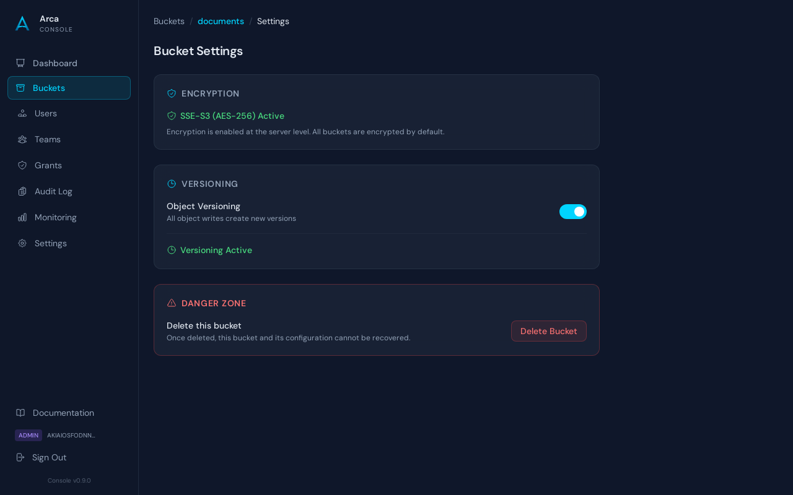

Click the gear icon in the bucket browser header (or on a bucket card) to open the settings view. Every card opens with a short plain-English intro paragraph describing what the setting does and whether it can be turned off afterwards. Cards whose effects are permanent (Versioning, Object Lock) show the intro in amber with a **"This action cannot be undone."** red-thread and, when enabled for the first time, prompt for typed bucket-name confirmation in a modal so the toggle cannot be flipped by accident on a production bucket.

### Encryption

- When **server-level encryption is enabled**, the card shows a read-only status indicator (e.g., "SSE-S3 (AES-256) Active" or "SSE-S3 (Vault) Active").
- When **server-level encryption is disabled** (per-bucket mode), you can toggle encryption on or off for individual buckets. New objects written after enabling encryption are encrypted; existing objects remain unchanged.

### Versioning


The versioning card lets you control object versioning for the bucket. The toggle cycles through three states:

| State | Description |
|-------|-------------|
| **Not versioned** | Default. Objects are overwritten in place, no history is kept. |
| **Enabled** (green) | All object writes create new versions. Deletes create delete markers instead of removing data. |
| **Suspended** (amber) | No new versions are created, but existing versions are preserved. New writes use a `null` version ID. |

!!! note
    Versioning cannot be disabled once it has been enabled, only suspended. This matches the S3 specification. Because the `Not versioned → Enabled` transition is irreversible, the console gates it behind a typed bucket-name confirmation modal; `Enabled ↔ Suspended` is reversible and flips directly.

### Object Lock (WORM)

The Object Lock card turns the bucket into a **Write-Once-Read-Many** store: objects can be protected by a retention period and/or a legal hold, during which deletion and overwrite are refused.

- **Enable at bucket creation** — tick the checkbox in the **Create Bucket** dialog. This is the canonical AWS S3 path.
- **Enable on an existing, empty bucket** — Arca relaxes the strict S3 rule: if a bucket still contains no objects, the settings card can turn Object Lock on after the fact. Versioning is enabled automatically. Non-empty buckets are still rejected (`InvalidBucketState`).
- **Default retention** — optionally pick `GOVERNANCE` or `COMPLIANCE` and a number of days. Every new object inherits this retention unless the client passes its own `x-amz-object-lock-*` headers.

Enabling Object Lock is irreversible. The card shows an amber warning and requires typed bucket-name confirmation in a modal before sending the request.

### Event Notifications

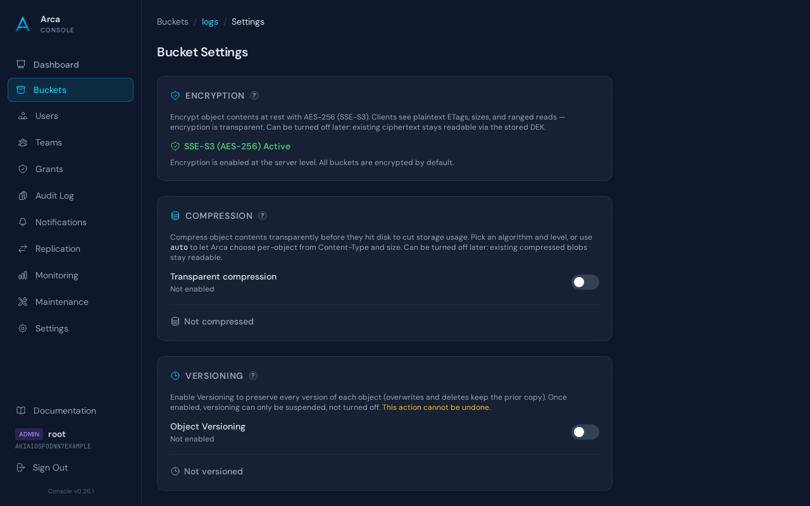

The Event Notifications card lets you configure where S3 events (object creates, deletes, etc.) are delivered. Each notification destination has:

- **Connector type** — which delivery backend to use. All 13 connectors are implemented and selectable: **Webhook** and **gRPC** (Functions); **Kafka**, **AMQP**, **Redis**, **NATS**, **MQTT** (Queue); **PostgreSQL**, **MySQL**, **MongoDB**, **Elasticsearch** (Database); **SMTP**, **Syslog** (Protocol).
- **Destination URL** — the endpoint address (format depends on the connector, e.g., `https://…/webhook`, `kafka-broker:9092`, `smtp://mail:25`)
- **Connector-specific properties** — such as Bearer token, Kafka topic, SMTP recipient, gRPC CA certificate (see [Notification Connectors](connectors.md) for the full catalog)
- **Event types** — which S3 events to deliver (e.g., `s3:ObjectCreated:*`, `s3:ObjectRemoved:Delete`)
- **Prefix/Suffix filters** — optional key filters to narrow which objects trigger events
- **Enabled/Disabled toggle** — temporarily suspend delivery without removing the configuration

Click **"+ Add Notification"** to open the notification modal:

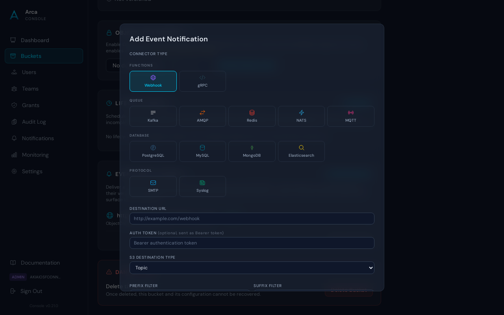

The modal opens with a connector type selector at the top, grouping every connector by category (Functions, Queue, Database, Protocol). Every tile is live — select any connector to reveal its specific form below the selector. Common S3 event type checkboxes and prefix/suffix filter inputs apply to every connector type.

Click an existing notification in the list to edit it in the same modal. Use the **Test connection** button at the bottom of the form to probe the destination before saving — the console calls the admin API `/admin/notifications/test-connector` endpoint, which runs the connector's own connectivity check (e.g., HTTP POST for webhook, Redis `PING`, gRPC unary probe, TCP connect for syslog/SMTP).

#### Example — Webhook connector form

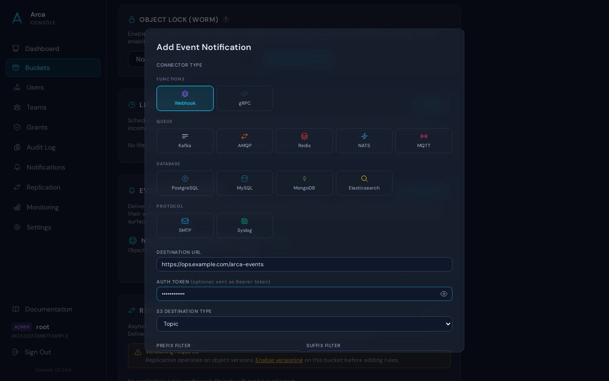

**Webhook** is the default (and most common) connector. The destination URL is any HTTP or HTTPS endpoint; the console POSTs the S3 event JSON to it. An optional **Bearer auth token** is sent in the `Authorization` header of every request so downstream systems can authenticate Arca's callbacks.

#### Example — SMTP connector form

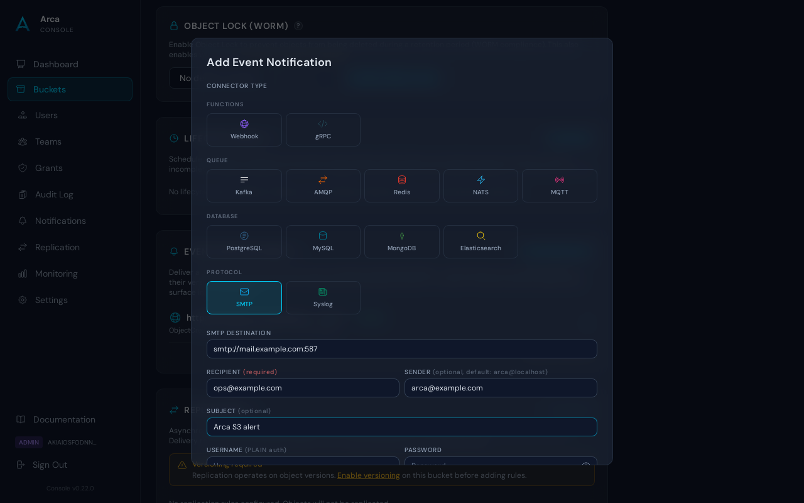

Selecting **SMTP** reveals the e-mail delivery fields. The destination URL is `smtp://host:port` (or `smtps://…`). `Recipient` is required; `Sender`, `Subject`, `Username`/`Password` (PLAIN auth), and the `STARTTLS` toggle are optional.

#### Example — gRPC connector form

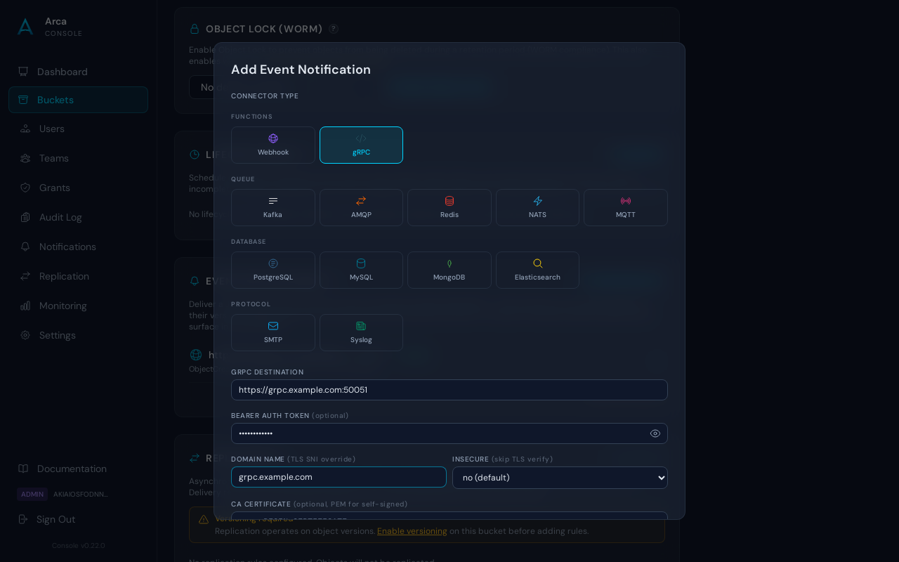

Selecting **gRPC** reveals the Notify-RPC form. The destination URL is `http://host:port` (h2c) or `https://host:port` (TLS). An optional **Bearer auth token** is forwarded as gRPC metadata, a **Domain name** override controls the TLS SNI, **Insecure** skips certificate verification for test servers, and a **CA certificate** textarea lets you trust a self-signed PEM CA.

### Replication

The Replication card configures asynchronous, per-rule cross-instance replication to any S3-compatible destination (another Arca, AWS S3, MinIO, …). Replication is an AWS Cross-Region Replication (CRR) style feature: **versioning must be enabled on the source bucket**. If it isn't, the card shows an amber "Versioning required" banner with an inline "Enable versioning" link that scrolls to the Versioning card.

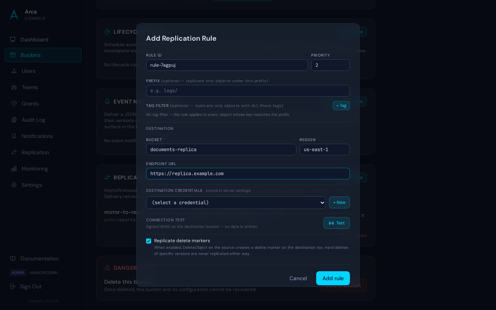

Each rule is a tuple of:

- **Rule ID** and **priority** — auto-generated for new rules; priority breaks ties when multiple rules match the same object.
- **Prefix filter** — replicate only objects whose key starts with the given prefix. Optional.
- **Tag filter** — replicate only objects that carry every specified tag (matches MinIO / AWS CRR tag-filter semantics). Optional.
- **Destination** — target bucket name, region, and endpoint URL. When the endpoint looks like another Arca instance, a subtle emerald "Loop prevention active" hint appears under the URL.
- **Destination credential** — a pointer into the global destination-credential table (see [Destination credentials](#destination-credentials) below). The dropdown lists every credential stored on the server; click **+ New** in the modal for an inline create flow if you don't want to leave the bucket settings page. For full lifecycle management (view, delete, or audit usage across buckets) go to the **Replication** page in the sidebar and click the **Credentials** button in the journal header.
- **Replicate delete markers** — toggles `DeleteMarkerReplication`. Enabled by default.

Click the **Test** button in the destination section to probe the endpoint: Arca runs a signed `HEAD` on the destination bucket using the selected credentials and reports the HTTP status (200/3xx = reachable; 404 = endpoint works but bucket missing; 403 = signature rejected; network error = unreachable). The response includes the destination's `Server` header, so if the target is another Arca the console confirms loop prevention applies.

Rule rows in the list display a `source ➜ destination` flow with a small accent arrow, chips for any tag-filter entries, and an inline Enabled/Disabled toggle. Disabled rules stop firing new journal entries but stay in the configuration so you can edit and re-enable them later.

### Danger Zone

- **Delete this bucket** — permanently removes the bucket. Requires typing the bucket name to confirm. The bucket must be empty.

## Object Versioning

When versioning is enabled on a bucket, the console provides several features for managing object versions, viewing deleted objects, and restoring data.

### Versioning Indicators

Versioned buckets are marked with visual indicators throughout the console:

- **Bucket list**: a blue clock icon with "Versioned" label (or amber with "Suspended")
- **Object browser breadcrumb**: a clock icon appears next to the bucket name
- **Dashboard legend**: versioning status is shown next to each bucket in the storage distribution chart

### Viewing Deleted Objects

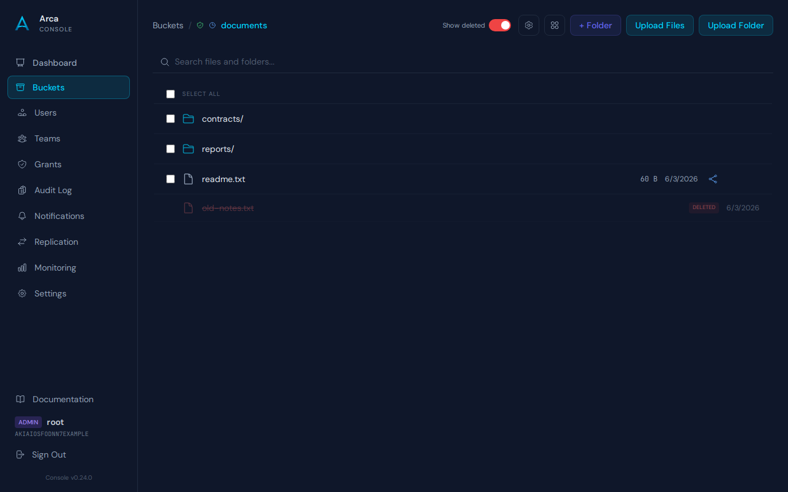

When browsing a versioned bucket, a **Show deleted** toggle appears in the toolbar. Enabling it reveals:

- **Deleted files** — shown with a strikethrough name, red "Deleted" badge, and the deletion date. Click a deleted file to open its detail panel and view its version history.
- **Deleted folders** — shown as faded folder icons with a strikethrough name and "Deleted" badge. These are directories where all contained objects have delete markers as their latest version.

### Version History

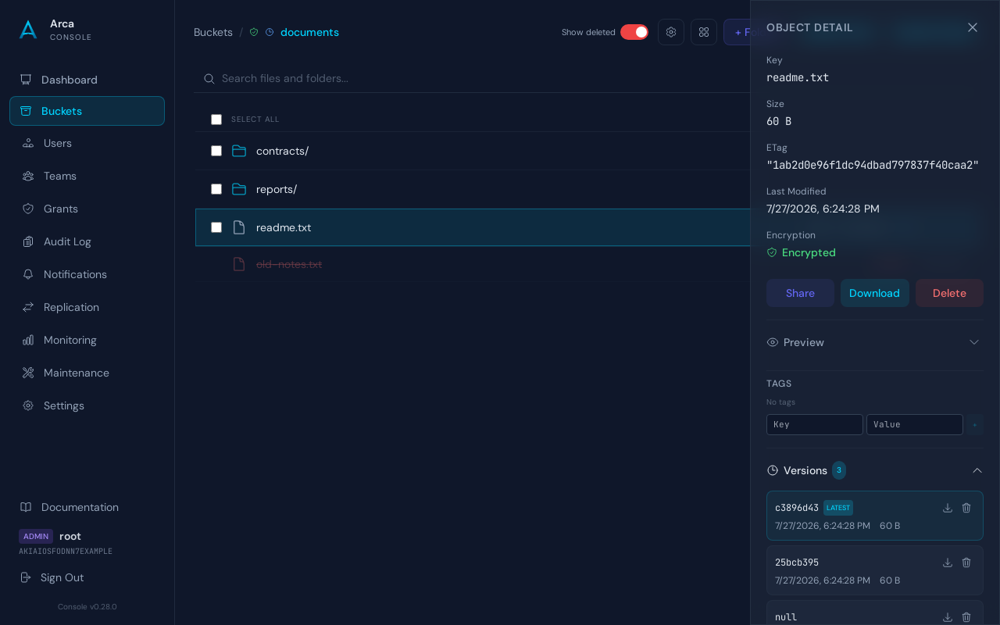

When viewing an object in a versioned bucket, the detail panel includes a collapsible **Versions** section. Click it to expand the version list, which shows:

- **Version ID** — truncated to 8 characters, hover for the full ID
- **Latest** badge (blue) — marks the current version
- **Delete Marker** badge (red) — marks versions that are deletion records, not actual data
- **Timestamp** and **size** for each version
- **Download** button — download a specific version (not available for delete markers)
- **Delete** button — permanently remove a specific version

### Deleting Versions

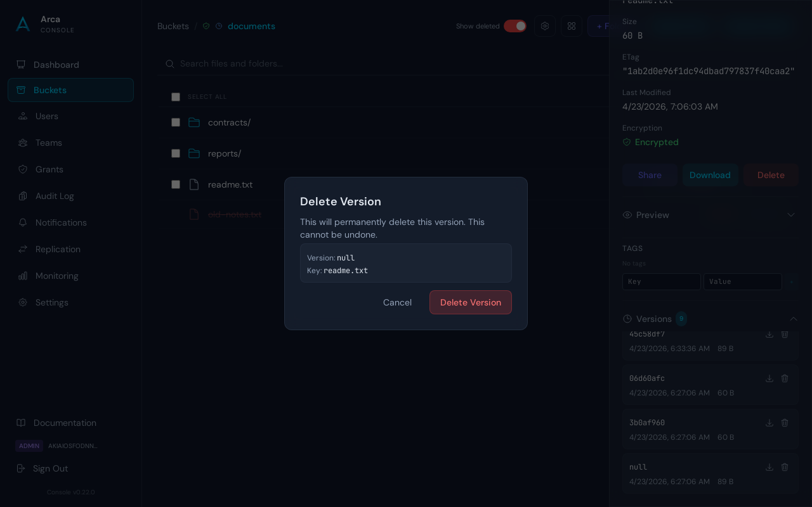

Click the delete button on any version to open a confirmation modal. The modal behavior varies based on the version type:

- **Regular version**: the modal title reads "Delete Version" and warns that the action is permanent and cannot be undone.
- **Delete marker**: the modal title reads "Remove Delete Marker" and explains that removing it will restore the object.

Both modals show the version ID and object key. A "Latest" badge appears if you are about to delete the current version.

!!! tip
    To **restore a deleted object**, toggle "Show deleted" on, click the deleted file, expand its version history, and remove the delete marker. The most recent non-deleted version becomes the current version.

## Credential Management

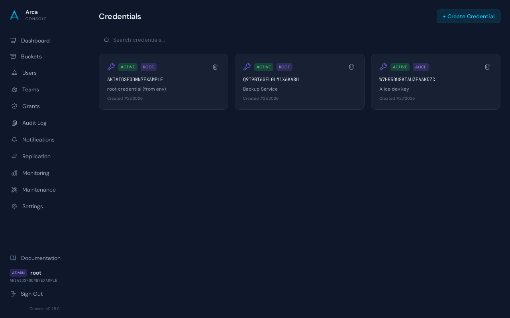

The Credentials view is available to **admin credentials only** (navigate to `#/credentials`). It shows all credentials across all users as cards, each displaying:

- **Active/Inactive** badge — green for active, red for inactive
- **Admin/User** badge — purple for admin privileges, gray for regular user
- **Access Key ID** — the full key ID
- **Description** — what the credential is used for
- **Creation date**

A warning banner appears when only one active credential remains, to prevent accidental lockout.

### Creating Credentials

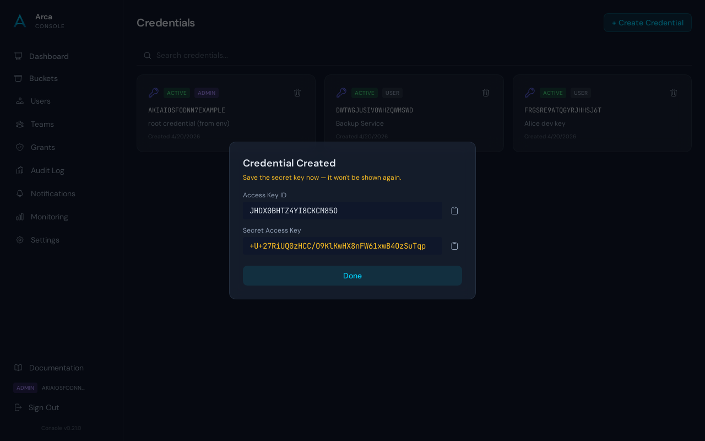

Click "+ Create Credential" to open the creation form:

1. Enter an optional **description** (e.g., "CI/CD Pipeline")
2. Check **Admin privileges** if the credential needs access to the Admin API and console management
3. Click **Create**

The secret key is displayed **only once** after creation. Copy it immediately, as it cannot be retrieved later.

## User Management

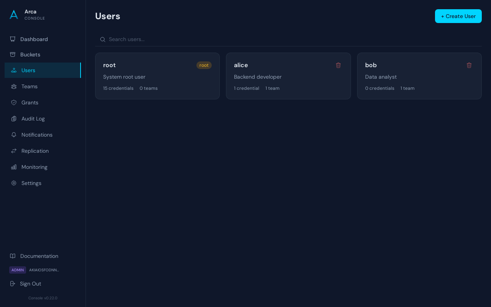

The Users view is available to **admin credentials only**. It displays all users as cards showing the username, description, credential/team/grant counts, and a "root" badge for the root user.

- **Create user** — click "+ Create User", enter a username and optional description
- **Delete user** — click the trash icon on any non-root user card (users with active credentials must have credentials removed first)
- **Open detail** — click a user card to open the user detail page

### User Detail

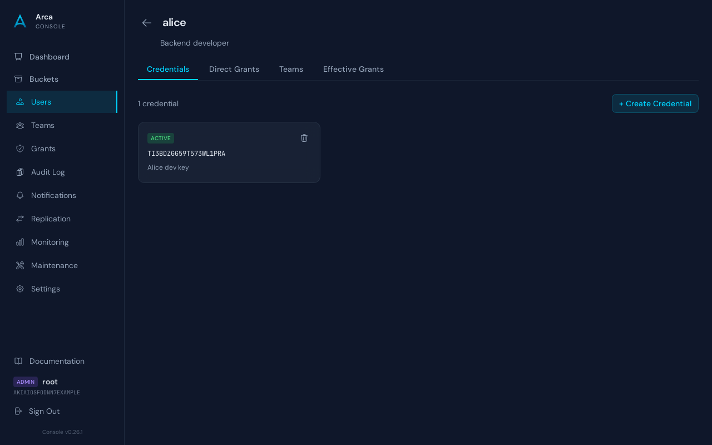

The user detail page shows the username as an inline-editable title and the description below it. Both save automatically on change. The root user's name and description are read-only.

Four tabs organize the user's related data:

#### Credentials Tab

The default tab shows all credentials belonging to this user. Each credential card displays:

- **Active/Inactive badge** — click to toggle. Deactivated credentials are rejected at authentication time. Arca prevents deactivating the last active credential or the last active admin credential.
- **Access Key ID**
- **Description** — inline-editable, saves on change

Click "+ Create Credential" to add a new credential. You can optionally provide custom access/secret keys or let Arca auto-generate them. The secret key is displayed only once.

#### Direct Grants Tab

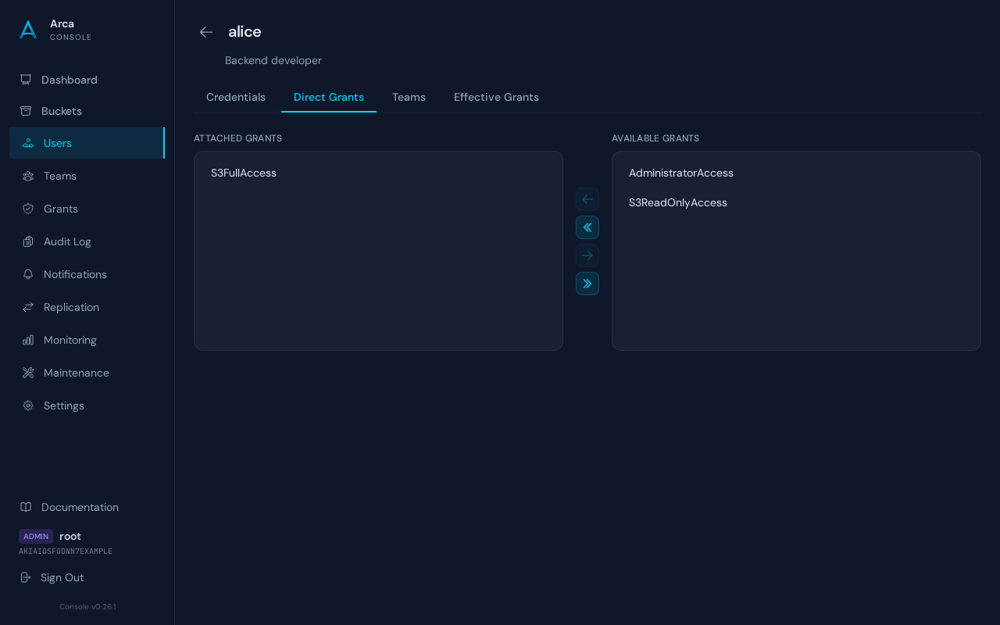

A dual-list shuttle component shows grants attached directly to this user (left) and available grants (right). Assign or remove grants by:

- Double-clicking an item to move it
- Selecting items and clicking the arrow buttons
- Dragging and dropping between lists
- Using the double-arrow buttons to move all items

#### Teams Tab

Same shuttle component for managing team membership. Add the user to teams or remove them.

#### Effective Grants Tab

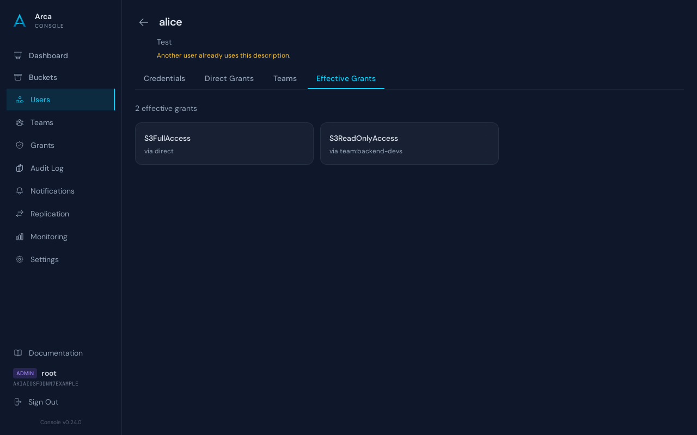

A read-only view showing all grants that apply to this user, combining direct grants and grants inherited through team membership. Each grant card shows the grant name and its source (direct or the team name it comes from).

## Team Management

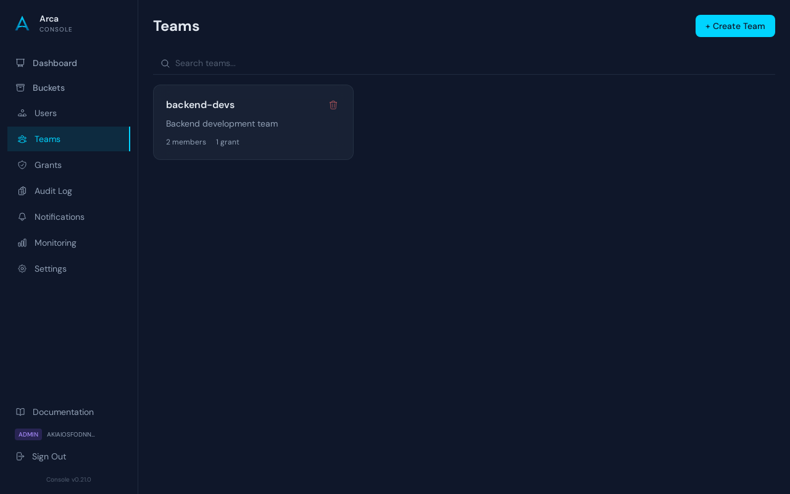

The Teams view is available to **admin credentials only**. It displays all teams as cards showing the team name and description.

- **Create team** — click "+ Create Team", enter a name and optional description
- **Delete team** — click the trash icon on any team card
- **Open detail** — click a team card to open the team detail page

### Team Detail

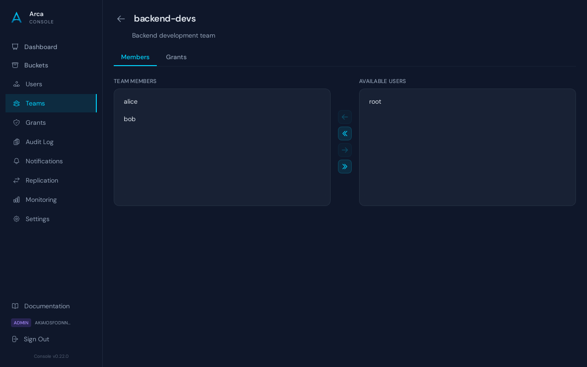

The team detail page shows the team name as an inline-editable title and the description below it. Both save automatically on change.

Two tabs organize the team's related data:

#### Members Tab

A dual-list shuttle component showing current team members (left) and available users (right). Manage membership using the same controls as the grants shuttle (double-click, arrows, drag-and-drop).

#### Grants Tab

A dual-list shuttle for managing grants attached to this team. Any grant attached here is inherited by all team members.

## Grant Management

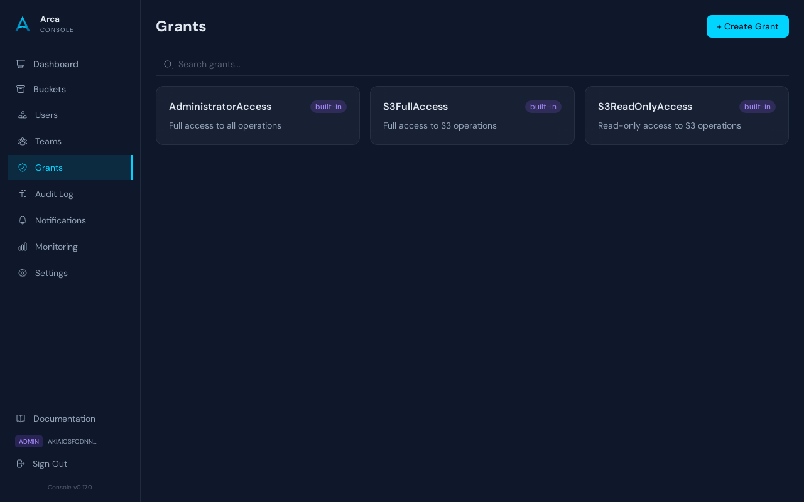

The Grants view is available to **admin credentials only**. It displays all grants as cards showing the grant name, description, and a "built-in" badge for system grants.

Three built-in grants are created automatically and cannot be modified or deleted:

| Grant | Description |
|-------|-------------|
| **AdministratorAccess** | Full access to all operations |
| **S3FullAccess** | Full access to all S3 operations |
| **S3ReadOnlyAccess** | Read-only S3 access |

- **Create grant** — click "+ Create Grant", enter a name, description, and policy document (JSON). Template buttons provide common starting policies.
- **Delete grant** — click the trash icon on any non-built-in grant card
- **Open detail** — click a grant card to open the grant detail page

### Grant Detail

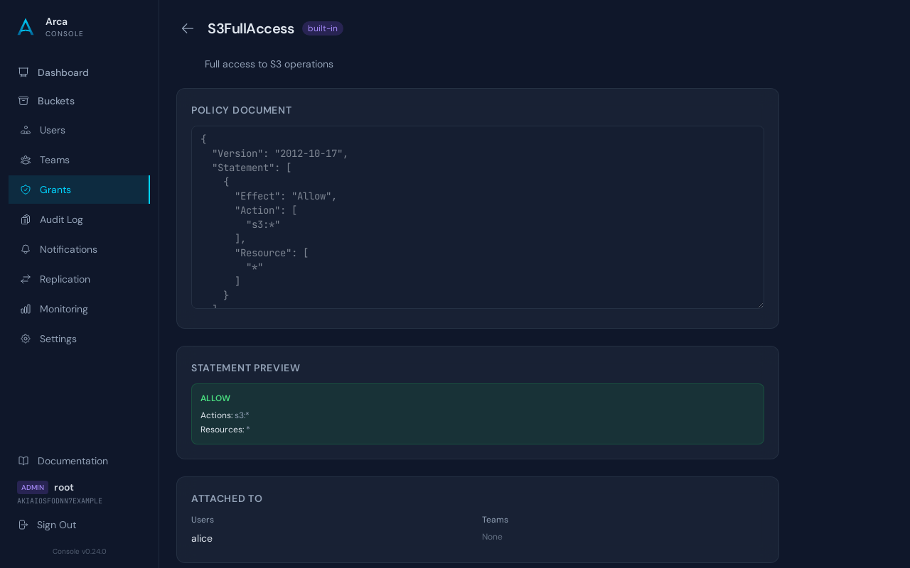

The grant detail page shows the grant name as an inline-editable title and the description below it. Both save automatically on change. Built-in grants display read-only name and description.

The detail page has three sections:

#### Policy Document

A JSON text editor for the IAM-style policy document. Template buttons insert common policies (Full Access, S3 Full, S3 Read-Only), and a Format button validates and pretty-prints the JSON. Click "Save Policy" to persist changes.

Built-in grants show the policy document as read-only.

#### Statement Preview

A visual breakdown of the policy statements, color-coded by effect: green for Allow, red for Deny. Each statement shows its actions and resources.

#### Attached To

Shows which users and teams have this grant attached. Click a user or team name to navigate to their detail page.

## Per-Node Views in a Cluster

The Audit Log, Monitoring, Notification Events, and Replication Journal views show **node-local** data: each cluster node records only what it served. Behind a load balancer, the answer would come from whichever node the LB picked — so on clustered deployments these four views gain a **Node** selector in their toolbar (it does not appear on single-node deployments):

- **This node (via LB)** — the default: data from whichever node serves the request. A monospace badge next to the selector (`via 1a2b3c4d`) always names the node that actually answered.
- **A specific node** — the query is proxied server-side to that node over the secure inter-node channel; the browser never needs to reach cluster nodes directly. Only eligible (alive, authenticated, config-aligned) nodes are listed; if the target goes down, the view shows a clear error instead of stale rows.
- **All nodes** — the merged view: rows from every eligible node, newest first, each row labeled with a color-coded badge of its source node (the same color identifies the node everywhere, charts included). A chip reports how many nodes were merged, and a red chip appears if some node failed to answer. In Monitoring, each chart draws **one series per node** with a legend.

Pagination of the merged view is approximate by design: each node is asked for the same page window and the newest rows across nodes are kept, so deep pages may interleave imperfectly.

!!! note
    Destructive or mutating actions (**Clear All**, journal **Retry**) are disabled while a node is selected — they operate on the node serving the request, not the one being viewed. Switch back to "This node (via LB)" to use them.

## Audit Log

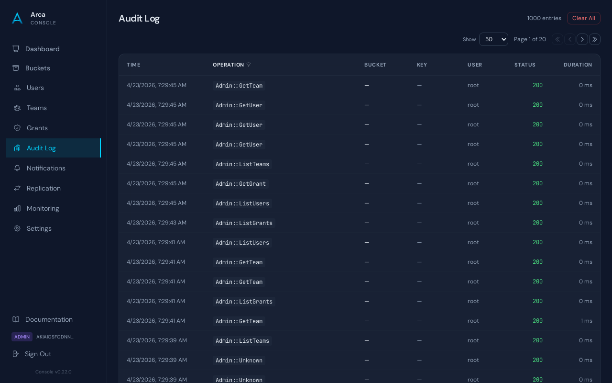

The Audit Log view is available to **admin credentials only**. It shows a chronological log of all S3 and admin operations performed on the server, with details about who performed them, when, and what the result was.

The table shows: timestamp, operation name, bucket, key, user, HTTP status (color-coded: green for 2xx, amber for 4xx, red for 5xx), and request duration.

### Filtering

Filters are built into the column headers. Click a filterable column header (indicated by a funnel icon on hover) to activate its filter. Active filters show a cyan badge with the filter value and an X to clear. All filters persist across navigation.

- **Time** — click to open a date range popover with From/To datetime pickers (server-side filtered)
- **Operation** — click to open a tag-based filter popover with Include/Exclude mode toggle and autocomplete search
- **Bucket** — click to open a dropdown with all distinct bucket names as checkboxes with occurrence counts
- **Key** — click to reveal an inline text input for substring search
- **User** — click to open a dropdown with all distinct user IDs as checkboxes with counts
- **Status** — click to open a dropdown with all distinct HTTP status codes as checkboxes, color-coded (green/amber/red)

### Detail Panel

Click any row to open a slide-in detail panel on the right showing all fields: operation, timestamp, HTTP method, status, duration, bucket, key, version ID, error code, user ID, access key, source IP, user agent, bytes received/sent, and request ID.

!!! note
    Read-only monitoring operations (Health, Metrics, ListAudit, etc.) are not logged to avoid feedback loops.

## Monitoring

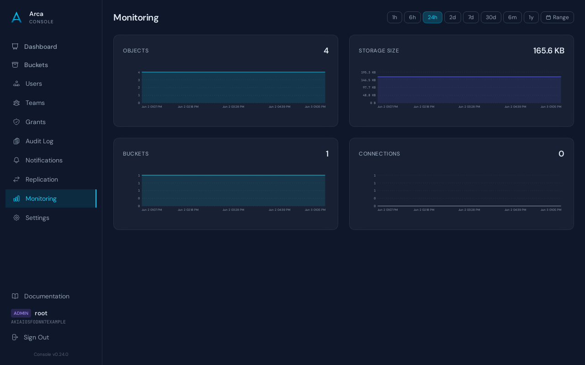

The Monitoring view is available to **admin credentials only**. It displays historical metrics as SVG sparkline charts with labeled axes:

- **Objects** — total object count over time
- **Storage Size** — total storage bytes over time
- **Buckets** — bucket count over time
- **Connections** — active HTTP connections at each snapshot

A time range selector at the top right offers: **1h**, **6h**, **24h**, **7d**, **30d**. Each chart shows the current value in the header and the trend line with labeled Y-axis ticks and X-axis time labels.

Metrics snapshots are recorded periodically (default: every 60 seconds) and stored in the database. The retention period is configurable in the Settings page.

## Notification Events

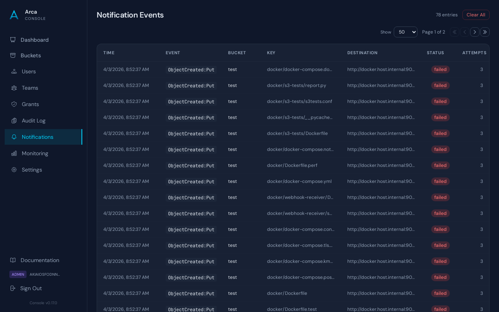

The Notification Events view is available to **admin credentials only**. It shows a chronological log of all notification delivery attempts, with details about the destination, event type, delivery status, and error messages.

The table shows: timestamp, event name, bucket, key, destination URL, and delivery status (color-coded: green for delivered, amber for pending, red for failed).

### Filtering

Filters are built into the column headers, following the same pattern as the Audit Log:

- **Time** — date range popover with From/To datetime pickers
- **Event** — dropdown with all distinct event names as checkboxes with occurrence counts
- **Bucket** — dropdown with all distinct bucket names as checkboxes
- **Key** — inline text input for substring search
- **Destination** — inline text input for substring search
- **Status** — dropdown with delivered/pending/failed checkboxes

### Detail Panel

Click any row to open a slide-in detail panel on the right showing all fields: event name, timestamp, bucket, key, destination URL, configuration ID, delivery status, delivery attempts, last error, and the full event payload (JSON).

### Clear Events

The **Clear All** button opens a confirmation modal requiring you to type "CLEAR EVENTS" to delete all notification event records. This is useful for cleaning up test data or resetting the event log.

## Replication

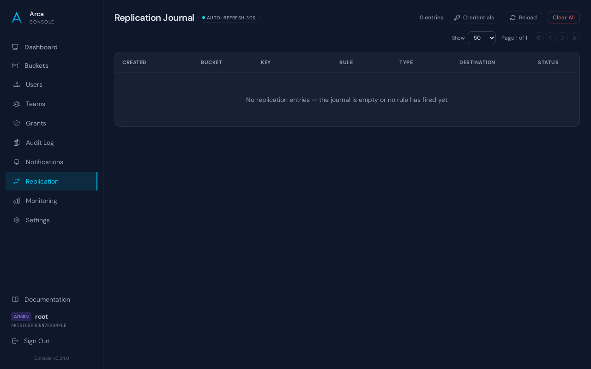

The Replication view is available to **admin credentials only** (navigate to `#/replication`). The page shows the **Replication Journal** as its main content. A compact **Credentials** button in the journal header opens a modal for managing destination credentials, keeping the journal above the fold even when many credentials are stored.

### Destination credentials

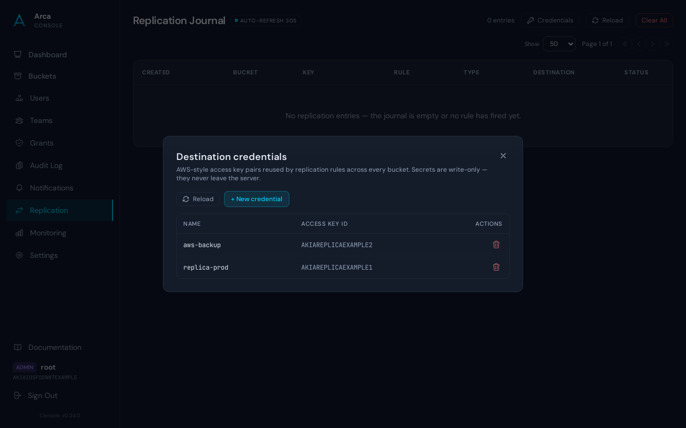

Destination credentials are AWS-style access key pairs reused by replication rules across every bucket. They live in the server's `server_config` table (key prefix `replication.credentials.<name>`); the access key id is displayed in the console, the secret is never returned.

Click the **Credentials** button in the journal header to open the management modal. The table lists each stored credential (name + access key id), with a **+ New credential** button to create one and a trash icon per row to delete. Creating a credential opens a modal asking for a short name (letters, digits, dot, dash, underscore), the access key id, and the secret. The name is the reference that replication rules point at — pick something short and descriptive (e.g., `replica-prod`, `aws-backup`).

**Deleting a credential is a cascading operation.** Before confirming, the modal fetches every replication rule (across every bucket) that references the credential and lists them in the dialog with a "will be disabled" / "already disabled" chip per rule:

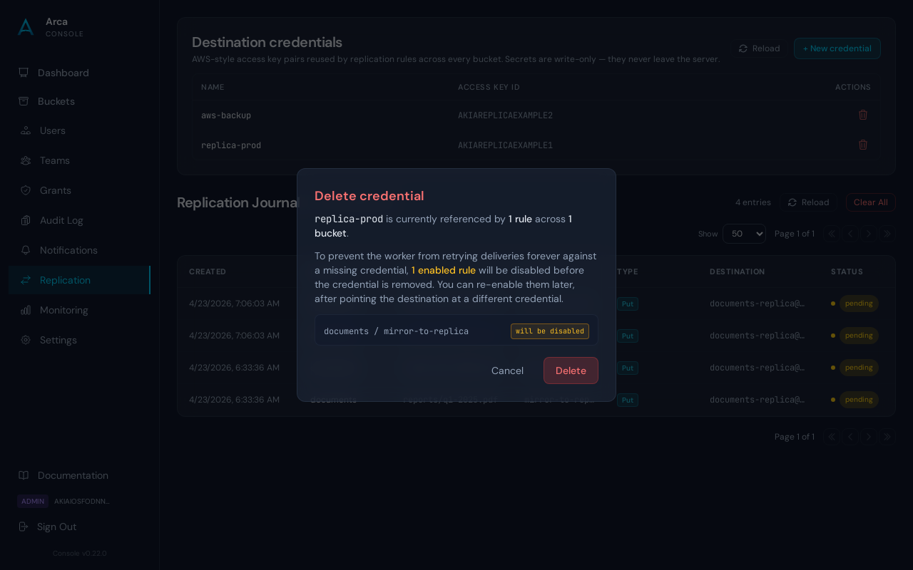

On confirm, Arca:

1. Disables every referenced rule (sets `status = Disabled` on each rule in the bucket's replication configuration).
2. Removes the credential from `server_config`.

This prevents the replication worker from looping forever retrying deliveries against a vanished credential reference. The rules stay in place with their other settings (prefix, tags, destination bucket, region) so you can edit them later, point them at a different credential, and re-enable.

### Replication Journal

The Journal is a chronological log of every replication delivery attempt — pending, in-flight, completed, and failed. Each row shows timestamp, source bucket + key, rule ID, event type (PUT / delete marker / tag), destination, and delivery status.

Filters are built into the column headers:

- **Created** — date range popover with From/To datetime pickers
- **Bucket** — checkbox dropdown with all distinct source buckets
- **Key** — inline substring search
- **Rule** — inline substring search for rule ID
- **Type** — checkbox dropdown for event type (PUT / delete marker / tag)
- **Destination** — inline substring search across endpoint and destination bucket
- **Status** — checkbox dropdown (pending / in_flight / completed / failed), with a subtle pulse dot on `in_flight` rows

Click any row to open a slide-in detail panel showing the full entry: flow summary (bucket ➜ destination), key, version id, rule id, destination endpoint and bucket, attempt count, next retry time, created/updated timestamps, last error message (if any), and the entry's internal id. Failed rows also show a **Retry delivery now** button that flips the entry back to `pending` so the worker picks it up on the next tick.

Auto-refresh is on by default (30-second cycle). The **Clear All** button opens a confirmation modal requiring you to type "CLEAR JOURNAL" to delete every entry regardless of status — useful for cleaning up test data or after a destination has been permanently retired.

## Settings

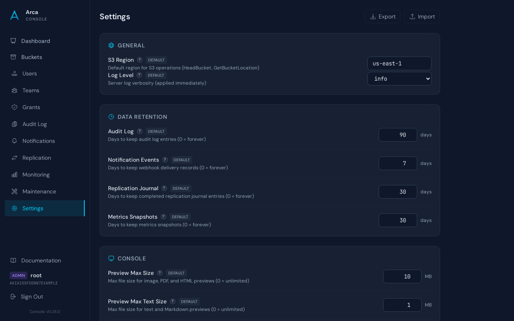

The Settings view is available to **admin credentials only**. It manages instance-wide configuration with a TOML > database > default precedence chain:

- Settings defined in the TOML configuration file are **locked** (shown with a lock icon and "Config file" badge, read-only in the console)
- Settings not in the TOML file can be edited from the console (stored in the database, shown with "Custom" or "Default" badge)
- Values save automatically on change

### General

- **S3 Region** — default region for HeadBucket, GetBucketLocation, and presigned URL generation. Can also be set per-bucket.

### Data Retention

- **Audit Log Retention** — days to keep audit log entries (0 = keep forever, default: 90 days)
- **Notification Event Retention** — days to keep notification event records (0 = keep forever, default: 7 days)
- **Metrics Retention** — days to keep metrics snapshots (0 = keep forever, default: 30 days)

## Custom Deployment

### Environment Variables

| Variable | Default | Description |
|----------|---------|-------------|
| `ARCA_ENDPOINT` | *(none)* | Arca server URL. When set, pre-fills and hides the endpoint field on the login screen. |

### Separate Network

The console can run on a different host or network from Arca. The browser (not the console container) makes API requests to Arca, so the **browser** must be able to reach the Arca endpoint URL.

```yaml
services:
  console:
    image: arca-console
    ports:
      - "9080:80"
    environment:
      - ARCA_ENDPOINT=https://s3.example.com
```

### Reverse Proxy

When placing the console behind a reverse proxy:

```nginx
server {
    listen 443 ssl;
    server_name console.example.com;

    location / {
        proxy_pass http://console:80;
        proxy_set_header Host $host;
    }
}
```

Since the console is a static single-page application, no special proxy configuration is needed — all API calls go directly from the browser to the Arca endpoint.
