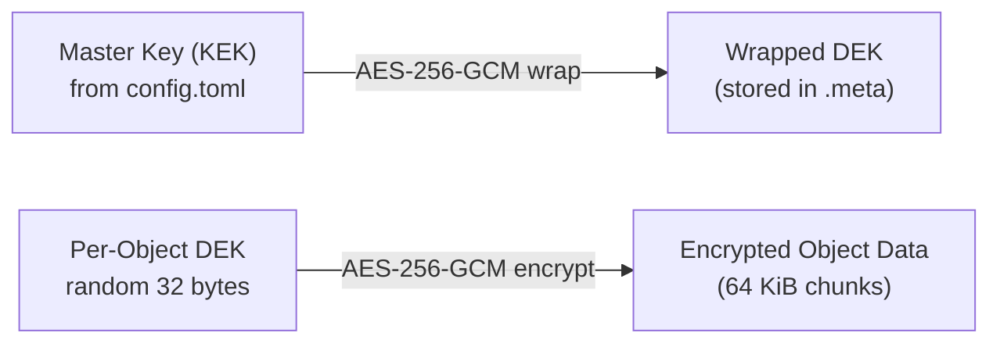

# Encryption

Arca supports server-side encryption at rest (SSE-S3) using AES-256-GCM. When enabled, objects are transparently encrypted before writing to disk and decrypted on read. Encryption uses an envelope scheme: each object gets a random data encryption key (DEK) that is wrapped by the master key, or key encryption key (KEK), from the server configuration.

## Quick Start

### 1. Generate a master key

```bash
bin/arca start -d --build    # ensure the image is built
docker compose -f docker/docker-compose.yml run --rm arca arca encryption generate-key
```

This outputs a base64-encoded 256-bit key. Save it securely.

### 2. Configure encryption

Add the `[encryption]` section to your `config.toml`:

```toml
[encryption]
enabled = true
master_key = "K+GgqdCNLvpsInhk8NWVJtXbfXt78A1zUc7QO343SJA="
```

### 3. Start the server

```bash
bin/arca start -d --build -c path/to/your-config.toml
```

The `-c` (`--config`) flag mounts the specified file as the server config inside the container. Without it, the server uses the default `config/default.toml`.

Check the logs to confirm encryption is active:

```
INFO arca: Server-side encryption enabled (AES-256-GCM) key_id="6602a944"
```

### 4. Verify

```bash
aws s3 cp myfile.txt s3://my-bucket/ --endpoint-url http://localhost:9000

# Check the response header
aws s3api head-object --bucket my-bucket --key myfile.txt --endpoint-url http://localhost:9000
```

The `ServerSideEncryption` field in the response will show `AES256`.

## How It Works

### Envelope Encryption

Each object is encrypted with a unique, randomly generated 256-bit DEK (data encryption key). The DEK is then wrapped (encrypted) using the master key encryption key (KEK) from the config file and stored alongside the object in the sidecar `.meta` file. The master key never touches the object data directly.



### Chunk-Based Streaming

Objects are encrypted in fixed-size 64 KiB chunks. Each chunk is independently encrypted and authenticated with its own GCM tag. This enables:

- **Streaming**: no need to buffer the entire object in memory
- **Byte range reads**: only the chunks overlapping the requested range are decrypted
- **Integrity**: corruption in one chunk is detected without reading the entire file

### ETag Preservation

The ETag (MD5) is computed on the **plaintext** data, not the ciphertext. This ensures S3 clients that compare ETags continue to work correctly.

## KMS Integration (Vault/OpenBAO)

Instead of storing the master key in the config file, Arca can fetch it from HashiCorp Vault or OpenBAO at startup. The key is cached in memory — Vault is only needed at startup, not during object operations.

### Setup

1. Store a base64-encoded 256-bit key in Vault KV v2:

```bash
# Generate a key
KEY=$(head -c 32 /dev/urandom | base64)

# Write to Vault
vault kv put -mount=secret arca/master-key key="$KEY"
```

2. Configure Arca to use Vault:

```toml
[encryption]
enabled = true

[encryption.kms]
endpoint = "http://vault:8200"
auth_method = "token"          # or "approle"
token = "s.my-vault-token"
# secret_path = "secret/arca/master-key"  # default
# secret_field = "key"                     # default
```

For AppRole authentication:

```toml
[encryption.kms]
endpoint = "http://vault:8200"
auth_method = "approle"
role_id = "abc-123"
secret_id = "def-456"
```

3. Start the server — the logs will confirm KMS key loading:

```
INFO arca: Server-side encryption enabled (AES-256-GCM) key_id="a1b2c3d4" provider="vault"
```

### Docker (Development)

Use the `--kms` flag to start with a pre-configured OpenBAO instance:

```bash
bin/arca start -d --build --dev --kms
```

This starts an OpenBAO dev server, generates a random master key, stores it in KV v2, and configures Arca to fetch it.

### KMS Configuration Reference

| Field | Type | Required | Description |
|-------|------|----------|-------------|
| `endpoint` | string | Yes | Vault/OpenBAO endpoint URL (e.g. `http://vault:8200`). |
| `auth_method` | string | Yes | `"token"` or `"approle"`. |
| `token` | string | When `token` | Vault token for authentication. |
| `role_id` | string | When `approle` | AppRole role ID. |
| `secret_id` | string | When `approle` | AppRole secret ID. |
| `secret_path` | string | No | KV v2 secret path. Default: `secret/arca/master-key`. Auto-normalized (no need to include `/data/`). |
| `secret_field` | string | No | Field name containing the base64 key. Default: `key`. |
| `tls_skip_verify` | bool | No | Skip TLS certificate verification. Default: `false`. Development only. |
| `ca_file` | string | No | CA certificate file for Vault TLS verification. |

!!! note
    `master_key` and `[encryption.kms]` are mutually exclusive — use one or the other.

## Configuration Reference

```toml
[encryption]
enabled = true                 # Enable server-side encryption (default: false)
master_key = "base64..."       # 256-bit master key (required when enabled, unless using KMS)
# previous_master_key = "..."  # Previous key for rotation (optional)

# Alternative: fetch master key from Vault/OpenBAO at startup
# [encryption.kms]
# endpoint = "http://vault:8200"
# auth_method = "token"
# token = "s.my-vault-token"
```

| Field | Type | Required | Description |
|-------|------|----------|-------------|
| `enabled` | bool | No | Enable encryption for new objects. Default `false`. |
| `master_key` | string | When no KMS | Base64-encoded 256-bit key. Generate with `arca encryption generate-key`. Mutually exclusive with `[encryption.kms]`. |
| `previous_master_key` | string | No | Previous master key, used for reading objects encrypted with an older key during key rotation. |

## Per-Bucket Encryption

In addition to the global `[encryption]` config, encryption can be configured per-bucket using standard S3 APIs:

```bash
# Set bucket encryption
aws s3api put-bucket-encryption \
  --bucket my-bucket \
  --server-side-encryption-configuration '{"Rules":[{"ApplyServerSideEncryptionByDefault":{"SSEAlgorithm":"AES256"}}]}' \
  --endpoint-url http://localhost:9000

# Check bucket encryption
aws s3api get-bucket-encryption --bucket my-bucket --endpoint-url http://localhost:9000

# Remove per-bucket config (falls back to global default)
aws s3api delete-bucket-encryption --bucket my-bucket --endpoint-url http://localhost:9000
```

## Mixed Mode

Encrypted and unencrypted objects coexist transparently:

- **Enabling encryption**: add `[encryption]` to config and restart. New objects are encrypted; existing objects remain unencrypted but readable.
- **Disabling encryption**: set `enabled = false`. New objects are stored unencrypted. Existing encrypted objects remain readable as long as `master_key` is in the config.
- **Detection**: the sidecar `.meta` file records whether an object is encrypted. No magic bytes or guessing required.

## CLI Commands

### Generate a master key

```bash
arca encryption generate-key
```

Outputs a random 256-bit key encoded as base64. Suitable for the `master_key` config field.

## Recovery and Integrity

### `arca recover`

The recovery tool reads sidecar `.meta` files to rebuild the database. Encrypted objects are imported with their encryption metadata intact. Checksum verification is skipped for encrypted blobs (the on-disk ciphertext MD5 differs from the plaintext ETag stored in the sidecar).

### `arca fsck`

The filesystem check tool skips checksum verification for encrypted objects when using `--verify-checksums`, since the on-disk data is ciphertext.

## Testing

Run the encryption integration tests:

```bash
bin/test encryption             # local key encryption (16 tests)
bin/test per-bucket-encryption  # per-bucket encryption (8 tests)
bin/test kms                    # Vault/OpenBAO KMS (10 tests)
```

The local encryption tests cover:

- Put/get roundtrip with plaintext verification
- ETag correctness (plaintext MD5)
- SSE response headers on put/get/head/copy
- Empty and large object encryption
- Byte range reads (including cross-chunk boundary)
- Multipart upload with encrypted final blob
- PutBucketEncryption / GetBucketEncryption / DeleteBucketEncryption
- Object overwrite and deletion

The KMS tests verify the same encryption behavior with a master key fetched from OpenBAO, plus admin API KMS provider reporting.

## Security Notes

- When using a local master key, the key is stored in the config file. Protect this file with filesystem permissions (e.g., `chmod 600`).
- For production deployments, use [KMS integration](#kms-integration-vaultopenbao) to store the master key in HashiCorp Vault or OpenBAO.
- AES-256-GCM provides both confidentiality and integrity. Each encrypted chunk includes a 16-byte authentication tag that detects tampering.
- Nonces are constructed from a random 4-byte prefix (unique per object) and an 8-byte chunk counter, ensuring no nonce reuse.
- Vault/OpenBAO is only contacted at startup — stopping Vault after Arca starts does not affect object operations.
