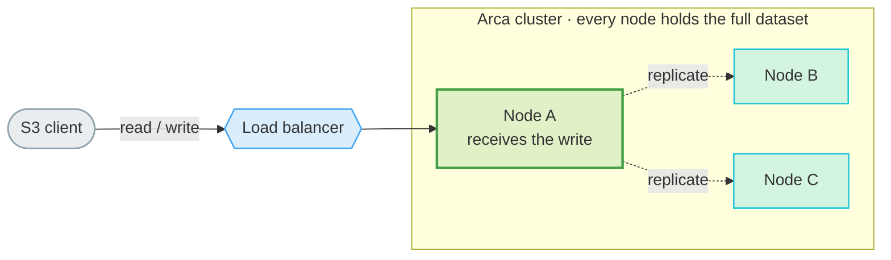
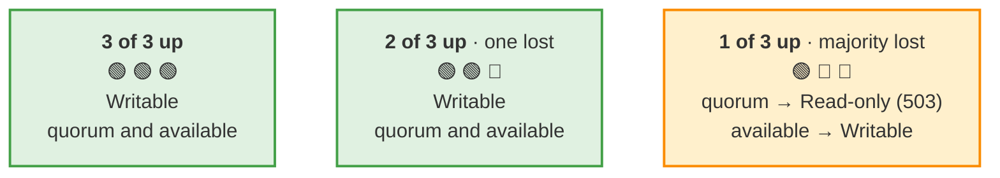

# High Availability (Clustering)

Arca runs as a **symmetric, self-configuring, shared-nothing cluster**. Every node is identical: there is no primary, no coordinator, no per-node configuration. You give all nodes the same config, they discover each other, and they replicate everything. A client can read and write through any node; a load balancer in front spreads traffic and routes around dead nodes.

This is the **full-replication** model (every node holds a complete copy), targeting small clusters (typically 3 nodes) where availability and operational simplicity matter more than storage efficiency. Sharding and erasure coding are explicitly out of scope (see [Design trade-offs](#design-trade-offs-and-honest-limitations)).

## How it works

A client talks to any node through the load balancer. Whichever node receives a
write fans it out to its peers, so every node ends up holding the full dataset:



The nodes are symmetric: the load balancer can route a request to **any** of
them, and any node that takes a write replicates it to the others.

### Symmetry and identity

The `[cluster]` section is **byte-for-byte identical on every node**. There is no `node_id` to assign and no peer list to maintain by hand: on first start each node generates a stable `node_id`, persists it in its own data directory, and keeps it across restarts. Adding a node is just starting another process with the same config.

### Discovery

Nodes find each other through one of three mechanisms (`[cluster].discovery`):

| Mode     | How peers are found | Use when |
|----------|---------------------|----------|
| `mdns`   | Multicast DNS on the local segment (default) | bare-metal / VMs on the same L2 subnet |
| `static` | A fixed `seeds` list of endpoints (identical on every node; a node ignores its own entry) | Docker, Kubernetes, or any routed network where multicast is dropped |
| `dns`    | A headless service name that resolves to all peer IPs | Kubernetes `StatefulSet` + headless `Service` |

Discovery only supplies *candidate endpoints* — it proves nothing about them. A node then probes each candidate with an **authenticated challenge-response ping** (a signed `GET /cluster/v1/ping` carrying a fresh nonce): the peer must answer with `HMAC(cluster secret, nonce)`, proving it actually holds the secret. Only a peer that passes this challenge becomes **authenticated** and participates in replication; anything else that answers HTTP — a stray process that registered itself over mDNS, a node with a different secret — stays visible as *alive* in the topology but receives no data and counts toward nothing. The public `/cluster/v1/health` only returns `{status, node_id}` (identity, so a node recognises itself and the operator sees who is there — nothing an attacker can use).

A peer is declared dead only after **two consecutive failed probes** (a single missed probe — a GC pause, a dropped packet — does not flap it out of the cluster) and alive again at the first success. A peer that stays unreachable beyond `peer_prune_days` (default: the tombstone grace) is **pruned** from membership entirely; if it ever returns it is re-discovered and re-synced like a new candidate.

### Replication — real time, then self-healing

Every mutation fans out to the *eligible* peers — alive, authenticated, config-aligned — **in real time** over the internal `/cluster/v1/*` API (signed with the shared cluster secret, never the public S3 path). That covers both planes:

- **Data plane** — object rows and blob bytes (`PutObject`, multipart, deletes, retention/legal-hold, tags).
- **Control plane** — buckets, bucket config, credentials, users, teams, grants, server settings.

Real-time fan-out is synchronous (awaited before the client gets its response) and sent to all peers in parallel; in `quorum` mode its acknowledgements decide whether the write is accepted at all (see [Consistency](#consistency-model)), in `available` mode it is best-effort. Either way, a node that was **down, slow, or unreachable** during a write catches up on its own through several converging mechanisms — this is what makes the cluster self-healing without operator action:

1. **Anti-entropy (objects)** — each node periodically pulls every peer's *changed-since* manifest (an indexed, incremental `seq` cursor) and applies the rows it is missing. Cheap enough to run frequently.
2. **Control-plane reconcile** — the control plane is small, so nodes periodically exchange a full snapshot and merge it last-writer-wins (see [Consistency](#consistency-model)).
3. **Tombstones** — a hard delete leaves a tombstone (a marker, not the row/blob) so the deletion *propagates* and a lagging peer cannot resurrect a deleted object/entity by shipping its stale copy back. Tombstones are invisible to reads and garbage-collected after a grace window — but **only while every known peer has been seen within that window**: if a peer has been unreachable beyond the grace, the purge is skipped (with a warning and a `tombstone_gc_blocked` flag on `/admin/cluster`) so the deletions are still there for it to learn on re-entry. Membership pruning eventually evicts a never-returning peer, unblocking the GC.
4. **Read-repair** — a `GET` for an object whose bytes are missing locally fetches them from a peer on the spot.
5. **Blob repair + GC** — on a slower cadence each node proactively fetches blob bytes it has the row for but not the file (durability), and reclaims orphan blobs left after deletes (composite-multipart-aware, so live parts are never deleted).

### Consistency model

Two policies, set per cluster with `[cluster].mode`:

- **`quorum` (CP, default)** — a write is acknowledged only when a **majority** of nodes (`floor(cluster_size/2) + 1`) durably hold it *at acknowledgement time*: the local copy plus every peer that confirmed, in its replication response, that it applied the row **and** has the blob. Two layers enforce this: a fast admission gate refuses immediately (`503 ServiceUnavailable`, with `Retry-After`) when membership already knows a majority is unreachable, and the fan-out ACK count catches what the gate cannot see — a peer believed alive that did not actually receive the copy. Only **eligible** nodes count toward the majority: alive, *authenticated* (proved possession of the cluster secret on their last probe) and *config-aligned* — a node that could not correctly hold the replicas cannot vouch for them. The same admission gate also **fails closed when MORE eligible nodes than `cluster_size` are observed** (`size_exceeded` on `/admin/cluster`): the majority is derived from `cluster_size`, so an over-sized membership — say a 4th node started with the 3-node config — would let two disjoint "majorities" accept conflicting writes. With `cluster_size = 3` the write quorum is `2`: the cluster tolerates losing **one** node and keeps serving reads and writes.
- **`available` (AP)** — any single node accepts writes and fans out best-effort. Maximum availability, at the cost of accepting writes that may momentarily diverge and converge later.

!!! warning "A quorum error does not undo the write"
    When a write fails the quorum (`503`), the copy already written on the serving node is **not rolled back** — as in any quorum system without distributed transactions, the error means *"not acknowledged as replicated"*, not *"undone"*. Anti-entropy will propagate that local copy to the peers (it survives), or a client retry simply overwrites it. What the quorum guarantees is the converse: every write acknowledged with `200 OK` is durable on a majority of nodes at that moment.

How a 3-node cluster behaves as nodes are lost (writes need a majority of `2` in `quorum`):



In `quorum` the cluster trades availability for safety at the majority boundary; in `available` it keeps accepting writes the whole way down. Across nodes both modes converge **eventually**: reads are always served locally, reconcile is asynchronous, and conflicts resolve **last-writer-wins (LWW)**. The LWW key is `(last_modified, version_id, blob_id)` — the `blob_id` is a stable tiebreaker so two nodes that wrote the "same" null-version object at the same wall-clock instant still pick the same winner deterministically, without a coordination protocol. The difference is which writes can conflict at all: in `quorum` mode every *acknowledged* write reached a majority, so two acknowledged writes to the same key cannot be accepted on two disconnected sides of a partition — LWW only ever has to resolve a client-visible conflict in `available` mode (or against writes the client was told did not reach quorum).

> **Read-after-write:** within a single node it is immediate. Across the cluster (through a round-robin load balancer) a read may briefly hit a node that has not yet received the write. Pin a client to one node (LB sticky sessions) if you need read-your-writes through the balancer.

### Background workers — one leader for shared work, every node for its own

Arca runs several periodic background workers. In a cluster they fall into two classes, audited individually (hardening R6):

- **Cluster-singleton (leader-gated)** — the **lifecycle evaluator** (expirations, noncurrent-version deletes, stale-multipart aborts) reads the *fully replicated* object table, so running it everywhere would mean every node deleting the same objects: N× the delete fan-out, duplicate audit entries, races between concurrent deleters. Only the **worker leader** runs the tick: the node with the lowest `node_id` among the *eligible* nodes (alive + authenticated + config-aligned — the same predicate that gates the quorum, so an unauthenticated rogue cannot steal the role and silence the workers). The role needs no election protocol: every node computes it locally from its membership view, and when the leader dies the next-lowest eligible node picks the work up at its next membership tick — automatic failover, no coordination. During a brief membership disagreement two nodes can both claim the role; the resulting double execution is harmless (the deletes are idempotent and converge). Each node reports its claim as `worker_leader` on `/admin/cluster`; in a stable cluster exactly one node says `true`.
- **Per-node (deliberately NOT gated)** — workers that operate on strictly node-local state, which every node must keep doing for itself: the metrics snapshot (this node's gauges), the retention purge (this node's audit/metrics/notification/journal tables), the notification delivery worker (its queue is fed only by the S3 events this node served), and the [bucket replication](replication.md) worker — see the note below.

!!! note "Bucket replication in a cluster: per-node journal"
    The Phase 28 replication worker delivers to *external* S3 destinations from a journal that is **node-local by design**: an entry is recorded only on the node that served the client write, and never by the cluster replication paths — so each S3 write is journaled exactly once cluster-wide and **duplicate deliveries to the destination cannot occur**, with no leader needed. The flip side is an RPO caveat: a node lost *for good* takes its still-pending journal entries with it, and those objects reach the external destination only when they are written again. A node that merely restarts loses nothing (the journal is on disk).

## Prerequisites

- **Same `[cluster].secret` on every node.** It authenticates all inter-node traffic. There is no per-node credential. It must be a **high-entropy value of at least 16 characters** (generate it: `openssl rand -hex 32`) — startup refuses shorter secrets and the placeholders shipped in the reference configs, and warns when the value looks low-entropy. To change it without downtime, see [Rotating the cluster secret](#rotating-the-cluster-secret).
- **Same encryption master key / same KMS on every node**, *if* encryption is enabled. Replication ships the encrypted bytes verbatim, so every node must be able to unwrap them. (SSE-C needs nothing special — the bytes are opaque to the cluster, the nonce travels in the sidecar, and since hardening R5 SSE-C reads repair locally-missing bytes from a peer just like any other object.)
- **Synchronized clocks (NTP).** LWW compares wall-clock timestamps; severe skew can pick the wrong winner on null-version rows. The `blob_id` tiebreaker mitigates ties, but NTP is still required.
- **Full connectivity between nodes** on the cluster port, plus the same `cluster_id`. `mdns` additionally needs a shared L2 subnet; otherwise use `static` or `dns`.
- **No data migration.** Enabling clustering on a node that already has data just works — anti-entropy populates the peers. This honours Arca's "configuration change without data migration" guarantee.

## Quick start

### Single-node dev cluster

To exercise the cluster code path and the console topology widget on one machine:

```bash
bin/arca start -d --dev --cluster      # 1-node "available" cluster (mDNS)
bin/console start -d --build           # console on http://localhost:9080
```

The dashboard's **Cluster Topology** card shows the mode, write status, and this single node.

### Three-node local cluster

A self-contained 3-node cluster with an HAProxy load balancer, for integration testing and demos:

```bash
bin/cluster up -d            # arca-1/2/3 + HAProxy + console
bin/cluster status           # container + per-node /admin/health view
```

Endpoints:

| Service       | URL |
|---------------|-----|
| Load balancer | `http://localhost:9000` (round-robin over the live nodes) |
| Console       | `http://localhost:9080` |
| Node 1/2/3    | `http://localhost:9001` / `:9002` / `:9003` (direct, for inspection) |

Simulate a failure and watch the cluster react:

```bash
bin/cluster node-stop 3      # kill a node — the LB drops it, peers mark it dead
bin/cluster status           # now 2/3 live; still writable (2 ≥ quorum)
bin/cluster node-start 3      # it rejoins and catches up via anti-entropy
bin/cluster down             # stop everything (add -v to wipe the data volumes)
```

The 3 nodes share one symmetric config (`docker/cluster/config.toml`, `mode = "quorum"`, `discovery = "static"`) — Docker's bridge network drops multicast, hence static seeds.

## Observability

- **Console** — the dashboard **Cluster Topology** card shows the consistency mode (Quorum·W=N / Available), the write status (Writable / Read-only when quorum is lost), and every node with a green/red status dot, the local-node badge, endpoint, and last-seen time. The Server card's *Topology* field summarises it as `Cluster · live/total`.
- **`GET /admin/cluster`** (admin SigV4) — JSON the console consumes: `mode`, `write_quorum`, `has_write_quorum`, `live_node_count`, `eligible_node_count` (nodes the write quorum is measured against: alive + authenticated + config-aligned), `node_count`, `config_aligned`, `size_exceeded`, `tombstone_gc_blocked`, `worker_leader` (whether THIS node runs the [cluster-singleton background work](#background-workers-one-leader-for-shared-work-every-node-for-its-own) — exactly one node says `true` in a stable cluster), and the `nodes` list (each with `alive`, `authenticated`, `config_ok`, `last_seen` — kept on dead nodes, showing the last successful contact). Returns `{"enabled": false}` on a single-node deployment.
- **`GET /admin/health?verbose=1`** (unauthenticated) — liveness plus the cluster snapshot, handy for scripts and load-balancer debugging. The plain `GET /admin/health` (200 / 503-on-drain) is the load-balancer check.

### Storage capacity (the smallest node wins)

With full replication every node holds a complete copy, so the cluster can only store as much as its **smallest** node: once the node with the least free space fills, new writes can no longer be replicated everywhere. Arca therefore treats the cluster's effective capacity as the **minimum across nodes**, not the sum.

- **Dashboard** — the *Total Storage* card shows the cluster-wide free/total as the minimum over the eligible nodes (labelled "cluster min"), so a node with a 2 TB disk doesn't mask a peer with only 1 TB. (Nodes exchange their disk stats on the authenticated ping — an unauthenticated stranger advertising a tiny disk cannot shrink the cluster minimum and block writes.)
- **Write guard** — a write is refused with `507 Insufficient Storage` if it would not fit on *some* node, even when the receiving node has room: a node with plenty of space still returns 507 when replicating the object would push a peer out of space, because the write could not be durably replicated. This keeps the "every node has a complete copy" invariant. Reads and deletes are never gated (so you can always recover space). The guard is by `Content-Length`; size-unknown streaming uploads fall back to the filesystem's own out-of-space error.

### Config-drift detection

A symmetric cluster only works if the alignment-critical config is identical on every node, and the dangerous mismatches are *silent*: a wrong `secret` lets a node look alive while every replication request 403s; a different encryption master key makes replicated blobs unreadable on the peer. So nodes actively check it.

Each node computes a **fingerprint** (a one-way hash) of the fields that must match — `cluster_id`, `secret`, `mode`, `cluster_size`, and the encryption master-key id — and exchanges it on the **authenticated ping** (not the public health: a public fingerprint would hand an attacker an offline brute-force oracle for the secret). A *wrong-secret* node cannot even answer the ping — its `403` is itself the drift signal, and its identity is recovered from the public health so the operator sees *who* is misaligned. On a mismatch:

- it **logs a `WARN`** naming the offending peer (once, on transition — not every tick);
- the console **Cluster Topology** card shows an amber warning banner and an alert icon on the mismatched node;
- `GET /admin/cluster` reports `config_aligned: false` and `config_ok: false` on that node;
- the drifted node is **excluded from replication fan-out and the write quorum** — it could not store the replicas correctly anyway (wrong key) or even authenticate them (wrong secret). With 1 of 3 nodes drifted the cluster keeps writing (2 eligible ≥ quorum 2); with 2 of 3 drifted the remaining aligned node refuses writes with `503` until the configs align.

The cluster does **not** refuse to start or auto-isolate the peer's process — a node can't know its peers' config at startup, and one misconfigured node shouldn't take down the healthy ones. It surfaces the problem loudly and keeps running; you fix the config and the warning clears on its own. (Fields that legitimately differ per node — port, `advertise_addr`, `node_id`, seeds, intervals, storage backend — are deliberately excluded from the fingerprint.)

## Production deployment

### Load balancer

Put any L7/L4 balancer in front and health-check `GET /admin/health` (200 = up, 503 = draining → out of rotation). The reference HAProxy backend:

```haproxy
backend arca_nodes
    balance roundrobin
    option httpchk
    http-check send meth GET uri /admin/health
    http-check expect status 200
    server arca-1 10.0.0.1:9000 check inter 2s fall 2 rise 1
    server arca-2 10.0.0.2:9000 check inter 2s fall 2 rise 1
    server arca-3 10.0.0.3:9000 check inter 2s fall 2 rise 1
```

For an active/passive VIP, pair HAProxy with keepalived. In Kubernetes, run a `StatefulSet` of 3 replicas with a headless `Service` and `discovery = "dns"` pointed at it; front it with a normal `Service` / Ingress.

### A note on the load balancer being a SPOF

The balancer is a single point of failure unless it is itself redundant (keepalived VIP, multiple ingress replicas, or a managed cloud LB). The Arca *cluster* survives node loss; make sure the entry point does too.

### Inter-node transport security (TLS + mutual TLS)

The challenge-response peer authentication above stops a rogue endpoint everywhere, including plain-HTTP clusters — but on a network you do not fully trust, plain HTTP still exposes inter-node traffic to sniffing, and a sniffed signed request used to be replayable. Two R4 hardenings close this:

- **Anti-replay window.** Every `/cluster/v1/*` request must carry an `x-amz-date` within ±15 minutes of the receiving node's clock (the timestamp is signed, so it cannot be refreshed without the secret). NTP — already a prerequisite — keeps legitimate peers well inside the window.
- **Verified mutual TLS with a cluster CA.** When the cluster runs over HTTPS, the `[cluster.tls]` section is **required** (the node refuses to start without it — there is no "accept invalid certificates" fallback): every node gets the same operator-distributed CA plus its own CA-signed cert/key. Inter-node clients verify the peer's certificate against that CA *and* present the node certificate as their client identity; the listener verifies any presented client certificate, and the `/cluster/v1/*` routes refuse requests whose connection did not present one. S3 clients on the same port are untouched — for them the client certificate is simply never requested as mandatory. The result is an independent second factor: pushing or pulling cluster data requires the secret **and** a CA-signed key.

Mint the whole material set with the shipped generator (one `--node` per node, SANs covering every name/IP peers dial — the seeds entries, the advertised address):

```console
$ arca tls generate-cluster --output-dir /etc/arca/certs/cluster \
    --node arca-1=arca-1.internal,10.0.0.1 \
    --node arca-2=arca-2.internal,10.0.0.2 \
    --node arca-3=arca-3.internal,10.0.0.3
```

Copy `arca-cluster-ca.crt` (and each node's own cert/key) to the nodes and point both `[server.tls]` and `[cluster.tls]` at them — see the TOML reference below. Keep `arca-cluster-ca.key` offline: it is only needed to mint certificates for new nodes. The same node certificate serves the S3 listener too, so S3 clients must trust the CA (`aws --ca-bundle arca-cluster-ca.crt`); if you prefer a public certificate for S3 clients, keep it in `[server.tls]` — the peers' clients trust the cluster CA *in addition to* the system roots, so both layouts work. Operators with their own PKI can supply equivalent material (a dedicated CA; per-node certs with serverAuth + clientAuth) instead of using the generator.

### Rotating the cluster secret

The optional `[cluster] secret_previous` makes a secret rotation a rolling operation instead of a full-cluster restart:

1. On every node set `secret_previous` to the current secret and `secret` to the new one.
2. Rolling-restart the nodes. Inbound authentication accepts both secrets, so replication keeps flowing in both directions across the window; outbound signing always uses the new secret. Expect transient `config_ok: false` flags while versions of the config coexist (the drift fingerprint includes the secret): nodes already on the new secret form the writable majority as soon as there are enough of them, exactly like a rolling upgrade.
3. When all nodes run the new secret, remove `secret_previous` (no restart urgency: it is inert once nothing signs with it, but leaving the old secret valid forever defeats the rotation).

## Design trade-offs (and honest limitations)

This section exists so you can judge the approach, not just use it.

- **Full replication, not sharding/erasure coding.** Every node stores everything. Simple and highly available; storage cost is `N×`. Sized for small clusters. Erasure coding and sharding are future work.
- **Eventual consistency, hand-rolled (Dynamo-style), not Raft.** There is no consensus log. Convergence is LWW + anti-entropy + tombstones. This keeps the data path coordination-free and fast, at the cost of the well-known AP/eventual-consistency caveats. It also means correctness rests on the convergence machinery being right — which is why each piece (manifest, tombstones, reconcile, GC) is unit-tested in isolation.
- **No hinted-handoff.** Larger clusters (Cassandra et al.) buffer writes for absent nodes. At N=3 with full replication, frequent incremental anti-entropy plus read-repair recover an absent node quickly enough that the extra machinery isn't worth it.
- **Control-plane catch-up is complete (hardening R5).** Every control-plane family reconciles via the periodic snapshot merge, deletions included: credentials, users, teams, grants and buckets, *and* their associations and settings — team memberships, grant attachments, `bucket_config` keys, bucket tag sets (the whole set is one LWW entity, matching `PutBucketTagging`'s replace-all semantics), cluster-wide server settings — plus in-progress multipart uploads with their parts. A node that was down during ANY of those changes fully self-heals at re-entry; a Complete/Abort that happened while it was away cannot resurrect (a `multipart` tombstone closes the upload), and a `CompleteMultipartUpload` landing on a node that is missing some part bytes fetches them from a peer before assembling. Object-Lock retention / legal-hold changes also reach a returning node (they stamp the anti-entropy cursor since R5). The brief window in which a *pairwise* exchange can transiently act on stale state before the deletion's tombstone arrives from its origin node is bounded by one anti-entropy cycle.
- **Tombstone grace vs downtime.** A returning node must come back **within `tombstone_grace_days`** (default 7) to learn of deletions that happened while it was away. The GC liveness guard keeps tombstones around *while the absent node is still remembered* (it blocks the purge and flags `tombstone_gc_blocked`), but once the node is pruned from membership (`peer_prune_days`, default = the grace) the tombstones it never saw are reclaimed — a node returning **beyond** the grace can still resurrect deleted data. Set the grace longer than your worst-case planned downtime. The guard's memory is also process-local: it cannot account for peers that vanished before the current process started.
- **Clock dependence.** LWW uses wall-clock time; run NTP. A hybrid logical clock is possible future hardening.
- **Rolling upgrades across the peer-authentication boundary.** A pre-ping (≤ 0.25.x) peer cannot prove possession of the secret, so an upgraded node treats it as alive-but-not-eligible: no fan-out toward it, no quorum contribution. Practical consequence in a 3-node `quorum` cluster: the **first** upgraded node refuses writes (`503`) until a **second** node is upgraded (the load balancer routes around it; legacy nodes keep accepting writes and their own fan-out/anti-entropy keep all data converging). On an **HTTPS** cluster the upgrade also introduces `[cluster.tls]` (mandatory), and the upgraded node additionally rejects inbound cluster requests from peers that present no client certificate — so legacy pushes toward it fail until those peers are upgraded too, and it catches up via anti-entropy afterwards. Complete the rolling upgrade promptly rather than running mixed versions for long.

## TOML configuration reference

```toml
[cluster]
enabled    = true
cluster_id = "arca-prod"          # only nodes sharing this id form a cluster
# Shared inter-node auth secret (identical everywhere): >= 16 chars, high
# entropy — generate with `openssl rand -hex 32`. Placeholders are refused.
secret     = "f3a91c0e7b2d485f9a6c1e8d0b7f42a3"
# secret_previous = "..."         # only during a rotation — see the runbook above
mode       = "quorum"             # "quorum" (CP, default) | "available" (AP)
cluster_size = 3                  # required in quorum mode → write quorum = 2

discovery  = "static"             # "mdns" (default) | "static" | "dns"
seeds      = ["arca-1:9000", "arca-2:9000", "arca-3:9000"]  # discovery = "static"
dns_name   = "arca-headless"      # discovery = "dns"

# Optional: what this node advertises to peers (defaults: auto-detected addr,
# [server].port). Set only behind NAT / port remapping.
advertise_addr = "10.0.0.1"
advertise_port = 9000

health_interval_seconds       = 3     # peer probe cadence (authenticated ping)
anti_entropy_interval_seconds = 5     # reconcile pass cadence
request_timeout_seconds       = 30    # inter-node HTTP timeout
tombstone_grace_days          = 7     # MUST exceed worst-case node downtime
peer_prune_days               = 7     # evict peers unreachable this long
                                      # (optional; default = tombstone_grace_days)

# REQUIRED when the cluster runs over HTTPS ([server.tls] enabled): the
# operator-distributed cluster CA + this node's CA-signed cert/key, used to
# verify peers and to authenticate this node to them (mutual TLS). Mint the
# material with `arca tls generate-cluster`.
[cluster.tls]
ca_file   = "/etc/arca/certs/cluster/arca-cluster-ca.crt"   # same on every node
cert_file = "/etc/arca/certs/cluster/arca-1.crt"            # this node's own
key_file  = "/etc/arca/certs/cluster/arca-1.key"
```

## Related

- [Encryption](encryption.md) — every node needs the same master key for encrypted clusters.
- [Replication](replication.md) — asynchronous *cross-cluster* mirroring to any S3 endpoint (a different feature from intra-cluster HA; `--cluster` and `--replication` are mutually exclusive).
- [Configuration](configuration.md) — full TOML reference.
