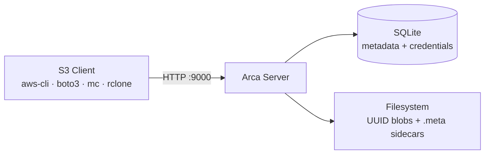
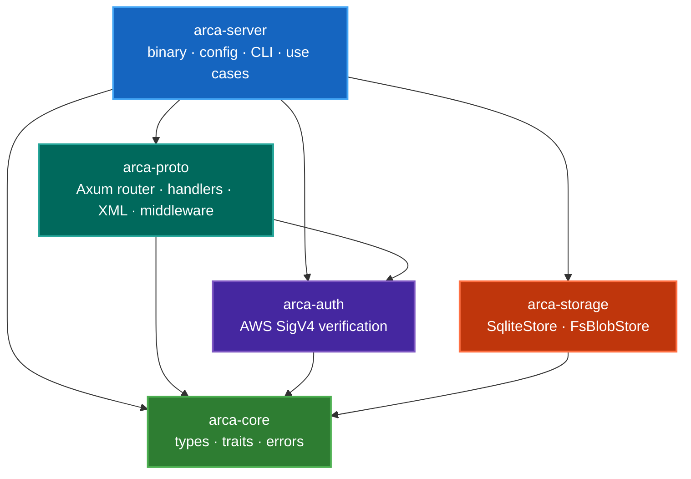
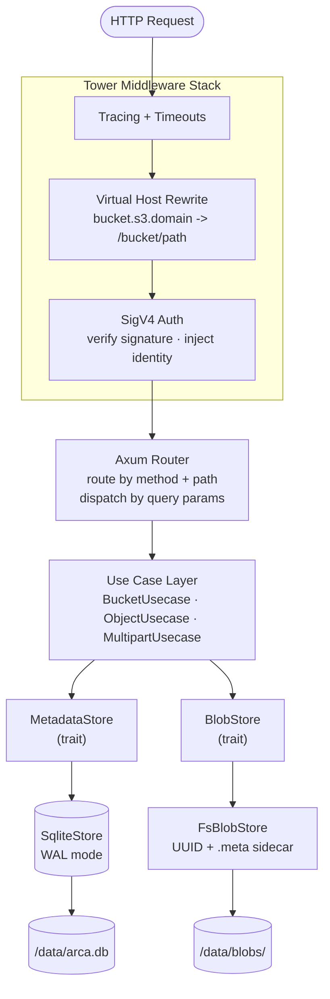
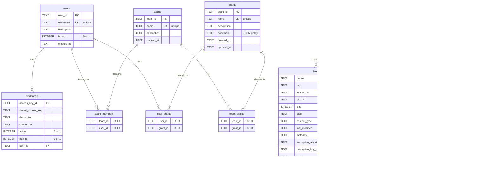
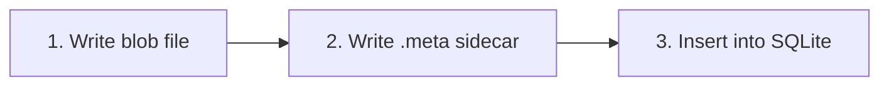

# Architecture

Arca is a ground-up implementation of the S3 API in Rust. Rather than wrapping an existing library, every layer — from HTTP protocol handling to storage — is built from first principles, giving us full control over behavior, performance, and correctness.

This page describes the system architecture, the reasoning behind key decisions, and how the pieces fit together at runtime.

## System Overview

Arca is a single-binary server that accepts S3-compatible HTTP requests on port 9000. It stores object data as UUID-named blob files on a local filesystem and tracks metadata (buckets, objects, credentials) in a SQLite database. A JSON sidecar file accompanies every blob, enabling full database reconstruction without any external backup.



The server is organized as a **five-crate Cargo workspace** with strict layered dependencies. Each crate has a single, well-defined responsibility and a minimal dependency surface.

## Crate Structure

| Crate | Role | I/O |
|-------|------|:---:|
| **arca-core** | Shared types, traits (`BlobStore`, `MetadataStore`, `CredentialStore`), error types | None |
| **arca-auth** | AWS Signature V4 verification | None |
| **arca-proto** | S3 HTTP protocol adapter — Axum 0.8 router, handlers, XML ser/de, middleware | Network |
| **arca-storage** | Storage implementations — `SqliteStore`, filesystem blob store (planned) | Disk + DB |
| **arca-server** | Binary crate — config, CLI, use-case layer, dependency wiring | All |

**arca-core** is the foundation: it defines the domain model and storage traits with zero I/O dependencies, making it independently testable and portable. Every other crate depends on it but never on each other horizontally.

### Dependency Graph



Dependencies flow strictly downward. There are no cycles: `arca-proto` never imports `arca-storage`, and `arca-storage` never imports `arca-proto`. The binary crate (`arca-server`) is the only place where all crates meet — it wires the storage implementations into the protocol handlers through the trait abstractions defined in `arca-core`.

## Layered Architecture

The system is organized into four distinct layers, each with clear responsibilities and boundaries:

| Layer | Crate | Responsibility |
|-------|-------|----------------|
| **Protocol** | arca-proto | HTTP routing, S3 XML parsing/generation, middleware (auth, virtual host) |
| **Use Case** | arca-server | Business logic orchestration — validates inputs, coordinates storage calls, enforces invariants |
| **Domain** | arca-core | Types, traits, error codes — defines *what* storage does, not *how* |
| **Infrastructure** | arca-storage | Concrete implementations — SQLite queries, filesystem I/O, blob management |

This separation means the business logic never depends on a specific database or filesystem layout. Swapping SQLite for Postgres, or local disk for cloud storage, requires only a new trait implementation — no changes to handlers or use cases.

## Request Flow

Every S3 request passes through a pipeline of middleware layers before reaching business logic:



The middleware stack is built with [Tower](https://docs.rs/tower), the standard Rust middleware framework. Each layer is independently testable and can be reordered or replaced without affecting the others.

## Storage Architecture

### Trait-Based Abstraction

All storage operations are defined as async traits in `arca-core`:

- **`BlobStore`** — binary data operations (write, read, delete blobs)
- **`MetadataStore`** — structured data operations (buckets, objects, multipart uploads)
- **`CredentialStore`** — credential management (CRUD for access keys)
- **`UserStore`** — user management (CRUD for users)
- **`TeamStore`** — team and membership management
- **`GrantStore`** — grant (policy) management, attachment to users/teams, effective policy resolution

The use-case layer depends only on these traits, never on concrete implementations. This enables:

- **Testing**: use cases are tested against in-memory implementations
- **Flexibility**: swap SQLite for Postgres without touching business logic
- **Separation**: storage internals are encapsulated behind clean interfaces

### SQLite (Metadata + Credentials)

Arca uses SQLite via `tokio-rusqlite`, which runs all database operations on a dedicated background thread to avoid blocking the async runtime.

Key characteristics:

- **WAL mode** — allows concurrent readers during writes
- **Version-tracked migrations** — a `_migrations` table tracks applied schema changes; new migrations run automatically at startup
- **Single database file** — stored at `{data_dir}/arca.db`

#### Database Schema

The schema is managed through version-tracked migrations (currently at version 9). The entity-relationship diagram below shows all tables and their relationships:



**Authentication model**: users don't log in directly. Each user has one or more **credentials** (access key + secret key pairs), and authentication happens via AWS SigV4 signature verification against a credential. The credential's `user_id` links back to the owning user, and from there the RBAC system resolves effective permissions through direct grants and team grants.

**RBAC model**: permissions are defined in **grants**, which contain an IAM-style JSON policy document. Grants can be attached directly to users (via `user_grants`) or to teams (via `team_grants`). A user's effective permissions are the union of their direct grants plus all grants from teams they belong to. Three built-in grants are seeded at database creation: `AdministratorAccess`, `S3FullAccess`, and `S3ReadOnlyAccess`.

**Ownership**: both `buckets` and `objects` track an `owner` field that records which user created the resource.

**Encryption**: the `objects` table has optional `encryption_algorithm` and `encryption_key_id` columns for SSE-S3 and SSE-KMS. The `bucket_config` table stores per-bucket settings such as default encryption configuration and versioning status.

**Versioning**: the `objects` table supports object versioning through `version_id`, `is_latest`, and `is_delete_marker` columns. When versioning is enabled on a bucket (via `bucket_config`), each write creates a new version with a unique `version_id` rather than overwriting the existing row. A partial unique index on `(bucket, key) WHERE is_latest = 1` guarantees exactly one current version per key, while previous versions remain queryable. Delete operations insert a delete marker (a zero-size row with `is_delete_marker = 1`) instead of removing the object.

### Filesystem (Blob Storage)

Object data is stored as UUID-named files under a dedicated `blobs/` subdirectory, keeping the top-level data directory clean:

```
/data/
├── arca.db                      # SQLite database
└── blobs/
    ├── ab/cd/
    │   ├── abcd1234-...uuid       # Blob file (raw object bytes)
    │   └── abcd1234-...uuid.meta  # JSON sidecar (metadata)
    └── ef/01/
        ├── ef012345-...uuid
        └── ef012345-...uuid.meta
```

UUID-based naming eliminates path-traversal risks entirely — object keys (which can contain arbitrary characters like `../`) are never used in filesystem paths.

**Integrity guarantees:**

- **No duplicate UUIDs** — blob files are created with `O_CREAT | O_EXCL` (`create_new(true)` in Rust), which atomically fails if the file already exists
- **No duplicate latest versions** — a partial unique index on `(bucket, key) WHERE is_latest = 1` ensures at most one "current" version per object key. When versioning is disabled, `put_object` returns the old record so the caller can delete the orphaned blob. When versioning is enabled, previous versions are preserved alongside the new latest version
- **Conflict detection** — `arca fsck` detects orphaned blobs (no DB record) and conflicting sidecars (multiple `.meta` files claiming the same `bucket + key`). `arca recover` resolves conflicts by keeping the newest sidecar (by `created_at`) and reporting discarded duplicates
- **Sidecar integrity** — the `objects` table stores a SHA-256 checksum of each `.meta` sidecar file, enabling `arca fsck` to detect corruption or tampering

### Write Order and Disaster Recovery

The write order for storing an object is deliberate:



If the server crashes at any point:

- **After step 1 only**: orphaned blob, no sidecar → `arca fsck` detects and cleans up
- **After step 2**: blob + sidecar exist but DB doesn't know → `arca recover` rebuilds the DB entry from the sidecar
- **After step 3**: fully consistent

The `arca recover` command walks the `blobs/` directory, reads every `.meta` sidecar file, and reconstructs the SQLite database from scratch. This means the filesystem is the **source of truth** — the database is a queryable index that can always be rebuilt.

### Sidecar `.meta` Format

Every blob is accompanied by a JSON sidecar file containing all metadata needed to reconstruct the database entry:

```json
{
  "bucket": "my-bucket",
  "key": "photos/2024/vacation.jpg",
  "content_type": "image/jpeg",
  "size": 1234567,
  "etag": "d41d8cd98f00b204e9800998ecf8427e",
  "user_metadata": {"x-amz-meta-author": "pietro"},
  "created_at": "2026-02-27T14:30:00Z"
}
```

### Data Integrity

Blob content integrity is verified via MD5 checksums:

| What | Hash | Stored in | Why this hash |
|------|------|-----------|---------------|
| Blob content | MD5 | `objects.etag` + `.meta` sidecar | Required by the S3 protocol — the ETag for non-multipart objects is defined by AWS as the MD5 hex digest |

This gives `arca fsck` coverage for blob corruption: recompute MD5 of the blob file and compare with the ETag in the database.

Note that this check requires the database to be intact. During `arca recover` (database is lost), the sidecars are trusted by necessity since there is nothing to compare against.

## Key Design Decisions

### Configuration Migration Without Data Migration

A core architectural principle: **any configuration change must be possible without migrating data to a new instance**. This includes switching storage backends (SQLite to PostgreSQL), enabling encryption on existing data, changing node topology, and any other setting change.

Many S3-compatible servers (notably MinIO) make certain configuration choices permanent — for example, you cannot move from a multi-node erasure-coded setup to a single node without standing up a fresh instance and copying all data over. Arca explicitly rejects this pattern.

Instead, Arca provides offline CLI migration tools (e.g., `arca migrate-db`) that transform data and metadata in place. When designing new features, this constraint means:

- **Storage formats must be evolvable** — sidecars, blob layouts, and DB schemas must support incremental migration.
- **Configuration changes must have a migration path** — every new config option that affects data layout must include a CLI command or startup procedure that converts existing data.
- **The data directory is sacred** — users should never need to re-upload objects because of an infrastructure change.

### No `s3s` Crate

We build our own S3 HTTP protocol adapter with Axum rather than depending on the [`s3s`](https://crates.io/crates/s3s) crate. This was an explicit decision to avoid pre-1.0 dependency risk and maintain full control over the protocol layer. The S3 protocol has many subtle behaviors (error formats, header handling, query-parameter routing) where we need precise control.

### S3 Query-Parameter Routing

S3 overloads the same HTTP method + path with different query parameters. Since Axum routes by method + path only, handlers dispatch internally based on query params:

| Route | Without query params | With query params |
|-------|---------------------|-------------------|
| `PUT /:bucket/*key` | PutObject | UploadPart (`?partNumber=&uploadId=`) |
| `GET /:bucket` | HeadBucket | ListObjectsV2 (`?list-type=2`) |
| `POST /:bucket/*key` | — | CreateMultipartUpload (`?uploads`) or CompleteMultipartUpload (`?uploadId=`) |
| `DELETE /:bucket/*key` | DeleteObject | AbortMultipartUpload (`?uploadId=`) |

This is the same approach used by MinIO, Ceph RGW, and RustFS.

### Streaming-First I/O

Arca never buffers full objects in memory:

- **PutObject**: the request body stream is teed to an MD5 hasher and a file writer concurrently. The ETag (MD5 hex digest) is computed on-the-fly without ever holding the full object in memory.
- **GetObject**: a `tokio::fs::File` is wrapped in a `ReaderStream` and sent directly as the response body. Range requests use seek + take for efficient partial reads.
- **UploadPart**: same streaming pattern as PutObject, writing to a temporary part file.

This means Arca can handle multi-gigabyte objects with constant memory usage.

### `put_object` Returns Old Record

`MetadataStore::put_object` returns `Option<ObjectRecord>` of the overwritten object so the caller can delete the orphaned blob. Without this, blob files would accumulate unboundedly on repeated writes to the same key.

### Multipart Composite ETag

The composite ETag follows the S3 standard:

```
hex(MD5(binary_MD5(part1) || binary_MD5(part2) || ...))-{count}
```

The binary MD5 bytes of each part are concatenated (not hex strings), then hashed again. The result is formatted as `"<hex>-<count>"`.

### Auth Body Hash Strategy

For streaming uploads, buffering multi-gigabyte objects for SHA-256 hashing is impractical. S3 clients send `x-amz-content-sha256: UNSIGNED-PAYLOAD`, indicating the body is not covered by the signature. Auth middleware verifies the request signature (headers + URI) only. Body integrity is separately guaranteed by `Content-MD5` headers.

## CLI Architecture

The `arca` binary exposes subcommands via [clap](https://docs.rs/clap):

| Command | Description |
|---------|-------------|
| `arca serve` | Start the S3 server |
| `arca credential add` | Generate a new access key pair (`--admin` for admin privileges) |
| `arca credential list` | List all credentials (shows role: Admin/User) |
| `arca credential remove` | Delete a credential by access key ID |
| `arca recover` | Rebuild SQLite DB from `.meta` sidecar files |
| `arca fsck` | Check consistency between DB and filesystem |

All subcommands accept `--config-path` (default: `/etc/arca/config.toml`) to locate the configuration file, which provides the `data_dir` path used to find the database and blob storage.

## Technology Choices

| Component | Choice | Rationale |
|-----------|--------|-----------|
| Language | Rust | Memory safety, predictable performance, zero-cost abstractions |
| HTTP framework | Axum 0.8 + Tower | Tokio-native, excellent middleware ecosystem, type-safe extractors |
| XML | quick-xml + serde | 10-50x faster than xml-rs, first-class serde integration |
| Metadata DB | SQLite via tokio-rusqlite | Embedded, zero-config, WAL mode for concurrency; trait abstraction allows future Postgres swap |
| Auth | Custom SigV4 (hmac + sha2) | Well-documented algorithm, testable against AWS official test vectors |
| Blob storage | UUID files + `.meta` sidecars | No path-traversal risks, enables disaster recovery without external backups |
| CLI | clap (derive) | Standard Rust CLI framework, type-safe argument parsing |
| Logging | tracing + tracing-subscriber | Structured, async-aware, supports JSON output for production |

## What's NOT Yet Implemented

Object tagging, lifecycle rules, object lock, metrics endpoint, replication, multi-node / distributed mode.

These are deferred by design. The trait-based architecture ensures they can be added incrementally without architectural changes. See the [roadmap](../roadmap.md) for the full post-MVP plan.
