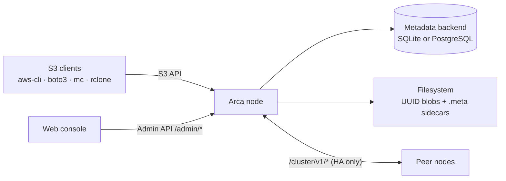
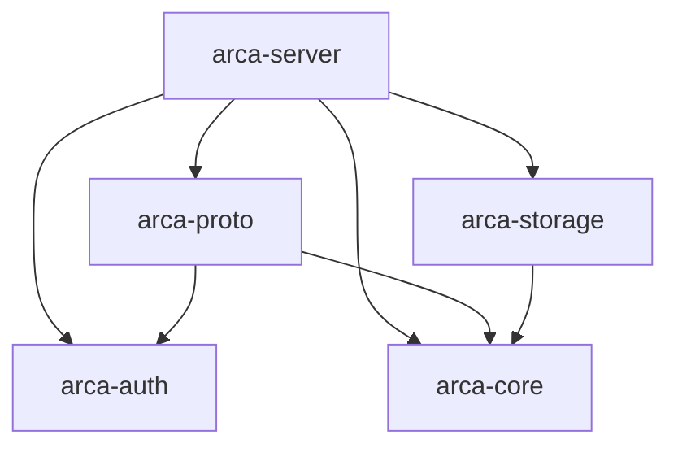
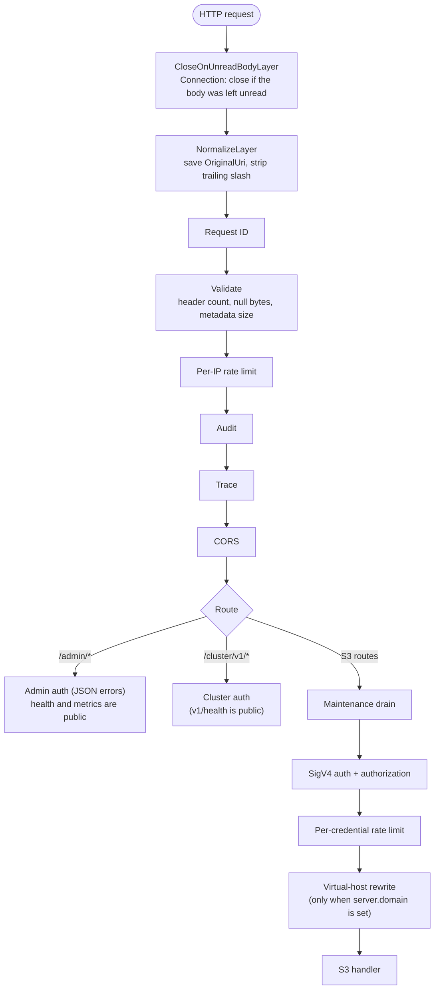

# Architecture

Arca implements the S3 API from the HTTP layer down to the storage layer in Rust, without wrapping an existing S3 library. This page describes how the code is organised today, how a request travels through it, how data and metadata are stored, and the design decisions (with their rationale) that contributors must preserve.

It is a reference for contributors and operators. Operating procedures live in the guides, which this page links to rather than repeats.

## System Overview

Arca ships as one server binary (`arca`) plus a separate web console (`console/`, a static web application that talks to the Admin API like any other client). A node serves the S3 API, the Admin API (`/admin/*`) and, when clustered, the inter-node API (`/cluster/v1/*`) on a single port.

Object bytes live as UUID-named blob files on the local filesystem, each with a JSON sidecar (`.meta`). Metadata (buckets, objects, versions, identities, configuration, journals) lives in a metadata backend: embedded SQLite (default) or an external PostgreSQL server.


```mermaid
graph LR
    C["S3 clients<br/>aws-cli · boto3 · mc · rclone"] -->|"S3 API"| A["Arca node"]
    CON["Web console"] -->|"Admin API /admin/*"| A
    A --> DB[("Metadata backend<br/>SQLite or PostgreSQL")]
    A --> FS["Filesystem<br/>UUID blobs + .meta sidecars"]
    A <-->|"/cluster/v1/* (HA only)"| P["Peer nodes"]
```

## Crate Structure

The server is a five-crate Cargo workspace:

| Crate | Role | Depends on |
|-------|------|------------|
| **arca-core** | Domain types (`ObjectRecord`, `BlobId`, ...), every storage trait, policy evaluation, S3 XML types, cluster wire types and pure merge logic, error codes. No I/O. | (none) |
| **arca-auth** | AWS Signature V4: request and presigned-URL verification, presigned-URL generation, outbound signing. No I/O. | (no workspace crate) |
| **arca-proto** | S3 and Admin HTTP adapter: Axum router, handlers, middleware, XML error responses, `AppState`. Handlers call the storage traits directly. | arca-core, arca-auth |
| **arca-storage** | Storage implementations: SQLite and PostgreSQL metadata stores, filesystem blob store, encryption/compression/SSE-C decorators, metadata cache, backend migration copier. | arca-core |
| **arca-server** | The binary: configuration, CLI, store composition and wiring, background workers, cluster decorators and membership, TLS, notification connectors, outbound replication, offline tools (`recover`, `fsck`, `gc`, migrations). | all four |


```mermaid
graph TD
    SERVER["arca-server"]
    PROTO["arca-proto"]
    STORAGE["arca-storage"]
    AUTH["arca-auth"]
    CORE["arca-core"]

    SERVER --> PROTO
    SERVER --> STORAGE
    SERVER --> AUTH
    SERVER --> CORE
    PROTO --> AUTH
    PROTO --> CORE
    STORAGE --> CORE
```

`arca-auth` is a leaf: it shares no types with the rest of the workspace. `arca-proto` never depends on `arca-storage`; where a handler needs a capability that only a concrete store has (SSE-C keys, raw blob access for the cluster endpoints), `arca-core` defines a trait for it (`SsecBlobOps`, `RawBlobOps`) and `arca-server` injects the implementation into `AppState`.

There is no separate use-case layer: S3 and Admin handlers in `arca-proto/src/handlers/` orchestrate the work themselves, calling `state.metadata`, `state.blob` (or `state.blob_for_write(bucket)`) and the other stores held by `AppState`.

## Request Flow

### Middleware order

The order below is the one built by `build_router` (`arca-proto/src/router.rs`) and `async_main` (`arca-server/src/main.rs`), outermost first:


```mermaid
flowchart TD
    REQ(["HTTP request"]) --> L1["CloseOnUnreadBodyLayer<br/>Connection: close if the body was left unread"]
    L1 --> L2["NormalizeLayer<br/>save OriginalUri, strip trailing slash"]
    L2 --> L3["Request ID"] --> L4["Validate<br/>header count, null bytes, metadata size"]
    L4 --> L5["Per-IP rate limit"] --> L6["Audit"] --> L7["Trace"] --> L8["CORS"]
    L8 --> R{"Route"}
    R -->|"/admin/*"| ADM["Admin auth (JSON errors)<br/>health and metrics are public"]
    R -->|"/cluster/v1/*"| CL["Cluster auth<br/>(v1/health is public)"]
    R -->|"S3 routes"| S1["Maintenance drain"]
    S1 --> S2["SigV4 auth + authorization"] --> S3["Per-credential rate limit"] --> S4["Virtual-host rewrite<br/>(only when server.domain is set)"]
    S4 --> H["S3 handler"]
```

- **Outside the router.** `NormalizeLayer` and `CloseOnUnreadBodyLayer` wrap the `Router` as plain Tower layers, because middleware attached with Axum's `Router::layer` runs only *after* a route has been matched. `NormalizeLayer` must rewrite the path before routing (clients such as `mc` send `/bucket/`); auth then verifies the signature against the saved `OriginalUri`. `CloseOnUnreadBodyLayer` is outermost so it also sees responses produced by middleware (an auth reject answers before any handler runs); on HTTP/1.x it adds `Connection: close` whenever the request body was not read to the end, so unread bytes cannot desync the next request on a keep-alive connection.
- **Common layers.** Request ID, validation, per-IP rate limiting, audit, tracing and CORS apply to every route. Rate limiters and the audit writer are no-ops when disabled in configuration; audit entries are handed to a background writer over a bounded channel.
- **S3 layers.** The maintenance drain answers `503` to every S3 request while a maintenance-mode job runs on the node (the Admin API stays live). SigV4 auth resolves the identity and its effective policies, then the per-credential rate limiter runs.
- **Virtual-host rewrite.** `virtual_host_middleware` is attached with `Router::layer`, so it rewrites the URI after the route and its path parameters have already been bound to the original path. Virtual-hosted-style addressing is therefore suspected not to work; this is tracked as TD-037 in [Technical Debt](../tech-debt.md) and has no test coverage.

### S3 query-parameter routing

S3 overloads the same method and path with query parameters and headers. Axum routes on method and path only (`/`, `/{bucket}`, `/{bucket}/{*key}`), so each handler dispatches internally. The main cases:

| Route | Without query parameters | With query parameters / headers |
|-------|--------------------------|---------------------------------|
| `GET /{bucket}` | ListObjects (V1) | `?list-type=2` ListObjectsV2, `?versions` ListObjectVersions, `?uploads` ListMultipartUploads, `?location`, `?versioning`, `?encryption`, `?tagging`, `?lifecycle`, `?object-lock`, `?notification`, `?replication`, `?compression` |
| `HEAD /{bucket}` | HeadBucket | |
| `POST /{bucket}` | (501) | `?delete` DeleteObjects |
| `PUT /{bucket}/{*key}` | PutObject; CopyObject when `x-amz-copy-source` is present | `?partNumber=&uploadId=` UploadPart (UploadPartCopy with `x-amz-copy-source`), `?tagging`, `?retention`, `?legal-hold` |
| `POST /{bucket}/{*key}` | | `?uploads` CreateMultipartUpload, `?uploadId=` CompleteMultipartUpload |
| `DELETE /{bucket}/{*key}` | DeleteObject | `?uploadId=` AbortMultipartUpload, `?tagging` |

`mc` sends `?uploads=` and `?delete=` (with `=`); the dispatchers accept both forms. The full operation list is in the [S3 API reference](s3-api.md).

## Storage Architecture

### Storage traits

All storage is reached through async traits defined in `arca-core/src/store/`:

| Trait | Responsibility |
|-------|----------------|
| `MetadataStore` | Buckets, bucket config, objects and versions (including conditional writes), multipart uploads and parts, tags, object lock, re-encryption updates, cluster apply/manifest/tombstone operations |
| `BlobStore` | Streamed blob put/get/delete, sidecar writes, multipart `concat` |
| `SsecBlobOps` | SSE-C blob put/get with a per-request customer key |
| `RawBlobOps` | Verbatim on-disk blob and sidecar access (cluster transfer, blob GC) |
| `CredentialStore`, `UserStore`, `TeamStore`, `GrantStore` | Identities and RBAC grants |
| `ServerConfigStore` | Instance settings managed from the console |
| `AuditStore`, `MetricsStore` | Audit log and metrics history |
| `NotificationStore`, `NotificationConnector` | Notification event log; delivery connectors (registered in a `ConnectorRegistry`) |
| `ReplicationStore` | Outbound replication journal |
| `PresignedUrlStore` | Tracking of generated presigned URLs |
| `MaintenanceStore` | Maintenance jobs and their logs |
| `ControlTombstoneStore`, `ControlSnapshotStore` | Cluster control-plane deletions and snapshot reconcile |

`SqliteStore` and `PgStore` each implement every store trait except the blob and connector ones; `open_stores` in `main.rs` turns the chosen backend into a set of trait objects.

### Implementations and decorators

| Type | Crate | Kind |
|------|-------|------|
| `SqliteStore` | arca-storage | Metadata backend (embedded) |
| `PgStore` | arca-storage | Metadata backend (PostgreSQL) |
| `CachingMetadataStore` | arca-storage | `MetadataStore` decorator: in-memory LRU + TTL cache of bucket lookups and latest-object lookups, invalidated on writes |
| `FsBlobStore` | arca-storage | `BlobStore` and `RawBlobOps` on the local filesystem |
| `EncryptingBlobStore` | arca-storage | `BlobStore` decorator: SSE-S3 / SSE-KMS (AES-256-GCM, see [Encryption](../guide/encryption.md)) |
| `CompressingBlobStore` | arca-storage | `BlobStore` decorator: per-bucket transparent compression (see [Compression](../guide/compression.md)) |
| `SsecBlobStore` | arca-storage | `SsecBlobOps` over `FsBlobStore` |
| `ClusterMetadataStore` | arca-server (`cluster/cluster_meta.rs`) | `MetadataStore` decorator: replicates object rows and bucket-level control ops to peers |
| `ClusterBlobStore`, `ClusterSsecBlobStore` | arca-server (`cluster/cluster_blob.rs`) | Blob decorators: replicate blobs to peers, read-repair missing blobs |
| `ClusterCredentialStore`, `ClusterUserStore`, `ClusterGrantStore`, `ClusterTeamStore`, `ClusterServerConfigStore` | arca-server (`cluster/cluster_control.rs`) | Identity and settings decorators: replicate control-plane mutations |

### Composition as wired

`async_main` in `arca-server/src/main.rs` builds the following stacks (outer to inner; bracketed layers are present only when the condition holds):

| `AppState` field | Stack |
|------------------|-------|
| `metadata` | [`ClusterMetadataStore`, cluster] → [`CachingMetadataStore`, `[server.cache] enabled`, default on] → `SqliteStore` or `PgStore` |
| `blob` | [`ClusterBlobStore`, cluster] → `CompressingBlobStore` → [`EncryptingBlobStore`, master key configured] → `FsBlobStore` |
| `plain_blob` (only when a master key is configured) | [`ClusterBlobStore`, cluster] → `CompressingBlobStore` → `FsBlobStore` |
| `ssec_blob` | [`ClusterSsecBlobStore`, cluster] → `SsecBlobStore` → `FsBlobStore` |
| `cluster_raw_blob` (cluster only) | `FsBlobStore` as `RawBlobOps` |
| `credentials`, `users`, `grants`, `teams`, `server_config` | [cluster decorator, cluster] → backend store |
| audit, metrics, notification, replication, presigned-URL, maintenance stores | backend store, never cluster-wrapped |

Rules that follow from this wiring:

- **Compression sits above encryption**: plaintext is compressed, then the compressed bytes are encrypted. (TD-029 in [Technical Debt](../tech-debt.md): reading a compressed object on a server with encryption enabled currently fails.)
- **Write routing**: `AppState::blob_for_write(bucket)` returns `blob` when encryption is on globally or for that bucket (a `bucket_config` lookup cached for 30 seconds), otherwise `plain_blob`. Reads always go through `blob`; the encryption layer reads the sidecar to tell encrypted blobs from plain ones, so mixed content coexists.
- **Cluster decorators sit on top**, above cache, compression and encryption, so they ship already-encoded bytes and canonical rows verbatim. The receive endpoints and anti-entropy apply through the inner (pre-decorator) stores, so a replicated write is never fanned out again.

### Metadata backends

**SQLite** (`arca-storage/src/sqlite/`, via `tokio-rusqlite`): one write connection serialises every mutation, and a pool of read-only connections (`PRAGMA query_only`) serves SELECTs round-robin. Every connection runs in WAL mode, which lets readers proceed during a write. The database is `{data_dir}/arca.db`.

**PostgreSQL** (`arca-storage/src/pg/`, via `sqlx`): an async connection pool, with the server's default READ COMMITTED isolation (Arca does not raise it). Enabled with `metadata_backend = "postgres"` and a `[storage.postgres]` section.

Both backends keep a version-tracked `_migrations` table and apply pending migrations at startup. The two migration sequences are numbered independently (`sqlite/migrations.rs`, `pg/migrations/*.sql`) but converge on the same logical schema. Switching backend in place is `arca migrate-db` (see [Configuration migration](#configuration-migration-without-data-migration)).

### Database tables

The same tables exist in both backends:

| Table | Content | In a cluster |
|-------|---------|--------------|
| `buckets` | Bucket name, creation time | Replicated |
| `bucket_config` | Per-bucket settings as key/value (versioning, encryption, compression, lifecycle, object lock, policy, notifications, replication, ...) | Replicated |
| `bucket_tags` | Bucket tags | Replicated |
| `objects` | One row per object version: blob id, size, ETag, content type, metadata JSON, encryption, lock state, checksum, replication status, `version_id` / `is_latest` / `is_delete_marker`, cluster fields (`seq`, `is_tombstone`, `lock_updated_at`, `content_updated_at`) | Replicated |
| `object_seq` | Single-row node-local counter that stamps `objects.seq` | Node-local |
| `object_tags` | Object tags per version | Replicated best-effort (TD-033) |
| `multipart_uploads`, `parts` | In-progress multipart uploads and their parts | Replicated |
| `users`, `credentials`, `teams`, `team_members`, `grants`, `user_grants`, `team_grants` | Identities and RBAC (see [Access Control](../guide/access-control.md)) | Replicated |
| `server_config` | Console-managed instance settings, plus this node's `node_id` | Replicated, except node-local keys such as `node_id` |
| `control_tombstones` | Deleted control-plane entities, for cluster convergence | Shipped in control snapshots |
| `audit_log` | Audit entries | Node-local |
| `metrics_snapshot` | Metrics history | Node-local |
| `notification_events` | Notification event log and delivery status | Node-local |
| `replication_journal` | Outbound replication work queue | Node-local |
| `presigned_urls` | Generated presigned URLs | Node-local |
| `maintenance_jobs`, `maintenance_job_logs` | Maintenance jobs and logs | Node-local |

A partial unique index on `objects(bucket, key) WHERE is_latest` guarantees at most one current version per key. In a versioned bucket every write adds a row and demotes the previous latest; a delete adds a delete-marker row. In an unversioned bucket a write replaces the key's row.

### Filesystem layout

```
{data_dir}/
├── arca.db                     # SQLite only
└── blobs/
    └── 55/0e/                  # prefix directories (blob_prefix_depth, default 2)
        ├── 550e8400-...-446655440000        # blob file
        ├── 550e8400-...-446655440000.meta   # JSON sidecar
        └── 550e8400-...-446655440000.tmp    # only while a write is in progress
```

`FsBlobStore::blob_path` builds the path from the `BlobId` alone: the UUID's hex digits (hyphens removed) give 1 to 4 two-character prefix directories (`[storage] blob_prefix_depth`, clamped to 1..4), then the UUID itself is the file name. Object keys never reach the filesystem, so a key such as `../../etc/passwd` cannot cause path traversal. Blob ids are minted with `BlobId::new()` (UUID v4); the cluster blob endpoints (`/cluster/v1/blob/{blob_id}`) reject any path parameter that is not a UUID before it reaches the blob layer. Blob ids carried inside replicated records and sidecars from (authenticated) peers are not yet validated (TD-041).

### Sidecar `.meta` format

Each blob has a sidecar holding `SidecarMeta` (`arca-core/src/store/blob.rs`) as JSON:

```json
{
  "bucket": "my-bucket",
  "key": "photos/2024/vacation.jpg",
  "size": 1234567,
  "etag": "d41d8cd98f00b204e9800998ecf8427e",
  "content_type": "image/jpeg",
  "last_modified": "2026-02-27T14:30:00+00:00",
  "metadata": {"x-amz-meta-author": "pietro"}
}
```

| Field | Meaning |
|-------|---------|
| `bucket`, `key` | Owning object. Part blobs use the key `{key}#{upload_id}#{part_number}` |
| `size`, `etag` | Plaintext size and ETag |
| `content_type`, `last_modified`, `metadata` | Object attributes (`metadata` holds `x-amz-meta-*` and system headers) |
| `encryption` (optional) | `BlobEncryptionInfo`: algorithm, wrapped DEK, nonces, key id |
| `compression` (optional) | `BlobCompressionInfo`: algorithm, chunk size, original and compressed size |
| `version_id` (optional) | Version id (currently never set: sidecars are written before the commit assigns the version, TD-032) |
| `composite` (optional) | List of `CompositePart` for a composite blob (see below) |

Sidecars serve two purposes: runtime reads (the encryption, compression and composite layers read them to decide how to decode a blob) and offline rebuilds (`arca recover`). The sidecar format is documented for operators in [Disaster Recovery](../operations/recovery.md).

### PutObject write path

```mermaid
sequenceDiagram
    participant H as put_object handler
    participant B as Blob stack
    participant F as FsBlobStore
    participant M as Metadata stack

    H->>H: early checks (bucket, early precondition reject, size, tags)
    H->>B: put_with_hints(blob_id, body stream)
    B->>F: put (after compression / encryption, if any)
    F->>F: bounded channel to blocking worker: MD5 + write {id}.tmp, rename to {id}
    H->>B: write_sidecar (cluster: blob + sidecar fan out here)
    H->>M: put_object_if(record, precondition)
    M-->>H: (old record, version id) or 412 / 404
    H->>B: refused: delete the new blob; accepted: delete the old blob in background
```

1. The request body becomes a `ByteStream` (`handlers/body.rs`); AWS chunked encoding (`x-amz-content-sha256: STREAMING-*`) is decoded on the fly and `max_body_size` is enforced while streaming.
2. `FsBlobStore::put` runs a producer/consumer pipeline: the async task forwards chunks through a bounded channel (capacity 4) to a `spawn_blocking` worker that MD5-hashes and writes each chunk. The worker writes `{id}.tmp`, opened with `create_new` (`O_CREAT | O_EXCL`), and the file is renamed to its final name when the stream ends. The ETag is the hex MD5 of the plaintext: the encryption and compression layers report the plaintext digest.
3. The handler writes the sidecar, then commits the metadata row through `put_object_if`, which evaluates the precondition and assigns the version id in one transaction (see [Conditional writes](#conditional-writes)).
4. `MetadataStore::put_object` and `put_object_if` return `(Option<ObjectRecord>, Option<String>)`: the record that was overwritten (so the caller can delete its now-orphaned blob, done in a background task) and the version id assigned to the new row.

GetObject streams the blob back through the same stack (`ReaderStream` over the file, 64 KiB reads); range requests seek and limit the read.

### Write order and crash consistency

The order is always **blob file → sidecar → metadata row**. If the process dies in between:

| Crash after | State left behind | Detected / handled by |
|-------------|-------------------|-----------------------|
| part of the blob | `{id}.tmp` | `arca fsck` (stale temp files) |
| blob | blob without sidecar or row | `arca fsck` (orphaned blob); reclaimed by [blob GC](../operations/gc.md) |
| sidecar | blob and sidecar, no row | `arca fsck`; `arca recover` can rebuild the row from the sidecar |
| row | consistent | |

Known gaps, tracked in [Technical Debt](../tech-debt.md):

- **No fsync (TD-038).** Blob writes flush and rename but never `sync_all` the file or its directory, and sidecars are written with a plain non-atomic `fs::write`. After a power loss an acknowledged write can be lost or truncated, which also weakens the ordering above.
- **`recover` is lossy (TD-014, TD-032).** It drops multipart (composite) objects, re-creates parts as bogus objects, keeps the oldest version of each key, restores only buckets, objects and credentials, and always writes a SQLite database. Treat it as a last resort; see [Disaster Recovery](../operations/recovery.md).
- **`fsck`** compares the database with the files on disk (missing blobs, orphaned blobs and sidecars, sidecar/row mismatches, stale temp files, and MD5 checksums with `--verify-checksums`). It does not understand composite blobs and reports them as orphaned sidecars (TD-014).

### Multipart uploads and composite blobs

- **UploadPart** stores each part as an ordinary UUID blob through the same write stack as PutObject, with a sidecar whose key is `{key}#{upload_id}#{part_number}`, and a row in `parts`. Re-uploading a part number deletes the previous part blob. (UploadPartCopy writes a part sidecar only when the part is encrypted.)
- **CompleteMultipartUpload** validates the part list (ETags, order, 5 MiB minimum for all but the last part), then calls `BlobStore::concat`:
    - `FsBlobStore::concat`: when every part has a sidecar and is plain (no encryption, no compression), it returns a **composite** result without copying any byte. Otherwise it copies the parts into a new blob.
    - `EncryptingBlobStore::concat`: when every part is SSE-S3 encrypted and uncompressed, it returns a composite that keeps each part's own DEK and nonce. Otherwise it decrypts and re-encrypts into a new blob.
- A **composite blob** has no file of its own: its sidecar lists the part blobs (`composite`), and reads stream the overlapping byte range of each part in order. The part blobs stay on disk for as long as the composite exists; `FsBlobStore::delete` on a composite cascades into its parts, while `delete_assembled` removes only the assembled blob's own file and sidecar (used when a conditional Complete is refused, so the client can retry with the same parts). For non-composite results the part blobs are deleted after the commit.
- The composite **ETag** is computed by the handler as `hex(MD5(binary_MD5(part1) || binary_MD5(part2) || ...))-{count}`: the 16-byte binary digests are concatenated, not their hex strings.
- SSE-C is not supported for multipart uploads (TD-010). Re-encryption maintenance jobs skip composite objects (TD-018).

## Conditional Writes

`If-Match` / `If-None-Match` on PutObject and CompleteMultipartUpload, and the conditional headers of DeleteObject and DeleteObjects, are compare-and-swap operations on the object's current state.

- **The authoritative check is inside the metadata transaction.** `put_object_if`, `delete_object_if` and `delete_object_version_if` (`arca-core/src/store/metadata.rs`) take a `WritePrecondition` / `DeletePrecondition` and evaluate it, with the same `evaluate` function, inside the transaction that installs the new version, delete marker or tombstone. On a mismatch nothing is written and the store returns `PreconditionFailed` (or `NoSuchKey` for `If-Match` on a missing object). The unconditional `put_object` / `delete_object` / `delete_object_version` are default methods that pass an empty precondition.
- **Handler checks are only an optimisation.** Handlers may reject a stale request before reading its body; that early check cannot decide a race, the commit-time check does.
- **SQLite** is atomic by construction: every write runs on the single writer connection, so no other writer can commit between the check and the write (`sqlite/metadata.rs`).
- **PostgreSQL** runs at READ COMMITTED, where a plain SELECT never blocks. Each objects-writing transaction therefore takes its first lock with `next_object_seq` (an `UPDATE ... RETURNING` on the `object_seq` row) and only then runs the CAS read. Once the lock is granted, every previously serialised writer has committed, so the read sees current state. A CAS read placed before that statement would read a stale snapshot and let two conflicting writers both succeed (`pg/metadata.rs`; regression coverage is missing, TD-039).
- **A losing writer has already uploaded its whole body.** The blob is written before the commit, so on refusal the handler deletes it and answers `412` (Arca never returns AWS's `409 ConditionalRequestConflict`).
- **In a cluster the CAS is exact per node only (TD-025).** The serving node commits locally and then fans out; two conditional writes for the same key on two different nodes can both succeed and are then resolved by last-writer-wins. See [High Availability](../guide/ha.md) for the operational mitigation.

## Authentication and Request Integrity

- **SigV4** verification lives in `arca-auth` (`verify_request`, `verify_presigned_request`), shared by three middlewares: S3 (`middleware/auth.rs`, S3 XML errors), Admin (`middleware/admin_auth.rs`, JSON errors) and inter-node (`middleware/cluster_auth.rs`). The computed and provided signatures are compared in constant time (`subtle::ConstantTimeEq`).
- **Anti-replay**: header-signed requests are accepted only when `x-amz-date` is within 15 minutes of the server clock (`REPLAY_WINDOW_SECS`); presigned URLs carry their own expiry (at most 7 days).
- **Authorization**: after authentication the S3 middleware loads the user's effective grants and evaluates them (deny overrides allow); root bypasses policy evaluation. See [Access Control](../guide/access-control.md).
- **HTTP/2**: browsers send `:authority` instead of `Host`; the S3 and Admin auth middlewares synthesise `host` from the URI authority when it is missing.

!!! warning "No request body integrity check"
    Signatures cover the method, URI, query and signed headers. The body is **not** verified today: `Content-MD5` is never read, `x-amz-checksum-*` values are stored and echoed back but never compared with the body, a hex `x-amz-content-sha256` is signed but never compared with the body, and `STREAMING-*` chunk signatures are stripped without verification. A corrupted upload is stored and acknowledged. Tracked as TD-034 in [Technical Debt](../tech-debt.md).

## Clustering

This section covers the architecture only; [High Availability](../guide/ha.md) is the operator guide and [HA Design Decisions](ha-design-decisions.md) records the individual decisions. A cluster is fully replicated (every node holds every object), symmetric (byte-identical configuration on every node, each node self-assigns and persists its `node_id` in `server_config`) and has no leader for the data path.

### Decorators over the storage traits

Clustering adds no code to the S3 handlers. When `[cluster] enabled = true`, `main.rs` wraps the stores with the cluster decorators listed [above](#implementations-and-decorators):

- `ClusterBlobStore` writes locally, and on `write_sidecar` (when bytes and sidecar are both on disk) ships both to peers. On `get`, a blob missing locally is fetched from a live peer (read-repair). `delete` is local only; peers reclaim orphaned blobs with their own GC.
- `ClusterMetadataStore` commits locally, then sends the row exactly as stored (including the version id the origin minted) to every peer. In `quorum` mode an admission gate refuses writes when too few nodes are live, and the write is acknowledged only when the local copy plus peer ACKs (row applied and blob present) reach the write quorum, otherwise `503` (the local copy is not rolled back). In `available` mode fan-out is best-effort. Bucket-level operations (create/delete, `bucket_config`, tags) and in-progress multipart state are sent as control operations to `/cluster/v1/op`.
- The identity and settings decorators replicate credential, user, team, grant and server-config mutations, which is what lets a client authenticate against any node.

### Dedicated inter-node transport

Replication uses the internal `/cluster/v1/*` endpoints (`arca-proto/src/handlers/cluster.rs`, client in `arca-server/src/cluster/client.rs`), never the public S3 API. A replica must keep the original `blob_id` and `version_id` identities and store the bytes verbatim, still encrypted and compressed, which an S3 PUT cannot express. Requests are SigV4-signed with the shared `[cluster] secret`, carry the sender's node id for loop prevention, and can additionally use mutual TLS (`[cluster.tls]`). Peer liveness is an authenticated challenge-response ping: a peer that cannot prove it holds the secret is never eligible for fan-out or quorum. JSON endpoints cap bodies at 2 MiB; blob bodies stream.

### Change tracking: the `seq` cursor

Every write to `objects` on a node, including rows applied from a peer, stamps a fresh value of a node-local, commit-ordered counter into `objects.seq`. A peer pulls `POST /cluster/v1/manifest` with "everything after `seq` N" and advances its per-peer high-water mark (in memory; it restarts from zero after a restart, which costs one idempotent full pass).

- **SQLite**: the `object_seq` counter is incremented on the single writer connection, inside the row's transaction.
- **PostgreSQL**: the `object_seq` counter row is updated with `UPDATE ... RETURNING` inside the row's transaction. Its row lock is held until commit, so seq order equals commit order. A PostgreSQL SEQUENCE (used before) is not transactional: a row holding seq N could commit after seq N+1, and a peer that had already advanced past N would never receive it.
- **Why not `last_modified`**: a wall-clock cursor breaks under clock skew between nodes and under several writes sharing a timestamp, and either case makes the cursor skip rows. A counter written in commit order cannot skip.

### Deletes and conflict resolution

- **Tombstones only in cluster mode.** `SqliteStore` / `PgStore::set_cluster_mode` is turned on when clustering is enabled; a hard delete then marks the row `is_tombstone` (blob cleared, `last_modified` set to the delete time, fresh `seq`) instead of removing it. A tombstone is an ordinary row in the manifest, so last-writer-wins converges deletions with no special case and anti-entropy cannot resurrect a deleted object. Single-node deployments delete rows outright. Tombstones older than the configured grace are purged, unless a known peer has been unseen for longer than the grace.
- **Replica conflict rule** (`ObjectRecord::resolve_replicated`, `arca-core/src/types.rs`), for an incoming row against the local row of the same version:
    1. A strictly newer `last_modified` replaces the whole row; a strictly older one loses.
    2. Equal `last_modified` with a different ETag is a concurrent overwrite: the row with the greater `blob_id` wins as a whole.
    3. Equal `last_modified` and equal ETag is the same content lineage, and two in-place registers merge independently, each adopting the incoming value only if strictly newer: the **lock register** (retention mode, retain-until date, legal hold) ordered by `lock_updated_at`, and the **content register** (`blob_id`, encryption algorithm and key id, changed by re-encryption) ordered by `content_updated_at`. Merging them separately keeps a re-encryption from reverting a newer legal hold and vice versa.
    4. If the result is identical to the local row, nothing is rewritten (no new `seq`), so caught-up nodes do not redeliver to each other forever.

### Anti-entropy and the control plane

The anti-entropy worker (`cluster/anti_entropy.rs`) runs on every node:

- **Objects**: pulls each live peer's manifest incrementally and applies rows through the inner store (no re-fan-out).
- **Control plane**: pulls each peer's full `ControlSnapshot` (credentials, users, teams, grants, memberships and attachments, buckets, bucket config and tags, server config, in-progress multipart uploads and parts, control tombstones) and merges it per row by last-writer-wins (`plan_control_merge`), with tombstones for deletions. Real-time changes also go over `/cluster/v1/op`; the snapshot is the convergence mechanism. A full snapshot is used instead of an operation log because the control plane is tiny, an op-log grows without bound, and an op-log cannot bootstrap a node that has been away past its GC horizon.
- **Blobs**: repairs blobs missing for local rows (budgeted per tick) and garbage-collects orphan blob files, composite-aware and grace-protected.
- **Not reconciled**: object tags are replicated only by best-effort fan-out (TD-033).

Node-local tables (`audit_log`, `metrics_snapshot`, `notification_events`, `replication_journal`, `presigned_urls`, `maintenance_jobs`, `maintenance_job_logs`, `object_seq`) are never replicated; the console reads another node's audit log, metrics history, notification events and replication journal through a signed admin proxy (`/cluster/v1/admin/*`).

### Discovery

Peers are found by mDNS (`_arca._tcp.local`), a static seed list or a DNS name resolving to all nodes (`cluster/membership.rs`), and verified by the authenticated ping. Discovery only supplies addresses. A gossip protocol was not adopted: at the small cluster sizes Arca targets it adds complexity without benefit.

## Background Workers

Spawned by `async_main` (`arca-server/src/worker.rs`, `maintenance.rs`, `replicator/`, `cluster/`):

| Worker | Purpose | Guide |
|--------|---------|-------|
| Audit writer | Batched inserts of audit entries | [Monitoring](../operations/monitoring.md) |
| Metrics | Periodic metrics snapshots | [Monitoring](../operations/monitoring.md) |
| Retention | Purges old audit, metrics, notification and replication-journal entries and expired presigned-URL records | [Configuration](../guide/configuration.md) |
| Lifecycle | Applies bucket lifecycle rules | [S3 API](s3-api.md) |
| Notification | Delivers S3 events through the connector registry | [Connectors](../guide/connectors.md) |
| Replication | Drains the outbound replication journal to S3 destinations | [Replication](../guide/replication.md) |
| Maintenance | Runs maintenance jobs (`encrypt`, `decrypt`, `migrate-db`) | [Maintenance](../guide/maintenance.md) |
| Blob GC | Single node, opt-in: reclaims orphan blob files | [Storage Reclamation](../operations/gc.md) |
| Membership, anti-entropy | Cluster only | [High Availability](../guide/ha.md) |

Outbound replication to external S3 endpoints is a separate feature from clustering: it uses the public S3 API of the destination and its own journal.

## Key Design Decisions

### Configuration migration without data migration

Any configuration change must be possible in place, on the existing data directory, without standing up a new instance and copying data over (as MinIO requires for some topology changes). The current tools:

- `arca migrate-db --to sqlite|postgres` copies all metadata to the other backend; blob files are not touched.
- `arca migrate-topology --to-cluster | --to-single` moves between standalone and HA: the cluster is fully replicated, so no data is redistributed.
- `arca encrypt-existing` / `decrypt-existing` and `compress-existing` / `decompress-existing` rewrite blobs in place.
- Re-encryption and `migrate-db` (PostgreSQL to SQLite only, TD-019) also run online as [maintenance jobs](../guide/maintenance.md).

For new features this means: storage formats (sidecars, blob layout, schema) must be evolvable, every option that affects data layout needs a migration path, and users must never have to re-upload objects because of an infrastructure change.

### No `s3s` crate

The S3 protocol adapter is built on Axum instead of the [`s3s`](https://crates.io/crates/s3s) crate, to avoid a pre-1.0 dependency at the core and to keep precise control over error formats, header handling and query-parameter routing.

### Streaming-first I/O

No path buffers a whole object in memory: PutObject and UploadPart stream to disk while hashing, GetObject streams from the file, CopyObject streams source to destination, and the cluster transport streams blob bodies. CPU-heavy work (MD5, AEAD) runs on blocking threads so the async runtime keeps pulling network bytes.

### Copy is a real data copy

CopyObject (and UploadPartCopy) reads the source and writes a new blob with a new `BlobId`; there is no reference counting between objects. Deleting either object never affects the other. The only blobs shared across records are composite parts, and those belong to exactly one composite.

### Opaque continuation tokens

ListObjectsV2 continuation tokens are opaque to clients. Today the token is the base64 encoding of the last key returned; clients must not depend on that.

### Admin API on the same port, console as a separate application

The Admin API lives under `/admin/*` on the S3 port, authenticated with SigV4 and answering JSON. The console is a separate application, so the server binary stays small, the two can be deployed and released independently, and the storage engine does not serve a web UI. See [Admin API](admin-api.md) and [Web Console](../guide/console.md).

## CLI

The `arca` binary exposes these subcommands (clap): `serve`, `credential`, `user`, `recover`, `fsck`, `gc`, `tls`, `encryption`, `compress-existing`, `decompress-existing`, `encrypt-existing`, `decrypt-existing`, `migrate-db`, `migrate-topology`, `cluster`. Options and examples are in the [CLI Reference](../guide/cli.md).

## Technology Choices

Exact versions are pinned in `Cargo.toml` and the Dockerfiles.

| Component | Choice | Rationale |
|-----------|--------|-----------|
| Language | Rust | Memory safety, predictable performance |
| HTTP | Axum + Tower; hyper-util for the TLS listener | Tokio-native, composable middleware |
| TLS | rustls (`ring` provider) + tokio-rustls, certificates hot-reloaded on SIGHUP | Pure-Rust TLS with the `ring` crypto backend |
| XML | quick-xml + serde | Fast, serde integration |
| Metadata | SQLite (tokio-rusqlite) or PostgreSQL (sqlx) | Embedded zero-config default, external database when needed |
| Metadata cache | moka | Bounded LRU with TTL |
| Auth | Own SigV4 implementation (hmac, sha2, subtle) | Testable against AWS test vectors |
| Encryption | AES-256-GCM via `ring`, 64 KiB chunks, per-object DEK wrapped by the master key | Streaming, envelope encryption |
| Cluster discovery | mdns-sd, static list or DNS | Zero-config on a LAN, explicit elsewhere |
| CLI | clap (derive) | Type-safe argument parsing |
| Logging | tracing + tracing-subscriber | Structured logs, JSON output, runtime-reloadable level |

## Known Limitations

Open workarounds and bugs, each with an ID referenced in the code, are listed in [Technical Debt](../tech-debt.md); planned work is in the [Roadmap](../roadmap.md). The items most relevant to this page are TD-014 and TD-032 (`recover` / `fsck`), TD-025 (cluster CAS), TD-029 (compression with encryption), TD-033 (object tags in a cluster), TD-034 (no body integrity check), TD-037 (virtual-hosted-style addressing) and TD-038 (no fsync).
