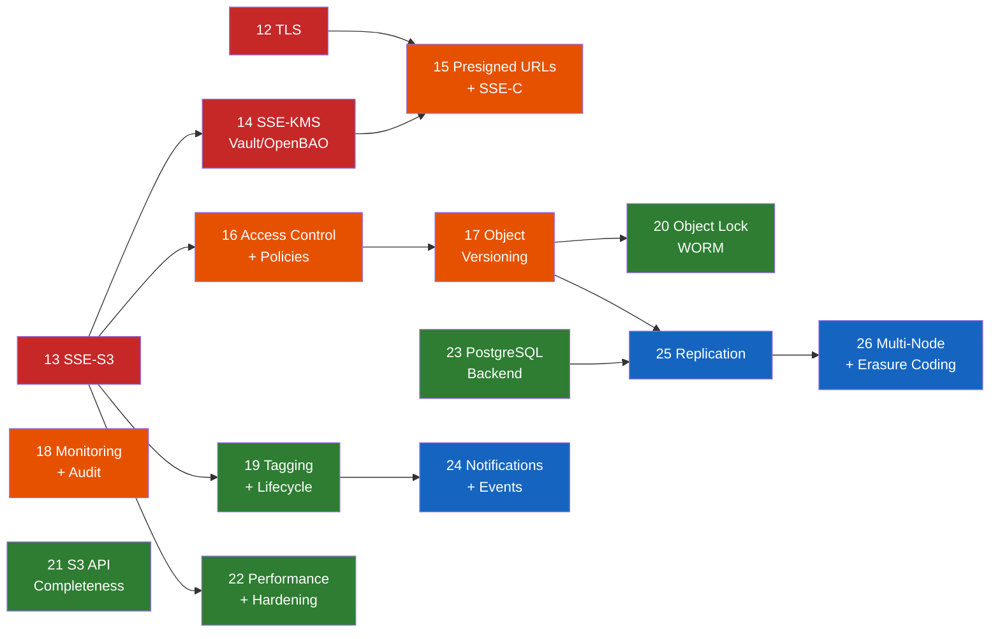

# Roadmap

## MVP Status: COMPLETE

The Arca MVP is complete. All 12 phases (0–11) have been implemented, tested, and verified. The server implements 15 S3 operations with 100% pass rate on implemented features against the Ceph s3-tests compatibility suite (270/829 passing — all 468 failures are in unimplemented feature categories).

See [S3 Compatibility Report](../s3-compatibility/) for the full breakdown.

---

## Full Product Roadmap

The post-MVP roadmap covers the path from a functional single-node S3 server to a
production-grade, enterprise-ready storage platform. Phases are numbered from 12 onward,
continuing from the MVP phases (0–11).

### Priority Legend

| Tag | Meaning |
|-----|---------|
| **P0** | Critical — required for production deployment |
| **P1** | High — expected by most users |
| **P2** | Medium — improves completeness and operational maturity |
| **P3** | Low — advanced features, long-term vision |

### Progress Overview

<!-- post-mvp-progress-bar -->

  

    
12

    
13

    
14

    
15

    
16

    
17

    
18

    
19

    
20

    
21

    
22

    
23

    
24

    
25

    
26

  

<!-- /post-mvp-progress-bar -->

### Dependency Overview

**Legend**: P0 Critical · P1 High · P2 Medium · P3 Low — Arrows indicate dependencies

### Phase Summary

| Phase | Name | Priority | Dependencies | Version | Status |
|:-----:|------|:--------:|:------------:|:-------:|:------:|
| 12 | [TLS/SSL and Transport Security](#phase-12-tlsssl-and-transport-security-p0) | P0 | — | `v0.2.0` | &#x2714; |
| 13 | [Server-Side Encryption: SSE-S3](#phase-13-server-side-encryption-sse-s3-p0) | P0 | — | `v0.3.0` | &#x2714; |
| 14 | [SSE-KMS with HashiCorp Vault/OpenBAO](#phase-14-sse-kms-with-hashicorp-vaultopenbao-p0) | P0 | 13 | `v0.4.1` | &#x2714; |
| 15 | [Presigned URLs, Query-String Auth, and SSE-C](#phase-15-presigned-urls-query-string-auth-and-sse-c-p1) | P1 | 12, 13 | | |
| 16 | [Access Control and Bucket Policies](#phase-16-access-control-and-bucket-policies-p1) | P1 | 13 | | |
| 17 | [Object Versioning](#phase-17-object-versioning-p1) | P1 | 16 | | |
| 18 | [Monitoring, Metrics, and Audit](#phase-18-monitoring-metrics-and-audit-p1) | P1 | — | | |
| 19 | [Object Tagging and Lifecycle Rules](#phase-19-object-tagging-and-lifecycle-rules-p2) | P2 | 13 | | |
| 20 | [Object Lock (WORM Compliance)](#phase-20-object-lock-worm-compliance-p2) | P2 | 17 | | |
| 21 | [S3 API Completeness](#phase-21-s3-api-completeness-p2) | P2 | — | | |
| 22 | [Performance and Hardening](#phase-22-performance-and-hardening-p2) | P2 | 13 | | |
| 23 | [PostgreSQL Backend](#phase-23-postgresql-backend-p2) | P2 | — | | |
| 24 | [Notifications and Event System](#phase-24-notifications-and-event-system-p3) | P3 | 19 | | |
| 25 | [Replication](#phase-25-replication-p3) | P3 | 17, 23 | | |
| 26 | [Multi-Node and Erasure Coding](#phase-26-multi-node-and-erasure-coding-p3) | P3 | All prior | | |

---

### Phase 12 — TLS/SSL and Transport Security [P0]

Native TLS termination in the Arca binary via `tokio-rustls`, enabling encrypted
transport without requiring a reverse proxy.

- [x] Config model: `[server.tls]` section with `cert_dir`, `cert_file`, `key_file`, optional `ca_file` (mTLS), optional `health_port`, `redirect_http` (default true)
- [x] TLS module: cert/key loading from PEM files, auto-detection, `ArcSwap`-based config for hot reload
- [x] `arca tls generate` CLI: self-signed CA + server cert + key via `rcgen`, with configurable SANs and validity
- [x] TLS listener: `tokio-rustls` acceptor + `hyper_util` connection serving, replacing `axum::serve` when TLS is enabled
- [x] Certificate reload on SIGHUP for rotation without downtime
- [x] ~~Health port~~ — removed: single-port approach (HTTPS for everything including health checks)
- [x] `tls_enabled` in AppState and `/admin/info` response
- [x] Docker TLS test infrastructure: compose override, test config, `bin/test tls` mode
- [x] Integration tests: HTTPS health/list/put/get/multipart, health port redirect, wrong CA rejection
- [x] (Console) TLS lock icon indicator in dashboard, derived from `/admin/info`
- [x] Documentation: dedicated TLS guide, config reference, CLI reference, deployment guide updates
- [x] Reverse-proxy documentation updated to note native TLS is available

---

### Phase 13 — Server-Side Encryption: SSE-S3 [P0]

Transparent at-rest encryption using AES-256-GCM with per-object data encryption keys (DEKs).
Local master key from config provides a bootstrap mode before Vault integration.

- [x] Encryption pipeline in `EncryptingBlobStore`: chunk-based AES-256-GCM streaming, random DEK per object, envelope encryption with master KEK
- [x] Master key encrypts DEKs — loaded from `[encryption]` config section (local secret, base64-encoded)
- [x] New `bucket_config` table in SQLite (foundation for versioning, lifecycle, policies in later phases)
- [x] `PutBucketEncryption` / `GetBucketEncryption` / `DeleteBucketEncryption` handlers
- [x] New fields on `ObjectRecord`: `encryption_algorithm`, `encryption_key_id`. DB migration v7
- [x] Sidecar `.meta` extended with encrypted DEK blob. `arca recover` and `arca fsck` handle encrypted objects
- [x] S3 response header: `x-amz-server-side-encryption: AES256`
- [x] `arca encryption generate-key` CLI command for master key generation
- [x] Mixed-mode: encrypted and unencrypted blobs coexist transparently
- [x] Byte range reads on encrypted objects (chunk-level seek and decrypt)
- [x] Docker encryption test infrastructure: compose overlay, `bin/test encryption` mode, 16 integration tests
- [x] (Console) Encryption indicator in dashboard and object detail panel
- [x] Resolves: TD-006

---

### Phase 14 — SSE-KMS with HashiCorp Vault/OpenBAO [P0]

Master key fetched from HashiCorp Vault or OpenBAO (100% API-compatible) KV v2 secrets
engine at startup, cached in memory. Vault is only needed at startup — not a runtime
dependency. Encryption pipeline (EncryptingBlobStore, DEK wrap/unwrap, streaming) unchanged.

- [x] `reqwest` dependency (rustls-tls backend) for Vault HTTP client at startup
- [x] Config: `[encryption.kms]` with `endpoint`, `auth_method` (`token` | `approle`), `secret_path`, `secret_field`, `ca_file`, `tls_skip_verify`. Mutually exclusive with `master_key`
- [x] Vault KV v2 client (`vault.rs`): `fetch_master_key`, AppRole login, auto-normalization of `/data/` path segment
- [x] Vault auth methods: token and AppRole. 100% compatible with both HashiCorp Vault and OpenBAO
- [x] Clear error messages on connection failure, auth failure, missing secret, invalid key
- [x] AppState extended with `kms_provider` ("local" | "vault") and `kms_endpoint`
- [x] `/admin/info` response includes `kms_provider` and `kms_endpoint` fields
- [x] (Console) Dashboard shows "SSE-S3 (Vault)" vs "SSE-S3 (Local)" based on KMS provider
- [x] Docker: OpenBAO KV v2 overlay (`docker-compose.kms.yml`) with AppRole and random key generation
- [x] Test infrastructure: `bin/test kms` mode, 10 integration tests (put/get, headers, ETag, multipart, copy, range, admin info, per-bucket encryption)
- [x] 16 new unit tests (8 config validation + 8 Vault path/response parsing)

**Depends on**: Phase 13 (encryption pipeline and bucket encryption config)

---

### Phase 15 — Presigned URLs, Query-String Auth, and SSE-C [P1]

Enable URL-based authentication for direct browser downloads and customer-provided encryption keys.

- [ ] Query-string SigV4 in `arca-auth`: parse `X-Amz-Algorithm`, `X-Amz-Credential`, `X-Amz-Date`, `X-Amz-Expires`, `X-Amz-SignedHeaders`, `X-Amz-Signature` from query params
- [ ] Auth middleware fallback: no `Authorization` header → check query-string params
- [ ] URL expiration validation (reject expired presigned URLs)
- [ ] SSE-C: customer-provided keys via `x-amz-server-side-encryption-customer-algorithm`, `x-amz-server-side-encryption-customer-key`, `x-amz-server-side-encryption-customer-key-MD5` headers. Key used for encrypt/decrypt, never stored
- [ ] Optional admin endpoint: `POST /admin/presign` for server-side URL generation
- [ ] (Console) "Share" button on objects: generate presigned URL with configurable expiry, copy-to-clipboard

**Depends on**: Phase 12 (TLS recommended for production presigned URLs), Phase 13 (encryption pipeline for SSE-C)

---

### Phase 16 — Access Control and Bucket Policies [P1]

Replace the current "all credentials have full access" model with proper ownership, policies, and ACLs.

- [ ] Owner model: replace hardcoded `"arca"` owner with credential-linked `owner_id`
- [ ] Bucket policies: `PutBucketPolicy` / `GetBucketPolicy` / `DeleteBucketPolicy`. JSON policy documents (IAM policy subset: Effect, Principal, Action, Resource). Policy evaluation in auth middleware
- [ ] Canned ACLs: `PutBucketAcl` / `GetBucketAcl`, `PutObjectAcl` / `GetObjectAcl` (private, public-read, public-read-write, authenticated-read)
- [ ] Public access block: `PutPublicAccessBlock` / `GetPublicAccessBlock` / `DeletePublicAccessBlock`
- [ ] CORS persistence: `PutBucketCors` / `GetBucketCors` / `DeleteBucketCors` (currently static middleware — make per-bucket, stored in `bucket_config`)
- [ ] (Console) Bucket settings panel: policy editor (JSON), ACL selector, CORS rules editor
- [ ] Resolves: TD-001, large portion of TD-007

**Depends on**: Phase 13 (`bucket_config` table)

---

### Phase 17 — Object Versioning [P1]

Full object versioning with version IDs, delete markers, and version-specific operations.

- [ ] Versioning state per bucket: `PutBucketVersioning` / `GetBucketVersioning` (Disabled / Enabled / Suspended)
- [ ] Version IDs (UUID) on `put_object` when versioning is enabled
- [ ] Schema migration: `objects` table gains `version_id`, `is_latest`, `is_delete_marker` columns
- [ ] Delete markers: `DeleteObject` on versioned bucket inserts a delete marker instead of removing the object
- [ ] Version-specific operations: `GetObject?versionId=X`, `HeadObject?versionId=X`, `DeleteObject?versionId=X`
- [ ] `ListObjectVersions` with real version data (replace TD-003 fake implementation)
- [ ] `arca recover` updated for versioned objects (multiple sidecars per bucket/key pair)
- [ ] (Console) Version history panel, restore previous version, delete marker indicator
- [ ] Resolves: TD-003

**Depends on**: Phase 16 (access control interacts with versioning)

---

### Phase 18 — Monitoring, Metrics, and Audit [P1]

Operational visibility through metrics, distributed tracing, and audit logging.

- [ ] Prometheus metrics endpoint: `GET /metrics`. Counters: request count by operation/status. Histograms: request latency. Gauges: active connections, storage bytes used, object count, bucket count
- [ ] OpenTelemetry tracing: optional OTLP exporter, distributed trace IDs in request headers
- [ ] Audit logging: structured JSON for every S3 operation (who, what, where, when, result). Configurable output: file, stdout, syslog. Optional S3 server access log format
- [ ] Configurable region in `config.toml`, per-bucket region stored in `bucket_config`
- [ ] (Console) Real-time metrics dashboard, audit log viewer with filtering
- [ ] Resolves: TD-004

---

### Phase 19 — Object Tagging and Lifecycle Rules [P2]

Object metadata tagging and automated lifecycle management for storage hygiene.

- [ ] Object tagging: `PutObjectTagging` / `GetObjectTagging` / `DeleteObjectTagging`. New `object_tags` table. Tags on `PutObject` via `x-amz-tagging` header
- [ ] Lifecycle rules: `PutBucketLifecycleConfiguration` / `GetBucketLifecycleConfiguration` / `DeleteBucketLifecycleConfiguration`. Rules stored in `bucket_config`
- [ ] Expiration (delete after N days), abort incomplete multipart uploads after N days, tag-based filtering
- [ ] Background worker framework: tokio task scheduler in `main.rs` for periodic lifecycle evaluation (reused by notifications later)
- [ ] (Console) Object tagging UI (view/edit key-value pairs), lifecycle rules editor in bucket settings

**Depends on**: Phase 13 (`bucket_config` table)

---

### Phase 20 — Object Lock (WORM Compliance) [P2]

Write-Once-Read-Many compliance for regulatory and data protection requirements.

- [ ] Object Lock config: `PutObjectLockConfiguration` / `GetObjectLockConfiguration`. Per-bucket default retention mode (GOVERNANCE / COMPLIANCE) and period
- [ ] Per-object retention: `PutObjectRetention` / `GetObjectRetention`. Mode + retain-until-date per version
- [ ] Legal hold: `PutObjectLegalHold` / `GetObjectLegalHold`. Binary flag per object version
- [ ] Enforcement: locked objects cannot be deleted or overwritten. GOVERNANCE mode allows bypass with permission. COMPLIANCE mode: no bypass whatsoever
- [ ] (Console) Object lock status indicator, retention date display, legal hold toggle

**Depends on**: Phase 17 (versioning — Object Lock operates on object versions)

---

### Phase 21 — S3 API Completeness [P2]

Fill remaining gaps in the S3 API surface to maximize compatibility.

- [ ] `ListParts`: `GET /{bucket}/{key}?uploadId=X` (MetadataStore method already exists)
- [ ] `GetObjectAttributes`: `GET /{bucket}/{key}?attributes`
- [ ] Checksum algorithms: `x-amz-checksum-sha256`, `x-amz-checksum-crc32`, `x-amz-checksum-crc64nvme`
- [ ] Storage classes: `storage_class` field on `ObjectRecord`, accept `x-amz-storage-class` header on PutObject
- [ ] Chunked transfer with SigV4 payload signing (`STREAMING-AWS4-HMAC-SHA256-PAYLOAD`)
- [ ] Resolves: TD-002, TD-008

---

### Phase 22 — Performance and Hardening [P2]

Production-grade limits, caching, and graceful operations.

- [ ] Request size limits: configurable max body size (default 5 GB for PutObject)
- [ ] Rate limiting: per-credential and per-IP via Tower middleware
- [ ] In-memory LRU cache for metadata lookups (bucket existence, HEAD). Invalidation on writes
- [ ] Graceful rolling upgrades: drain connections, health endpoint reports "draining", configurable drain timeout
- [ ] Performance benchmarking suite: automated benchmarks (concurrent uploads, large files, metadata ops/sec)
- [ ] Security hardening: request validation, header size limits
- [ ] `arca encrypt-existing` / `arca decrypt-existing` CLI tools for background encryption/decryption of existing objects in-place

**Depends on**: Phase 13 (encryption pipeline)

---

### Phase 23 — PostgreSQL Backend [P2]

Alternative metadata backend for deployments requiring a shared database.

- [ ] `PgMetadataStore` implementing the existing `MetadataStore` trait (`sqlx` or `tokio-postgres`)
- [ ] `PgCredentialStore` implementation
- [ ] Config switch: `[storage.metadata] type = "sqlite" | "postgres"` with connection string
- [ ] Data migration tool: `arca migrate-db --from sqlite --to postgres`
- [ ] (Console) Server info panel shows database backend type

---

### Phase 24 — Notifications and Event System [P3]

S3-compatible bucket notifications for event-driven architectures.

- [ ] Bucket notifications: `PutBucketNotificationConfiguration` / `GetBucketNotificationConfiguration`
- [ ] Events: `s3:ObjectCreated:*`, `s3:ObjectRemoved:*`
- [ ] Webhook destination (HTTP POST). Optional: AMQP, Redis Streams, NATS
- [ ] S3-compatible JSON event format (`Records[].s3.bucket/object/eventName`)
- [ ] (Console) Notification rules editor, event log viewer

**Benefits from**: Phase 19 (background worker framework)

---

### Phase 25 — Replication [P3]

Asynchronous cross-instance replication for disaster recovery and geographic distribution.

- [ ] Change journal in metadata DB, replication worker forwards objects to destination Arca instance
- [ ] `PutBucketReplication` / `GetBucketReplication` / `DeleteBucketReplication` config
- [ ] `x-amz-replication-status` headers (PENDING / COMPLETED / FAILED / REPLICA)
- [ ] Conflict resolution: last-writer-wins by timestamp

**Depends on**: Phase 17 (versioning), Phase 23 (PostgreSQL for production)

---

### Phase 26 — Multi-Node and Erasure Coding [P3]

Distributed storage for horizontal scalability and data durability beyond single-node.

- [ ] Erasure coding: data + parity shards across storage volumes (e.g., EC:4+2)
- [ ] Multi-node clustering: service discovery, consistent hashing, distributed metadata
- [ ] S3 Batch Operations API
- [ ] `SelectObjectContent` (SQL queries on CSV/JSON)

**Depends on**: All prior phases. Major architecture evolution.

---

### Console Enhancements

Independent of server phases — can ship at any time.

- [x] Multipart upload with progress bar (P2)
- [x] Drag-and-drop upload (P2)
- [x] Directory upload with structure preservation (P2)
- [x] Multi-select with batch operations (P2)
- [x] Batch delete with recursive directory support (P2)
- [x] Batch download as streaming tar.gz archive (P2) — requires `POST /admin/archive` endpoint
- [ ] Object preview: images, text, JSON, PDF (P2)
- [ ] Search and filter within buckets (P2)
- [ ] Dark/light theme toggle (P3)
- [ ] Responsive mobile layout (P3)

---

## MVP Implementation Plan

Each phase built on the previous one and ended with verification: unit tests, boto3 integration tests, and manual `aws s3` CLI checks — all inside Docker containers.

### Progress Overview

<!-- progress-bar -->

  

    
0

    
1

    
2

    
3

    
4

    
5

    
6

    
7

    
8

    
9

    
10

    
11

  

<!-- /progress-bar -->

| Phase | Name | Status |
|:-----:|------|:------:|
| 0 | [Project Skeleton](#phase-0-project-skeleton) | &#x2714; |
| 1 | [Configuration & Storage Foundation](#phase-1-configuration-storage-foundation) | &#x2714; |
| 2 | [Bucket Operations](#phase-2-bucket-operations) | &#x2714; |
| 3 | [Core Object Operations](#phase-3-core-object-operations) | &#x2714; |
| 4 | [CopyObject + ListObjectsV2](#phase-4-copyobject-listobjectsv2) | &#x2714; |
| 5 | [Multipart Upload](#phase-5-multipart-upload) | &#x2714; |
| 6 | [AWS SigV4 Authentication](#phase-6-aws-sigv4-authentication) | &#x2714; |
| 7 | [Disaster Recovery + Polish](#phase-7-disaster-recovery-polish) | &#x2714; |
| 8 | [Admin API](#phase-8-admin-api) | &#x2714; |
| 9 | [Web Console](#phase-9-web-console) | &#x2714; |
| 10 | [S3 Compatibility Hardening](#phase-10-s3-compatibility-hardening) | &#x2714; |
| 11 | [Documentation](#phase-11-documentation) | &#x2714; |

<!-- Status: green checkmark = done, :construction: = in progress, empty = not started -->

---

## Phase 0 — Project Skeleton

Set up the Cargo workspace with all 5 crates and the basic infrastructure.

- [x] Initialize Cargo workspace: `arca-core`, `arca-auth`, `arca-proto`, `arca-storage`, `arca-server`
- [x] Scaffold Axum router with stub handlers returning `S3Error::NotImplemented`
- [x] Wire `XmlErrorResponse` so all requests return valid S3 XML errors
- [x] Dockerfile (multi-stage: `rust:1.85-bookworm` builder + `debian:bookworm-slim` runtime), docker-compose.yml
- [x] LICENSE, CLAUDE.md, `config/default.toml`

**Verify**: `docker compose up` starts server; `aws s3 ls --endpoint-url http://localhost:9000` returns valid S3 XML error (NotImplemented).

---

## Phase 1 — Configuration & Storage Foundation

Establish the configuration model and SQLite database foundation. MinIO-like approach: static server settings in a TOML config file, dynamic data (credentials, users) in the database.

- [x] Config file at `/etc/arca/config.toml` (default), `config/default.toml` as repo template, `--config-path` override
- [x] SQLite database initialization in `arca-storage` (tokio-rusqlite, WAL mode)
- [x] Schema: `credentials` table (access_key_id, secret_access_key, created_at, active)
- [x] `arca credential add/list/remove` CLI subcommands (direct SQLite access)
- [x] Auto-generate root credential on first startup if none exist, print to stdout
- [x] Unit tests for config loading, credential CRUD, auto-generation
- [x] Integration test: server starts, prints generated credentials

**Verify**: `bin/arca start -d --build` starts server and prints auto-generated credentials; `arca credential list` shows the generated credential.

---

## Phase 2 — Bucket Operations

Implement the 4 bucket operations with SQLite metadata storage.

- [x] SQLite schema (`buckets` table), `SqliteMetadataStore` bucket methods
- [x] Bucket name validation (S3 naming rules) in `arca-core`, handlers call MetadataStore directly
- [x] Axum handlers in `arca-proto/handlers/bucket.rs` with `AppState` injection
- [x] XML response types: `ListAllMyBucketsResult`
- [x] Unit tests for validation (~22 tests), `SqliteMetadataStore` (~7 tests), XML types (~3 tests)
- [x] Integration test: `test_buckets.py` with boto3 (~10 tests)

**Verify**: `aws s3 mb`, `aws s3 ls`, `aws s3 rb` all work.

---

## Phase 3 — Core Object Operations

Implement PutObject, GetObject, HeadObject, and DeleteObject with streaming I/O.

- [x] `FsBlobStore`: UUID path generation, configurable prefix depth (1–4, default 2), streaming write with concurrent MD5 computation, atomic rename (temp file + rename), sidecar `.meta` JSON write
- [x] `FsBlobStore.get()`: streaming read via `tokio::fs::File`, byte range support (seek + take)
- [x] SQLite `objects` table, `SqliteMetadataStore` object methods (put returns old record for cleanup), `bucket_is_empty` check
- [x] Axum handlers with streaming request/response bodies (handlers call BlobStore + MetadataStore directly)
- [x] DeleteBucket now checks bucket is empty before deleting (returns BucketNotEmpty 409)
- [x] Unit tests for `FsBlobStore` (~12 tests), `SqliteMetadataStore` objects (~7 tests)
- [x] Integration test: `test_objects.py` (~12 tests)

**Verify**: `aws s3 cp localfile s3://bucket/key` and back, range requests, ETags, Content-Type.

---

## Phase 4 — CopyObject + ListObjectsV2

Add object copying and listing with prefix/delimiter/pagination support.

- [x] CopyObject: `PUT /{bucket}/{*key}` with `x-amz-copy-source` header, stream-through copy via BlobStore get → put
- [x] `SqliteMetadataStore::list_objects`: SQL with `key > ?` for pagination, `key LIKE ?` for prefix, delimiter handling for common prefixes
- [x] Continuation token: base64-encoded last key (opaque to client)
- [x] XML response: `ListBucketResult` with Contents, CommonPrefixes, IsTruncated, NextContinuationToken
- [x] Integration tests: `test_list.py` (~12 tests), `TestCopyObject` (~6 tests), unit tests for XML builders and list_objects

**Verify**: `aws s3 ls s3://bucket/prefix/`, `aws s3 cp s3://bucket/a s3://bucket/b`.

---

## Phase 5 — Multipart Upload

Full multipart upload lifecycle with composite ETag computation.

- [x] SQLite tables: `multipart_uploads`, `parts`
- [x] `MetadataStore` multipart methods: create/get/delete upload, put/list parts
- [x] Parts stored as normal blobs via `BlobStore::put()`, stream-concatenated at complete time
- [x] Composite ETag: `hex(MD5(binary_MD5(part1) || binary_MD5(part2) || ...))-{count}`
- [x] XML: `InitiateMultipartUploadResult`, `CompleteMultipartUploadResult`, parse `CompleteMultipartUpload` request body
- [x] Query-param dispatch in object/multipart handlers
- [x] Part size validation at complete time (non-last parts >= 5 MB)
- [x] Integration test: `test_multipart.py` (~12 tests)

**Verify**: `aws s3 cp largefile s3://bucket/key` (triggers multipart in aws-cli), ETag format is `"<hex>-<count>"`.

---

## Phase 6 — AWS SigV4 Authentication

Full AWS Signature V4 implementation with auth middleware. Credentials loaded from the SQLite database (managed via `arca credential` CLI from Phase 1).

- [x] `arca-auth`: Full SigV4 implementation (canonical request, string-to-sign, signing key derivation, signature verification)
- [x] Test against AWS SigV4 test vectors (downloadable test suite)
- [x] Constant-time signature comparison via `subtle`
- [x] Auth middleware in `arca-proto`: parse Authorization header, look up credential in DB, verify signature
- [x] Virtual-hosted-style middleware: rewrite `bucket.s3.domain/key` -> `/bucket/key`
- [x] Trailing-slash normalization with original URI preservation (mc compatibility)
- [x] Environment variable credential override (`ARCA_ROOT_ACCESS_KEY`/`ARCA_ROOT_SECRET_KEY`) for testing
- [x] Integration tests: valid credentials succeed, bad credentials get `SignatureDoesNotMatch` / `InvalidAccessKeyId`

**Verify**: Set up credentials via `arca credential add`, all operations require auth, unauthenticated requests rejected.

---

## Phase 7 — Disaster Recovery + Polish

Recovery tools, operational logging, and graceful shutdown.

- [x] `arca recover` CLI: walk `data/` tree, read all `.meta` sidecar files, rebuild SQLite DB from scratch. Supports `--dry-run` for preview and `--skip-verify` to skip MD5 checksum verification. Preserves credentials across DB rebuild. Skips orphaned/malformed/corrupt sidecars with warnings.
- [x] `arca fsck` CLI: compare DB records against filesystem, report orphaned blobs / missing blobs / sidecar mismatches / orphaned sidecars / stale temp files. Optional `--verify-checksums` for MD5 verification of every blob. Exit code 0 = clean, 1 = issues found.
- [x] Structured logging with tracing (`--log-format text|json` on `serve` command)
- [x] Graceful shutdown (finish in-flight requests on SIGTERM/SIGINT)
**Verify**: Delete SQLite DB, run `arca recover`, verify all data accessible again.

---

## Phase 8 — Admin API

JSON-based administration API for the web console and other management tools.
Endpoints live under `/admin/*` on the same port (9000), using SigV4 auth.

- [x] Health, info, stats endpoints (`GET /admin/health`, `/admin/info`, `/admin/stats`)
- [x] Credential CRUD (`GET/POST /admin/credentials`, `DELETE /admin/credentials/{access_key_id}`)
- [x] Unit + integration tests

**Verify**: Admin API responds to health/info/stats requests; credential CRUD works via API.

---

## Phase 9 — Web Console

Web-based administration console and bucket browser, deployed as a **separate application**
(`console/` directory) that communicates with Arca exclusively via S3 API and Admin API.

- [x] Web console app: single-file Alpine.js + Tailwind CSS, "The Vault" dark theme, nginx:alpine Docker image
- [x] Admin dashboard: bento-grid layout with server info, storage stats, SVG donut chart, health indicator, auto-refresh
- [x] Bucket browser: list/create/delete buckets, prefix navigation with breadcrumbs, upload/download/delete objects, detail panel, treemap visualization
- [x] Credential management: card grid, create with reveal-once secret, delete with confirmation, lockout warning
- [x] Browser SigV4 signing via Web Crypto API, CORS middleware in Arca
- [x] Admin flag on credentials: `admin` boolean field, migration v5, CLI `--admin` flag
- [x] Admin-only access to Admin API endpoints (non-admin gets 403)
- [x] Role-aware console: admin sees dashboard + credentials + buckets; non-admin sees buckets only
- [x] Lockout prevention: cannot delete last admin credential

**Verify**: Web console connects to Arca and provides dashboard and bucket browsing.

---

## Phase 10 — S3 Compatibility Hardening

Run industry-standard compatibility tests and harden edge cases.

- [x] Set up Ceph s3-tests in Docker (`docker/s3-tests/Dockerfile` + `s3tests.conf`, `bin/s3-tests` runner)
- [x] Run test suite, triage failures — 232 pass / 506 fail / 91 skip (see `s3-tests/TRIAGE.md`)
- [x] Fix compatibility issues: `x-amz-request-id`/`x-amz-id-2`/`Server` headers, `GetBucketLocation`, `CreateBucket` idempotency, `ListObjectsV1`, empty delimiter handling, whitespace-preserving `DeleteObjects` XML parser, unimplemented PUT bucket ops return 501
- [x] Track pass/fail list (`s3-tests/passlist.txt`), HTML compatibility dashboard (`s3-tests/report.html`)
- [x] Performance testing with concurrent requests + large files (`tests/perf/perf_test.py`, `bin/perf-test`)

**Verify**: Ceph s3-tests running in CI, pass/fail list tracked, no regressions.

---

## Phase 11 — Documentation

Comprehensive manuals and guides for users, administrators, and operators.

- [x] Restructured documentation into grouped sections (Getting Started, User Guide, Reference, Operations)
- [x] Installation guide and Quick Start
- [x] CLI reference (extracted from configuration page)
- [x] Web Console guide with automated screenshots
- [x] Disaster Recovery guide (extracted from configuration + architecture)
- [x] Monitoring & Logging guide
- [x] Production Deployment guide
- [x] Automated screenshot tool (`bin/screenshots`, Playwright + Docker)

**Verify**: All manuals published on GitHub Pages, covering installation through production operations.

---

## Post-MVP — Technical Debt

The MVP includes several workarounds and hardcoded values that pass compatibility
tests but need proper implementation for production use. These are tracked in
[`TECH_DEBT.md`](https://github.com/dxc-technology/arca/blob/main/TECH_DEBT.md)
with unique IDs (`TD-XXX`) referenced in source code comments.

Remaining items:

- **Ownership model** (TD-001): Owner ID hardcoded to `"arca"` — needs account/user model tied to credentials
- **Storage classes** (TD-002): Always `STANDARD` — no storage tiering
- **Versioning** (TD-003): Faked for mc compatibility — no real version tracking
- **Region support** (TD-004): Hardcoded `us-east-1` — no per-bucket regions
- ~~**Request ID consistency** (TD-005)~~: **Resolved** — error XML and response header now match
- ~~**Encryption** (TD-006)~~: **Resolved** — SSE-S3 with AES-256-GCM implemented in Phase 13
- **Unimplemented ops** (TD-007): ~35 bucket operations return 501
- **Multipart Content-Type** (TD-008): Captured at init time — verify against AWS semantics
