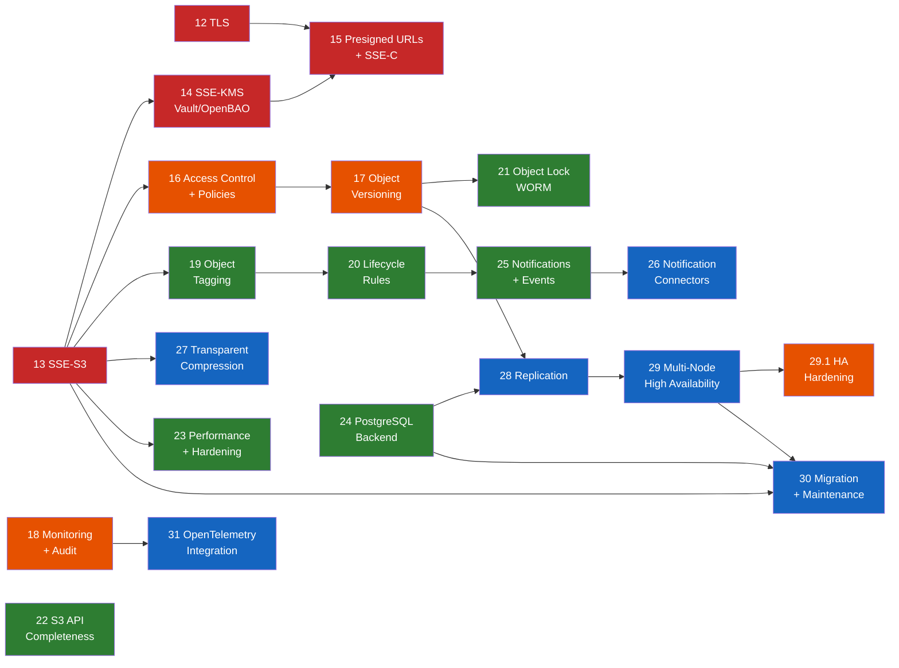

# Roadmap

## MVP

<!-- mvp-progress-bar -->

  

    
0

    
1

    
2

    
3

    
4

    
5

    
6

    
7

    
8

    
9

    
10

    
11

  

<!-- /mvp-progress-bar -->

The Arca MVP (Minimum Viable Product) is complete. All 12 phases (0–11) have been implemented, tested, and verified. The server implements 15 S3 operations with 100% pass rate on implemented features against the Ceph s3-tests compatibility suite (270/829 passing — all 468 failures are in unimplemented feature categories).

---

## Full Product Roadmap

The post-MVP roadmap covers the path from a functional single-node S3 server to a
production-grade, enterprise-ready storage platform. Phases are numbered from 12 onward,
continuing from the MVP phases (0–11).

### Priority Legend

| Tag | Meaning |
|-----|---------|
| **P0** | Critical — required for production deployment |
| **P1** | High — expected by most users |
| **P2** | Medium — improves completeness and operational maturity |
| **P3** | Low — advanced features, long-term vision |

### Progress Overview

<!-- post-mvp-progress-bar -->

  

    
12

    
13

    
14

    
15

    
16

    
17

    
18

    
19

    
20

    
21

    
22

    
23

    
24

    
25

    
26

    
27

    
28

    
29

    
29.1

    
30

    
31

  

<!-- /post-mvp-progress-bar -->

### Dependency Overview

**Legend**: P0 Critical · P1 High · P2 Medium · P3 Low — Arrows indicate dependencies

### Phase Summary

| Phase | Name | Priority | Dependencies | Version | Status |
|:-----:|------|:--------:|:------------:|:-------:|:------:|
| 12 | [TLS/SSL and Transport Security](#phase-12-tlsssl-and-transport-security-p0) | P0 | — | `v0.2.0` | &#x2714; |
| 13 | [Server-Side Encryption: SSE-S3](#phase-13-server-side-encryption-sse-s3-p0) | P0 | — | `v0.3.0` | &#x2714; |
| 14 | [SSE-KMS with HashiCorp Vault/OpenBAO](#phase-14-sse-kms-with-hashicorp-vaultopenbao-p0) | P0 | 13 | `v0.5.0` | &#x2714; |
| 15 | [Presigned URLs, Query-String Auth, and SSE-C](#phase-15-presigned-urls-query-string-auth-and-sse-c-p1) | P1 | 12, 13 | `v0.6.0` | &#x2714; |
| 16 | [Access Control and Bucket Policies](#phase-16-access-control-and-bucket-policies-p1) | P1 | 13 | `v0.7.0` | &#x2714; |
| 17 | [Object Versioning](#phase-17-object-versioning-p1) | P1 | 16 | `v0.8.1` | &#x2714; |
| 18 | [Monitoring, Metrics, and Audit](#phase-18-monitoring-metrics-and-audit-p1) | P1 | — | `v0.9.0` | &#x2714; |
| 19 | [Object Tagging](#phase-19-object-tagging-p2) | P2 | 13 | `v0.12.0` | &#x2714; |
| 20 | [Lifecycle Rules](#phase-20-lifecycle-rules-p2) | P2 | 19, 18 | `v0.13.0` | &#x2714; |
| 21 | [Object Lock (WORM Compliance)](#phase-21-object-lock-worm-compliance-p2) | P2 | 17 | `v0.13.0` | &#x2714; |
| 22 | [S3 API Completeness](#phase-22-s3-api-completeness-p2) | P2 | — | `v0.14.0` | &#x2714; |
| 23 | [Performance and Hardening](#phase-23-performance-and-hardening-p2) | P2 | 13 | `v0.14.0` | &#x2714; |
| 24 | [PostgreSQL Backend](#phase-24-postgresql-backend-p2) | P2 | — | `v0.16.1` | &#x2714; |
| 25 | [Notifications and Event System](#phase-25-notifications-and-event-system-p3) | P3 | 20 | `v0.18.0` | &#x2714; |
| 26 | [Notification Connectors](#phase-26-notification-connectors-p3) | P3 | 25 | `v0.20.0` | &#x2714; |
| 27 | [Transparent Compression](#phase-27-transparent-compression-p2) | P2 | 13 | `v0.21.0` | &#x2714; |
| 28 | [Replication](#phase-28-replication-p3) | P3 | 17, 24 | `v0.23.0` | &#x2714; |
| 29 | [Multi-Node High Availability](#phase-29-multi-node-high-availability-p3) | P3 | All prior | `v0.25.0` | &#x2714; |
| 29.1 | [HA Hardening](#phase-291-ha-hardening-p1) | P1 | 29 | `v0.26.0` | &#x2714; |
| 30 | [Migration and Maintenance](#phase-30-migration-and-maintenance-p3) | P3 | 13, 24, 29 | `v0.28.0` | &#x2714; |
| 31 | [OpenTelemetry Integration](#phase-31-opentelemetry-integration-p3) | P3 | 18 | | |

---

### Phase 12 — TLS/SSL and Transport Security [P0]

Native TLS termination in the Arca binary via `tokio-rustls`, enabling encrypted
transport without requiring a reverse proxy.

- [x] Config model: `[server.tls]` section with `cert_dir`, `cert_file`, `key_file`, optional `ca_file` (mTLS), optional `health_port`, `redirect_http` (default true)
- [x] TLS module: cert/key loading from PEM files, auto-detection, `ArcSwap`-based config for hot reload
- [x] `arca tls generate` CLI: self-signed CA + server cert + key via `rcgen`, with configurable SANs and validity
- [x] TLS listener: `tokio-rustls` acceptor + `hyper_util` connection serving, replacing `axum::serve` when TLS is enabled
- [x] Certificate reload on SIGHUP for rotation without downtime
- [x] ~~Health port~~ — removed: single-port approach (HTTPS for everything including health checks)
- [x] `tls_enabled` in AppState and `/admin/info` response
- [x] Docker TLS test infrastructure: compose override, test config, `bin/test tls` mode
- [x] Integration tests: HTTPS health/list/put/get/multipart, health port redirect, wrong CA rejection
- [x] (Console) TLS lock icon indicator in dashboard, derived from `/admin/info`
- [x] Documentation: dedicated TLS guide, config reference, CLI reference, deployment guide updates
- [x] Reverse-proxy documentation updated to note native TLS is available

---

### Phase 13 — Server-Side Encryption: SSE-S3 [P0]

Transparent at-rest encryption using AES-256-GCM with per-object data encryption keys (DEKs).
Local master key from config provides a bootstrap mode before Vault integration.

- [x] Encryption pipeline in `EncryptingBlobStore`: chunk-based AES-256-GCM streaming, random DEK per object, envelope encryption with master KEK
- [x] Master key encrypts DEKs — loaded from `[encryption]` config section (local secret, base64-encoded)
- [x] New `bucket_config` table in SQLite (foundation for versioning, lifecycle, policies in later phases)
- [x] `PutBucketEncryption` / `GetBucketEncryption` / `DeleteBucketEncryption` handlers
- [x] New fields on `ObjectRecord`: `encryption_algorithm`, `encryption_key_id`. DB migration v7
- [x] Sidecar `.meta` extended with encrypted DEK blob. `arca recover` and `arca fsck` handle encrypted objects
- [x] S3 response header: `x-amz-server-side-encryption: AES256`
- [x] `arca encryption generate-key` CLI command for master key generation
- [x] Mixed-mode: encrypted and unencrypted blobs coexist transparently
- [x] Byte range reads on encrypted objects (chunk-level seek and decrypt)
- [x] Docker encryption test infrastructure: compose overlay, `bin/test encryption` mode, 16 integration tests
- [x] (Console) Encryption indicator in dashboard and object detail panel
- [x] Resolves: TD-006

---

### Phase 14 — SSE-KMS with HashiCorp Vault/OpenBAO [P0]

Master key fetched from HashiCorp Vault or OpenBAO (100% API-compatible) KV v2 secrets
engine at startup, cached in memory. Vault is only needed at startup — not a runtime
dependency. Encryption pipeline (EncryptingBlobStore, DEK wrap/unwrap, streaming) unchanged.

- [x] `reqwest` dependency (rustls-tls backend) for Vault HTTP client at startup
- [x] Config: `[encryption.kms]` with `endpoint`, `auth_method` (`token` | `approle`), `secret_path`, `secret_field`, `ca_file`, `tls_skip_verify`. Mutually exclusive with `master_key`
- [x] Vault KV v2 client (`vault.rs`): `fetch_master_key`, AppRole login, auto-normalization of `/data/` path segment
- [x] Vault auth methods: token and AppRole. 100% compatible with both HashiCorp Vault and OpenBAO
- [x] Clear error messages on connection failure, auth failure, missing secret, invalid key
- [x] AppState extended with `kms_provider` ("local" | "vault") and `kms_endpoint`
- [x] `/admin/info` response includes `kms_provider` and `kms_endpoint` fields
- [x] (Console) Dashboard shows "SSE-S3 (Vault)" vs "SSE-S3 (Local)" based on KMS provider
- [x] Docker: OpenBAO KV v2 overlay (`docker-compose.kms.yml`) with AppRole and random key generation
- [x] Test infrastructure: `bin/test kms` mode, 10 integration tests (put/get, headers, ETag, multipart, copy, range, admin info, per-bucket encryption)
- [x] 16 new unit tests (8 config validation + 8 Vault path/response parsing)

**Depends on**: Phase 13 (encryption pipeline and bucket encryption config)

---

### Phase 15 — Presigned URLs, Query-String Auth, and SSE-C [P1]

Enable URL-based authentication for direct browser downloads and customer-provided encryption keys.

- [x] Query-string SigV4 in `arca-auth`: parse `X-Amz-Algorithm`, `X-Amz-Credential`, `X-Amz-Date`, `X-Amz-Expires`, `X-Amz-SignedHeaders`, `X-Amz-Signature` from query params
- [x] Auth middleware fallback: no `Authorization` header → check query-string params
- [x] URL expiration validation (reject expired presigned URLs)
- [x] Presigned URL generation in `arca-auth`: `generate_presigned_url()` pure function for server-side URL creation
- [x] SSE-C: customer-provided keys via `x-amz-server-side-encryption-customer-algorithm`, `x-amz-server-side-encryption-customer-key`, `x-amz-server-side-encryption-customer-key-MD5` headers. Key used for encrypt/decrypt, never stored
- [x] SSE-C support for PutObject, GetObject, HeadObject, CopyObject (including cross-mode: SSE-C↔plain, SSE-C↔SSE-C)
- [x] SSE-C multipart uploads properly rejected with clear error (TECHDEBT TD-010)
- [x] Admin endpoint: `POST /admin/presign` for server-side URL generation
- [x] (Console) "Share" button on objects: generate presigned URL with configurable expiry (1h/6h/1d/7d), copy-to-clipboard
- [x] Integration tests: 15 presigned URL tests (GET/PUT/HEAD/DELETE, security, admin presign) + 17 SSE-C tests (put/get, errors, head, copy, range, delete, validation, multipart rejection)

**Depends on**: Phase 12 (TLS recommended for production presigned URLs), Phase 13 (encryption pipeline for SSE-C)

---

### Phase 16 — Access Control and Bucket Policies [P1]

Role-based access control with users, teams, and policy-based authorization.

- [x] RBAC foundation: User, Team, Grant types with store traits and SQLite implementations
- [x] Policy evaluation engine: AWS IAM-style documents (Effect, Action, Resource), wildcard matching, deny-overrides
- [x] S3 authorization middleware: every S3 request evaluated against effective policies (root users bypass)
- [x] Admin authorization: non-root users need `arca:*` grants for admin endpoints
- [x] Identity resolution: credential → user → (direct grants + team grants) → effective policies
- [x] Built-in grants: AdministratorAccess, S3FullAccess, S3ReadOnlyAccess
- [x] Owner model: buckets and objects track creator's username. Resolves TD-001
- [x] Admin API: `/admin/me`, `/admin/users`, `/admin/teams`, `/admin/grants` with CRUD, membership, attachments
- [x] CLI: `arca user create/list/delete`, `arca credential add --user`
- [x] SQLite migration v8: users, teams, grants tables + junction tables + owner fields
- [x] (Console) Users, Teams, Grants management views with dual-list shuttle components
- [x] Integration tests: 41 tests covering CRUD, attachments, E2E access control scenarios
- [x] Resolves: TD-001

**Depends on**: Phase 13 (`bucket_config` table)

---

### Phase 17 — Object Versioning [P1]

Full object versioning with version IDs, delete markers, and version-specific operations.

- [x] Versioning state per bucket: `PutBucketVersioning` / `GetBucketVersioning` (Disabled / Enabled / Suspended)
- [x] Version IDs (UUID) on `put_object` when versioning is enabled
- [x] Schema migration v9: `objects` table gains `version_id`, `is_latest`, `is_delete_marker` columns, partial unique index
- [x] Delete markers: `DeleteObject` on versioned bucket inserts a delete marker instead of removing the object
- [x] Version-specific operations: `GetObject?versionId=X`, `HeadObject?versionId=X`, `DeleteObject?versionId=X`
- [x] `ListObjectVersions` with real version data (replace TD-003 fake implementation)
- [x] `CopyObject` with source `?versionId=X` support
- [x] Suspended versioning: null-version overwrites, real versions preserved
- [x] `x-amz-version-id` and `x-amz-delete-marker` response headers
- [x] `arca recover` updated for versioned objects (sorts by last_modified, recovers latest)
- [x] `arca fsck` updated to handle delete markers and all object versions
- [x] (Console) Bucket versioning toggle (Enable/Suspend), version history panel, version-specific download/delete, delete marker indicators
- [x] Integration tests: 18 versioning tests (boto3)
- [x] Resolves: TD-003

**Depends on**: Phase 16 (access control interacts with versioning)

---

### Phase 18 — Monitoring, Metrics, and Audit [P1]

Operational visibility through metrics, audit logging, instance-wide settings, and region support.

- [x] Prometheus metrics endpoint: `GET /admin/metrics` (unauthenticated). Counters: request count by operation/status. Histograms: request latency (10 buckets). Gauges: active connections, storage bytes, object count, bucket count
- [x] Audit logging: structured JSON for every S3 and admin operation (who, what, where, when, result). Stored in SQLite `audit_log` table. Admin API: `GET /admin/audit` with filters (bucket, operation, user, time range, pagination)
- [x] Configurable region: `[server]` TOML section or Admin API (`/admin/settings/region`). Per-bucket region via `bucket_config`. TOML > DB > default precedence
- [x] Instance-wide settings: new `server_config` table, `GET/PUT/DELETE /admin/settings/{key}`, console Settings page with lock indicators for TOML-set values
- [x] Metrics snapshot worker: periodic gauge snapshots to `metrics_snapshot` table. Admin API: `GET /admin/metrics/history`
- [x] Retention purge worker: hourly cleanup of old audit and metrics records based on configurable retention days
- [x] Background worker framework: reusable `BackgroundWorker::spawn_periodic` for Phase 19 lifecycle rules
- [x] (Console) Audit log viewer with table, filters, pagination, color-coded status. Monitoring dashboard with SVG sparkline charts and time range selector. Settings page for region and retention
- [x] Resolves: TD-004 (region), adds TD-005 (audit write contention)
- [x] Integration tests: 27 tests (Prometheus, audit, metrics history, settings, region)

**Depends on**: None

---

### Phase 19 — Object Tagging [P2]

S3-compatible object and bucket tagging with key-value metadata.

- [x] Object tagging: `PutObjectTagging` / `GetObjectTagging` / `DeleteObjectTagging`. New `object_tags` table (migration v11). Max 10 tags per object, key max 128 chars, value max 256 chars
- [x] Bucket tagging: `PutBucketTagging` / `GetBucketTagging` / `DeleteBucketTagging`. New `bucket_tags` table
- [x] Tags on `PutObject` via `x-amz-tagging` header. Tags on `CopyObject` via `x-amz-tagging-directive`
- [x] Version-aware tagging: tags tied to specific object versions when bucket versioning is enabled
- [x] Cascade deletes: object/bucket tags cleaned up on object/bucket deletion
- [x] (Console) Object tagging UI (view/edit key-value pairs in detail panel), bucket tags in bucket settings

**Depends on**: Phase 13 (`bucket_config` table)

---

### Phase 20 — Lifecycle Rules [P2]

Automated lifecycle management for storage hygiene with configurable expiration and cleanup rules.

- [x] Lifecycle rules: `PutBucketLifecycleConfiguration` / `GetBucketLifecycleConfiguration` / `DeleteBucketLifecycleConfiguration`. XML format (S3 compatible). Rules stored as JSON in `bucket_config`
- [x] Expiration: delete objects after N days, with prefix and tag-based filtering (single tag, And filter with prefix + tags)
- [x] NoncurrentVersionExpiration: hard-delete old versions after N days
- [x] Abort incomplete multipart uploads after N days
- [x] Configurable evaluation interval via `lifecycle_evaluation_interval` admin setting (default: 3600s / hourly)
- [x] Background lifecycle worker using existing `BackgroundWorker::spawn_periodic` framework. Batch processing (100 objects/rule/cycle), audit logging for all lifecycle actions
- [x] (Console) Lifecycle rules editor in bucket settings: add/remove/save rules with prefix filter, expiration days, noncurrent days, abort upload days

**Depends on**: Phase 19 (tagging for tag-based filtering), Phase 18 (background worker framework)

---

### Phase 21 — Object Lock (WORM Compliance) [P2]

Write-Once-Read-Many compliance for regulatory and data protection requirements.

- [x] Object Lock config: `PutObjectLockConfiguration` / `GetObjectLockConfiguration`. Per-bucket default retention mode (GOVERNANCE / COMPLIANCE) and period (days or years). Auto-enables versioning, prevents suspension. Stored as JSON in `bucket_config`
- [x] Per-object retention: `PutObjectRetention` / `GetObjectRetention`. Mode + retain-until-date per version. COMPLIANCE can only be extended. GOVERNANCE requires bypass header to modify. Default retention applied on PutObject from bucket config
- [x] Legal hold: `PutObjectLegalHold` / `GetObjectLegalHold`. Binary ON/OFF flag per object version. Requires Object Lock enabled on bucket
- [x] Enforcement: locked objects cannot be hard-deleted (version-specific DELETE blocked). GOVERNANCE mode allows bypass with `x-amz-bypass-governance-retention: true` + `s3:BypassGovernanceRetention` permission. COMPLIANCE mode: no bypass until retention expires. Legal hold: blocks deletion when ON. Delete marker creation always allowed. Lifecycle worker respects locks
- [x] Response headers: `x-amz-object-lock-mode`, `x-amz-object-lock-retain-until-date`, `x-amz-object-lock-legal-hold-status` on GET/HEAD
- [x] Schema migration v12: `retention_mode`, `retain_until_date`, `legal_hold_status` columns on objects table
- [x] 7 new S3 policy actions including `s3:BypassGovernanceRetention`
- [x] (Console) Object Lock card in bucket settings: enable with mode/days, status indicator. Versioning suspend disabled when locked

**Depends on**: Phase 17 (versioning — Object Lock operates on object versions)

---

### Phase 22 — S3 API Completeness [P2]

Fill remaining gaps in the S3 API surface to maximize compatibility.

- [x] `ListParts`: `GET /{bucket}/{key}?uploadId=X` with pagination (max-parts, part-number-marker)
- [x] `GetObjectAttributes`: `GET /{bucket}/{key}?attributes` with x-amz-object-attributes header (ETag, Checksum, ObjectParts, StorageClass, ObjectSize)
- [x] Checksum algorithms: store and return client-provided `x-amz-checksum-sha256`, `x-amz-checksum-crc32`, `x-amz-checksum-crc32c`, `x-amz-checksum-crc64nvme` on PutObject/GetObject/HeadObject. Schema migration v13
- [x] Storage classes: `storage_class` field on ObjectRecord (default STANDARD), accept `x-amz-storage-class` header on PutObject, return in list and head responses
- [x] Chunked transfer with SigV4 payload signing (`STREAMING-AWS4-HMAC-SHA256-PAYLOAD`) — already implemented in body.rs
- [x] Resolves: TD-002 (storage class), TD-008 (content-type source)

---

### Phase 23 — Performance and Hardening [P2]

Production-grade limits, caching, and graceful operations.

- [x] Request size limits: configurable max body size (default 5 GB for PutObject). `[server.limits]` TOML section with `max_body_size`, streaming `LimitedByteStream` wrapper, Content-Length fast-reject, `EntityTooLarge` S3 error
- [x] Rate limiting: per-credential and per-IP via `governor` crate (GCRA algorithm). `SlowDown` (503) S3 error with `Retry-After` header. Configurable rates and burst in `[server.limits]`, disabled by default (rate = 0)
- [x] In-memory LRU cache for metadata lookups (bucket existence, HEAD) via `moka` crate. `CachingMetadataStore` wrapper with configurable size and TTL in `[server.cache]`. Write-through invalidation on create/delete/put
- [x] Graceful rolling upgrades: drain mode via `tokio::sync::watch` channel. Health endpoint returns 503 `{"status":"draining"}` during configurable drain window (`drain_timeout_seconds`). Load balancers stop routing traffic before connections are closed
- [x] Performance benchmarking suite: HEAD and DELETE benchmarks, JSON output (`--json`), baseline comparison (`--baseline FILE`), p50/p95/p99 latency reporting
- [x] Security hardening: request validation middleware (header count limit, null byte rejection, user metadata size limit). Configurable via `max_header_count` and `max_metadata_size` in `[server.limits]`

**Depends on**: Phase 13 (encryption pipeline)

---

### Phase 24 — PostgreSQL Backend [P2]

Alternative metadata backend for deployments requiring a shared database.

- [x] `PgStore` implementing all 8 store traits (MetadataStore, CredentialStore, UserStore, TeamStore, GrantStore, AuditStore, MetricsStore, ServerConfigStore) via `sqlx-core`/`sqlx-postgres`
- [x] Config switch: `[storage] metadata_backend = "sqlite" | "postgres"` with `[storage.postgres]` connection settings
- [x] Docker Compose overlay (`docker-compose.postgres.yml`) + `--postgres` flag for `bin/arca start` and `bin/test postgres`
- [x] PostgreSQL schema migration runner with consolidated initial schema (equivalent to SQLite v1-v13)
- [x] (Console) Server info panel shows database backend type, `/admin/info` returns `metadata_backend` field
**Depends on**: Phase 13 (encryption pipeline)

---

### Phase 25 — Notifications and Event System [P3]

S3-compatible bucket notifications for event-driven architectures.

- [x] Bucket notifications: `PutBucketNotificationConfiguration` / `GetBucketNotificationConfiguration` — accepts TopicConfiguration, QueueConfiguration, CloudFunctionConfiguration, all treated as webhook destinations
- [x] Events: `s3:ObjectCreated:Put`, `s3:ObjectCreated:Copy`, `s3:ObjectCreated:CompleteMultipartUpload`, `s3:ObjectRemoved:Delete`, `s3:ObjectRemoved:DeleteMarkerCreated`
- [x] Webhook destination (HTTP POST) with exponential-backoff retry, configurable timeout and max retries
- [x] S3-compatible JSON event format (`Records[].s3.bucket/object/eventName`) with event version 2.1
- [x] Notification event persistence (`notification_events` table, SQLite migration v14, PostgreSQL schema) with delivery tracking and auto-purge
- [x] Admin API: event log listing, count, test-webhook endpoint
- [x] `[notifications]` config section: channel_size, max_retries, retry_base_seconds, webhook_timeout_seconds, event_retention_days
- [x] (Console) Per-bucket notification rules editor with add/edit/remove webhooks, event type selection, prefix/suffix filters, test button
- [x] (Console) Global notification event log viewer with filters, pagination, auto-refresh, and event detail modal
- [x] Docker webhook receiver and `bin/test notifications` mode
- [x] 35 unit tests + ~18 integration tests

**Benefits from**: Phase 20 (lifecycle worker framework)

---

### Phase 26 — Notification Connectors [P3]

Modular delivery connectors for the notification system. Phase 25 established a trait-based
connector architecture with webhook as the first implementation. This phase adds 13 additional
connectors across four categories.

**Queue connectors**: Kafka (`rdkafka`), AMQP/RabbitMQ (`lapin`), Redis Pub/Sub (`redis`), NATS (`async-nats`), MQTT (`rumqttc`)

**Database connectors**: PostgreSQL (`sqlx-postgres`, zero new deps), MySQL/MariaDB (`sqlx-mysql`), MongoDB (`mongodb`), Elasticsearch (`reqwest`, zero new deps)

**Protocol connectors**: gRPC (`tonic`), SMTP (email notifications), Syslog RFC 5424 (`syslog`)

- [x] Kafka connector + integration tests
- [x] AMQP connector + integration tests
- [x] Redis Pub/Sub connector + integration tests
- [x] NATS connector + integration tests
- [x] MQTT connector + integration tests
- [x] PostgreSQL connector + integration tests
- [x] MySQL/MariaDB connector + integration tests
- [x] MongoDB connector + integration tests
- [x] Elasticsearch connector + integration tests
- [x] gRPC connector + integration tests
- [x] SMTP connector + integration tests
- [x] Syslog (RFC 5424) connector + integration tests
- [x] Modular test infrastructure: per-connector ephemeral Docker containers (`bin/test connectors <type>`)
- [x] (Console) Connector-specific form fields for each type
- [x] Documentation: connector configuration guide

**Testing architecture**: Each connector's tests run against a real backend in a temporary Docker container, started one at a time (not all at once). `bin/test connectors <type>` and `bin/test connectors all` subcommands. Connector tests are a separate test stream, not included in `bin/test` or `bin/test all`.

**Depends on**: Phase 25 (notification system and connector trait)

---

### Phase 27 — Transparent Compression [P2]

Server-side transparent object compression with pluggable algorithms, per-bucket configuration,
and offline migration tools. `CompressingBlobStore` follows the `EncryptingBlobStore` wrapper
pattern: compress, then encrypt, then store. ETag computed on original data, Content-Length
reports original size. Mixed-mode coexistence allows compressed and uncompressed objects to
coexist transparently.

- [x] `CompressingBlobStore` wrapper implementing `BlobStore` trait
- [x] zstd compression
- [x] lz4 compression
- [x] gzip compression
- [x] snappy compression
- [x] brotli compression
- [x] xz (LZMA2) compression
- [x] `auto` rule table (deterministic algorithm pick by Content-Type and size)
- [x] `[compression]` TOML config section + config fragment
- [x] Per-bucket compression configuration (bucket_config table)
- [x] MIME type filtering (skip already-compressed formats)
- [x] Size thresholds (min_size and max_size)
- [x] Sidecar metadata for compression info
- [x] Mixed-mode coexistence
- [x] Correct stacking with encryption: compress then encrypt then store
- [x] Chunked frame format with footer index (enables ranged reads)
- [x] `arca compress-existing` CLI command (offline, in-place, with --dry-run)
- [x] `arca decompress-existing` CLI command (offline, in-place)
- [x] Prometheus metrics: per-algorithm byte counters + skip reasons + ratio gauge
- [x] Console: per-bucket compression settings card
- [x] Unit tests (18 new tests across arca-storage)
- [x] Integration tests (10 boto3 tests, `bin/test compression`)
- [x] Documentation: compression configuration guide

**Depends on**: Phase 13 (encryption pipeline for correct stacking order)

---

### Phase 28 — Replication [P3]

Asynchronous cross-instance replication for disaster recovery and geographic distribution.

- [x] Change journal in metadata DB (`replication_journal`, SQLite v17 + Postgres 0004); worker drains it on a periodic tick
- [x] Outbound S3 client over `reqwest` + full AWS SigV4 signing — talks to any S3-compatible endpoint
- [x] `PutBucketReplication` / `GetBucketReplication` / `DeleteBucketReplication` handlers with Arca-flavoured `<Endpoint>` / `<CredentialRef>` / `<Region>` extensions on top of the standard XML
- [x] `x-amz-replication-status` headers (`PENDING` / `COMPLETED` / `FAILED` / `REPLICA`) on Put/Get/Head/Copy/CompleteMultipart; new `replication_status` column on `objects`
- [x] Loop-prevention: `x-amz-arca-replication-source` header on every outbound request; receiving Arca marks the object `REPLICA` and skips journal emission. Two-way mirror setups converge without ping-pong
- [x] Per-event-type replication: PutObject, CompleteMultipartUpload, delete-marker creation on versioned buckets, `PutObjectTagging`
- [x] Conflict resolution: last-writer-wins by `Last-Modified` (HEAD destination before every PUT)
- [x] Exponential backoff capped at 1h; `FAILED` only stamped after terminal retry
- [x] Admin API: `GET /admin/replication/journal` (filterable), `POST|DELETE /admin/replication/credentials/:name`, `POST /admin/replication/retry/:id`; `/admin/info` gained `replication_enabled`
- [x] `[replication]` TOML section + bounded retention (`journal_retention_days`, `journal_max_age_days`) plumbed into the existing retention purge worker
- [x] `docker-compose.replication.yml` (second `arca-replica` instance) + `bin/arca start --replication` + `bin/test replication`; 4 boto3 integration tests covering basic PUT, delete-marker, tags, and the two-way mirror no-loop invariant
- [x] (Console) Per-bucket Replication card in Bucket Settings with versioning-required banner, modal-based rule editor with inline "+ New credential" flow
- [x] (Console) Global Replication Journal admin view with inline column filters, side detail panel, auto-refresh, per-row Retry action

**Depends on**: Phase 17 (versioning), Phase 24 (PostgreSQL for production)

---

### Phase 29 — Multi-Node High Availability [P3]

High availability beyond single-node: a symmetric, self-configuring, fully-replicated cluster. See the [High Availability guide](guide/ha.md).

- [x] Multi-node clustering: symmetric nodes, service discovery (mDNS / static / DNS), real-time replication of the full data and control plane
- [x] Consistency modes: `quorum` (CP, majority to write) and `available` (AP); last-writer-wins with a deterministic `blob_id` tiebreak
- [x] Self-healing: anti-entropy reconciliation (objects + control plane), tombstones (no delete resurrection), proactive blob repair, composite-aware blob GC
- [x] Cluster-aware storage capacity (smallest node bounds the cluster) + `507 InsufficientStorage` write guard; config-drift detection
- [x] Console cluster topology, `GET /admin/cluster`, `GET /admin/health?verbose=1`, `bin/cluster`, and production deploy manifests (Kubernetes StatefulSet + HAProxy/keepalived)

**Deferred to future phases** (the cluster ships with full replication, not sharding): erasure coding (data + parity shards, e.g. EC:4+2), consistent-hashing / sharding for capacity beyond full replication, S3 Batch Operations API, and `SelectObjectContent` (SQL queries on CSV/JSON).

**Depends on**: All prior phases. Major architecture evolution.

---

### Phase 29.1 — HA Hardening [P1]

Remediation of all findings from an in-depth post-release review of the Phase 29 HA cluster
(design and implementation, `v0.24.0 → v0.25.1`). The full working plan — fixed design decisions,
per-milestone detail, and a finding-by-finding traceability table — is published as a living
document: see the [HA Hardening plan](ha-hardening.md). The review it stems from is in the
repository: [arca-phase-29-ha-review.md](https://github.com/dxc-technology/arca/blob/main/.claude/reviews/arca-phase-29-ha-review.md).
The whole phase ships as a **single release** when all nine milestones are done (plan decision H11).

- [x] R1 — P0 correctness: true write quorum (ACK counting), commit-ordered PostgreSQL manifest cursor, tombstone-first control merge
- [x] R2 — Cluster test infrastructure: real network partitions, available-mode suite, control-plane catch-up test, flakiness fixes
- [x] R3 — Membership and quorum integrity: **peer authentication** (H12: a challenge-response on the cluster secret — signed ping, fresh nonce, `HMAC(secret, nonce)` — ships for every cluster, plain-HTTP included, as the baseline layer; the R4 mutual TLS adds the independent second factor; fan-out, anti-entropy pulls, quorum and capacity minimum all count only authenticated + config-aligned peers), config drift excluded from quorum, public health minimised to `{status, node_id}`, fail-closed cluster-size write gate (H6), tombstone-GC liveness guard, membership pruning, 2-strike failure detector
- [x] R4 — Inter-node transport security: **verified mutual TLS with a shared cluster CA** (H12 confirmed: CA provided via config — `[cluster.tls]`, required over HTTPS, fail-closed; `arca tls generate-cluster` tooling shipped; client certificates enforced on `/cluster/v1/*`; resolves TD-015), ±15 min anti-replay window, 2 MiB body cap on the JSON cluster endpoints, secret-strength enforcement (16-char floor, placeholders refused), dual-secret rotation (`secret_previous`)
- [x] R5 — Reconcile completeness: every control-plane family now in the snapshot merge — grant attachments, memberships, bucket config keys, bucket tag sets, server settings (resolves TD-016) — plus multipart uploads/parts with close tombstones and concat fetch-from-peer, Object-Lock changes visible to anti-entropy, identical-row no-op ending the steady-state manifest churn, SSE-C cluster read-repair (§3.6 spike: fixed in scope, no new debt), export/import node-identity guard
- [x] R6 — Cluster-aware workers: the lifecycle evaluator is leader-gated (lowest `node_id` among the *eligible* nodes — the quorum's own predicate, so a rogue cannot steal the role; automatic failover, `worker_leader` exposed on `/admin/cluster`); the per-node workers (metrics, retention, notification delivery) and the external-replication worker stay un-gated by design — the replication journal is node-local and deliveries were already exactly-once, the review's duplicate-delivery premise did not hold
- [x] R7 — Synchronization state and operability: **syncing readiness gate** (a re-entering node answers 503 on the LB health check until its first anti-entropy pass toward every eligible peer completes — no stale 404s/partial listings served from rotation), per-peer sync state on `/admin/cluster` (HWM cursor, lag, `first_pass_done`, skipped entries), backup-restore rewind detection (automatic HWM reset off the ping's seq cursor), stuck-entry skip after 5 failed passes, budget-bounded resumable blob repair (`blob_repair_budget`), Retry-After pinned on every retriable 503, console syncing/lag indicators — **plus finding N2**: an equal-timestamp LWW tie let a restarted node's stale manifest re-pull silently erase Object-Lock state cluster-wide; lock changes now carry their own `lock_updated_at` LWW dimension on both backends
- [x] R8 — Console: node selector for the node-local views behind the load balancer (audit, metrics history, notification events, replication journal) via a server-side `?node=` proxy over the signed cluster transport (eligible peers only — every H12 gate applies; clear 404/503/502 errors), including an "All nodes" merged view (parallel fan-out, rows merged newest-first and labeled with their source node, per-source result report; pagination is per-source-page by design) and per-node chart series in Monitoring; every response is labeled with the node that answered, so the default LB view always says what it shows (decision H9)
- [x] R9 — Documentation, deploy and closure: **write-aware health check** (`?writable=1` answers 503 `read_only` while the write gate is closed — a separate LB write pool drops read-only nodes, commented reference backends in both HAProxy configs), §5.4 integration tests (proactive blob repair observed on the node volume without a masking GET; tombstone-GC liveness guard blocking, no-resurrection at re-entry, release — on a `tombstone_grace_seconds` test overlay), honest consistency docs (available-mode silent LWW losers + RPO window, the real read-staleness window under partitions, the 503-behind-LB cost and mitigations, the WORM-in-cluster trust model), six operational runbooks (dead-node replacement, restore from backup, cluster resize, secret rotation, coherent backups, non-empty merge), deploy alignment (HAProxy fall/rise motivated per environment + sticky example; k8s readiness 5s/2 and liveness moved off the syncing path)

It also closes a **security workstream** (review §3.7): the cluster authenticates the *sender* of every replication request but never the *receiver* of a fan-out, so a rogue peer discovered over mDNS can receive all newly written data without holding the shared secret. R3 (peer authentication, public-health minimisation) and R4 (verified inter-node TLS, secret-strength enforcement, anti-replay) close it; on an untrusted cluster network this carries P0 urgency.

**Depends on**: Phase 29. Critical for production `[cluster]` deployments: it closes the gap between the consistency guarantees the cluster declares and those it enforces, and the inter-node trust gaps found in review §3.7.

---

### Phase 30 — Migration and Maintenance [P3]

In-place migration and maintenance tooling — change the metadata backend, the
encryption state of existing objects, or the cluster topology without migrating
to a new instance — built on a new console-driven maintenance-jobs subsystem.
See the [Migration & Maintenance guide](guide/maintenance.md).

- [x] **Maintenance-jobs subsystem (M1)**: long-running operator operations tracked as `maintenance_jobs` rows (progress persisted across restarts), one job at a time, **live** vs **maintenance** mode (the latter drains the S3 API on the node via the health check so the load balancer stops routing, while the admin API and worker stay live), pause / resume / cancel with state-guarded transitions, a single background worker that is **leader-gated in a cluster** (only the worker-leader node runs it). New JSON admin API under `/admin/maintenance/jobs` and a console **Maintenance** page.
- [x] **Hot copy-on-write re-encryption (M2)** — `arca encrypt-existing` / `arca decrypt-existing`: encrypt existing plaintext objects to SSE-S3, or decrypt them back, in place without re-uploading. Runs as an `encrypt` / `decrypt` maintenance job in **live** mode (copy-on-write + compare-and-swap + optional byte/sec throttle, **zero downtime**) or **maintenance** mode (drained, full speed); ETag and Last-Modified preserved. Also available as an offline CLI escape hatch for disaster recovery. SSE-C and multipart/composite objects are skipped (TD-014).
- [x] **`arca migrate-db --to <sqlite|postgres>` (M3)**: metadata migration between SQLite and PostgreSQL backends in place. Copies every metadata table via a generic, type-aware, FK-safe column copier with per-table row-count reconciliation; blob files are untouched. Available as an offline CLI escape hatch and as a maintenance-mode `migrate-db` job. After a run, switch `metadata_backend` and restart.
- [x] **`arca migrate-topology --to-cluster | --to-single` (M4)**: guided in-place transition between standalone and HA cluster. The cluster is fully replicated (not sharded), so **no data redistribution**: `--to-cluster` emits a ready-to-paste `[cluster]` stanza and seeds the `object_seq` counter; `--to-single` purges cluster-only tombstones and VACUUMs SQLite. CLI-only by design (both directions are operator+restart actions). Full 3-node bringup runbook lives in the [HA guide](guide/ha.md).

**Descoped** (Pietro's decision — these duplicate `mc` / `aws s3` and add a client-mode surface Arca does not need to own):

- ~~Remote S3 client mode: `arca s3 ls/cp/mv/rm/sync/presign`~~ — use `mc` or `aws s3` against the endpoint instead.
- ~~Profile management: `arca profile add/list/remove/use` (`~/.arca/profiles.toml`)~~ — client-mode only; descoped with the S3 client.
- ~~Interactive shell mode: `arca shell`~~ — client-mode only; descoped with the S3 client.

**Depends on**: Phase 13 (encryption pipeline for encrypt/decrypt), Phase 24 (PostgreSQL for migrate-db), Phase 29 (multi-node for topology migration)

---

### Phase 31 — OpenTelemetry Integration [P3]

Export traces, metrics, and logs via the OpenTelemetry Protocol (OTLP) for integration
with observability platforms (Grafana, Datadog, Jaeger, etc.).

- [ ] Distributed tracing: instrument request handling with `tracing` + `opentelemetry-otlp`. Each S3/admin request produces a trace span with operation, bucket, key, status, latency. Spans propagate `traceparent` (W3C Trace Context) for end-to-end visibility
- [ ] OTLP metrics export: export the existing Prometheus counters, histograms, and gauges via OTLP gRPC/HTTP alongside the `/admin/metrics` scrape endpoint
- [ ] OTLP log export: forward structured log entries (and optionally audit records) via OTLP for centralized log aggregation
- [ ] Config: `[monitoring.otlp]` section with `endpoint`, `protocol` (`grpc` | `http`), per-signal enable flags (`traces`, `metrics`, `logs`), `service_name`, optional headers/auth
- [ ] Docker Compose overlay with OpenTelemetry Collector + Jaeger for local development and testing
- [ ] (Console) Trace ID in audit log entries, linkable to external trace viewer

**Depends on**: Phase 18 (monitoring and audit infrastructure)

---

### Admin & Server Enhancements

Independent of numbered phases — general improvements to the admin API and server capabilities.

- [x] Configuration export/import API: `GET /admin/export` and `POST /admin/import` for full instance config (settings, users, teams, grants, credentials, buckets, bucket configs). Supports section filtering, secret masking, skip/overwrite/dry_run modes (P2)
- [ ] Per-bucket quota: hard/soft caps on bucket size (bytes) and/or object count, enforced at `PutObject`/`CompleteMultipartUpload` with `QuotaExceeded`-style S3 errors. Stored in `bucket_config`, live-updatable via the admin API (P2)

---

### Console Enhancements

Independent of server phases — can ship at any time.

- [x] Multipart upload with progress bar (P2)
- [x] Drag-and-drop upload (P2)
- [x] Directory upload with structure preservation (P2)
- [x] Multi-select with batch operations (P2)
- [x] Batch delete with recursive directory support (P2)
- [x] Batch download as streaming tar.gz archive (P2) — requires `POST /admin/archive` endpoint
- [x] Object preview: images, text, JSON, PDF (P2)
- [x] Search and filter within buckets (P2)
- [x] Responsive mobile layout (P3)
- [x] Configuration export/import modals: section checkboxes, secrets toggle, drag-and-drop file import, conflict mode selection, per-section result display (P2)
- [ ] Deep search: recursive object search across all prefixes with server-side API, tag-based search (`tag:key=value` syntax with autocompletion), dedicated search results view showing full key paths (P2)
- [ ] Per-bucket quota editor in bucket settings: numeric inputs for max size (with unit selector: MB/GB/TB) and max object count, soft/hard toggle, current usage progress bar, quota-exceeded banner on bucket browser (P2)

---

## MVP Implementation Plan

Each phase built on the previous one and ended with verification: unit tests, boto3 integration tests, and manual `aws s3` CLI checks — all inside Docker containers.

### Progress Overview

<!-- progress-bar -->

  

    
0

    
1

    
2

    
3

    
4

    
5

    
6

    
7

    
8

    
9

    
10

    
11

  

<!-- /progress-bar -->

| Phase | Name | Status |
|:-----:|------|:------:|
| 0 | [Project Skeleton](#phase-0-project-skeleton) | &#x2714; |
| 1 | [Configuration & Storage Foundation](#phase-1-configuration-storage-foundation) | &#x2714; |
| 2 | [Bucket Operations](#phase-2-bucket-operations) | &#x2714; |
| 3 | [Core Object Operations](#phase-3-core-object-operations) | &#x2714; |
| 4 | [CopyObject + ListObjectsV2](#phase-4-copyobject-listobjectsv2) | &#x2714; |
| 5 | [Multipart Upload](#phase-5-multipart-upload) | &#x2714; |
| 6 | [AWS SigV4 Authentication](#phase-6-aws-sigv4-authentication) | &#x2714; |
| 7 | [Disaster Recovery + Polish](#phase-7-disaster-recovery-polish) | &#x2714; |
| 8 | [Admin API](#phase-8-admin-api) | &#x2714; |
| 9 | [Web Console](#phase-9-web-console) | &#x2714; |
| 10 | [S3 Compatibility Hardening](#phase-10-s3-compatibility-hardening) | &#x2714; |
| 11 | [Documentation](#phase-11-documentation) | &#x2714; |

<!-- Status: green checkmark = done, :construction: = in progress, empty = not started -->

---

## Phase 0 — Project Skeleton

Set up the Cargo workspace with all 5 crates and the basic infrastructure.

- [x] Initialize Cargo workspace: `arca-core`, `arca-auth`, `arca-proto`, `arca-storage`, `arca-server`
- [x] Scaffold Axum router with stub handlers returning `S3Error::NotImplemented`
- [x] Wire `XmlErrorResponse` so all requests return valid S3 XML errors
- [x] Dockerfile (multi-stage: `rust:1.85-bookworm` builder + `debian:bookworm-slim` runtime), docker-compose.yml
- [x] LICENSE, CLAUDE.md, `config/default.toml`

**Verify**: `docker compose up` starts server; `aws s3 ls --endpoint-url http://localhost:9000` returns valid S3 XML error (NotImplemented).

---

## Phase 1 — Configuration & Storage Foundation

Establish the configuration model and SQLite database foundation. MinIO-like approach: static server settings in a TOML config file, dynamic data (credentials, users) in the database.

- [x] Config file at `/etc/arca/config.toml` (default), `config/default.toml` as repo template, `--config-path` override
- [x] SQLite database initialization in `arca-storage` (tokio-rusqlite, WAL mode)
- [x] Schema: `credentials` table (access_key_id, secret_access_key, created_at, active)
- [x] `arca credential add/list/remove` CLI subcommands (direct SQLite access)
- [x] Auto-generate root credential on first startup if none exist, print to stdout
- [x] Unit tests for config loading, credential CRUD, auto-generation
- [x] Integration test: server starts, prints generated credentials

**Verify**: `bin/arca start -d --build` starts server and prints auto-generated credentials; `arca credential list` shows the generated credential.

---

## Phase 2 — Bucket Operations

Implement the 4 bucket operations with SQLite metadata storage.

- [x] SQLite schema (`buckets` table), `SqliteMetadataStore` bucket methods
- [x] Bucket name validation (S3 naming rules) in `arca-core`, handlers call MetadataStore directly
- [x] Axum handlers in `arca-proto/handlers/bucket.rs` with `AppState` injection
- [x] XML response types: `ListAllMyBucketsResult`
- [x] Unit tests for validation (~22 tests), `SqliteMetadataStore` (~7 tests), XML types (~3 tests)
- [x] Integration test: `test_buckets.py` with boto3 (~10 tests)

**Verify**: `aws s3 mb`, `aws s3 ls`, `aws s3 rb` all work.

---

## Phase 3 — Core Object Operations

Implement PutObject, GetObject, HeadObject, and DeleteObject with streaming I/O.

- [x] `FsBlobStore`: UUID path generation, configurable prefix depth (1–4, default 2), streaming write with concurrent MD5 computation, atomic rename (temp file + rename), sidecar `.meta` JSON write
- [x] `FsBlobStore.get()`: streaming read via `tokio::fs::File`, byte range support (seek + take)
- [x] SQLite `objects` table, `SqliteMetadataStore` object methods (put returns old record for cleanup), `bucket_is_empty` check
- [x] Axum handlers with streaming request/response bodies (handlers call BlobStore + MetadataStore directly)
- [x] DeleteBucket now checks bucket is empty before deleting (returns BucketNotEmpty 409)
- [x] Unit tests for `FsBlobStore` (~12 tests), `SqliteMetadataStore` objects (~7 tests)
- [x] Integration test: `test_objects.py` (~12 tests)

**Verify**: `aws s3 cp localfile s3://bucket/key` and back, range requests, ETags, Content-Type.

---

## Phase 4 — CopyObject + ListObjectsV2

Add object copying and listing with prefix/delimiter/pagination support.

- [x] CopyObject: `PUT /{bucket}/{*key}` with `x-amz-copy-source` header, stream-through copy via BlobStore get → put
- [x] `SqliteMetadataStore::list_objects`: SQL with `key > ?` for pagination, `key LIKE ?` for prefix, delimiter handling for common prefixes
- [x] Continuation token: base64-encoded last key (opaque to client)
- [x] XML response: `ListBucketResult` with Contents, CommonPrefixes, IsTruncated, NextContinuationToken
- [x] Integration tests: `test_list.py` (~12 tests), `TestCopyObject` (~6 tests), unit tests for XML builders and list_objects

**Verify**: `aws s3 ls s3://bucket/prefix/`, `aws s3 cp s3://bucket/a s3://bucket/b`.

---

## Phase 5 — Multipart Upload

Full multipart upload lifecycle with composite ETag computation.

- [x] SQLite tables: `multipart_uploads`, `parts`
- [x] `MetadataStore` multipart methods: create/get/delete upload, put/list parts
- [x] Parts stored as normal blobs via `BlobStore::put()`, stream-concatenated at complete time
- [x] Composite ETag: `hex(MD5(binary_MD5(part1) || binary_MD5(part2) || ...))-{count}`
- [x] XML: `InitiateMultipartUploadResult`, `CompleteMultipartUploadResult`, parse `CompleteMultipartUpload` request body
- [x] Query-param dispatch in object/multipart handlers
- [x] Part size validation at complete time (non-last parts >= 5 MB)
- [x] Integration test: `test_multipart.py` (~12 tests)

**Verify**: `aws s3 cp largefile s3://bucket/key` (triggers multipart in aws-cli), ETag format is `"<hex>-<count>"`.

---

## Phase 6 — AWS SigV4 Authentication

Full AWS Signature V4 implementation with auth middleware. Credentials loaded from the SQLite database (managed via `arca credential` CLI from Phase 1).

- [x] `arca-auth`: Full SigV4 implementation (canonical request, string-to-sign, signing key derivation, signature verification)
- [x] Test against AWS SigV4 test vectors (downloadable test suite)
- [x] Constant-time signature comparison via `subtle`
- [x] Auth middleware in `arca-proto`: parse Authorization header, look up credential in DB, verify signature
- [x] Virtual-hosted-style middleware: rewrite `bucket.s3.domain/key` -> `/bucket/key`
- [x] Trailing-slash normalization with original URI preservation (mc compatibility)
- [x] Environment variable credential override (`ARCA_ROOT_ACCESS_KEY`/`ARCA_ROOT_SECRET_KEY`) for testing
- [x] Integration tests: valid credentials succeed, bad credentials get `SignatureDoesNotMatch` / `InvalidAccessKeyId`

**Verify**: Set up credentials via `arca credential add`, all operations require auth, unauthenticated requests rejected.

---

## Phase 7 — Disaster Recovery + Polish

Recovery tools, operational logging, and graceful shutdown.

- [x] `arca recover` CLI: walk `data/` tree, read all `.meta` sidecar files, rebuild SQLite DB from scratch. Supports `--dry-run` for preview and `--skip-verify` to skip MD5 checksum verification. Preserves credentials across DB rebuild. Skips orphaned/malformed/corrupt sidecars with warnings.
- [x] `arca fsck` CLI: compare DB records against filesystem, report orphaned blobs / missing blobs / sidecar mismatches / orphaned sidecars / stale temp files. Optional `--verify-checksums` for MD5 verification of every blob. Exit code 0 = clean, 1 = issues found.
- [x] Structured logging with tracing (`--log-format text|json` on `serve` command)
- [x] Graceful shutdown (finish in-flight requests on SIGTERM/SIGINT)
**Verify**: Delete SQLite DB, run `arca recover`, verify all data accessible again.

---

## Phase 8 — Admin API

JSON-based administration API for the web console and other management tools.
Endpoints live under `/admin/*` on the same port (9000), using SigV4 auth.

- [x] Health, info, stats endpoints (`GET /admin/health`, `/admin/info`, `/admin/stats`)
- [x] Credential CRUD (`GET/POST /admin/credentials`, `DELETE /admin/credentials/{access_key_id}`)
- [x] Unit + integration tests

**Verify**: Admin API responds to health/info/stats requests; credential CRUD works via API.

---

## Phase 9 — Web Console

Web-based administration console and bucket browser, deployed as a **separate application**
(`console/` directory) that communicates with Arca exclusively via S3 API and Admin API.

- [x] Web console app: single-file Alpine.js + Tailwind CSS, "The Vault" dark theme, nginx:alpine Docker image
- [x] Admin dashboard: bento-grid layout with server info, storage stats, SVG donut chart, health indicator, auto-refresh
- [x] Bucket browser: list/create/delete buckets, prefix navigation with breadcrumbs, upload/download/delete objects, detail panel, treemap visualization
- [x] Credential management: card grid, create with reveal-once secret, delete with confirmation, lockout warning
- [x] Browser SigV4 signing via Web Crypto API, CORS middleware in Arca
- [x] Admin flag on credentials: `admin` boolean field, migration v5, CLI `--admin` flag
- [x] Admin-only access to Admin API endpoints (non-admin gets 403)
- [x] Role-aware console: admin sees dashboard + credentials + buckets; non-admin sees buckets only
- [x] Lockout prevention: cannot delete last admin credential

**Verify**: Web console connects to Arca and provides dashboard and bucket browsing.

---

## Phase 10 — S3 Compatibility Hardening

Run industry-standard compatibility tests and harden edge cases.

- [x] Set up Ceph s3-tests in Docker (`docker/s3-tests/Dockerfile` + `s3tests.conf`, `bin/s3-tests` runner)
- [x] Run test suite, triage failures — 232 pass / 506 fail / 91 skip (see `s3-tests/TRIAGE.md`)
- [x] Fix compatibility issues: `x-amz-request-id`/`x-amz-id-2`/`Server` headers, `GetBucketLocation`, `CreateBucket` idempotency, `ListObjectsV1`, empty delimiter handling, whitespace-preserving `DeleteObjects` XML parser, unimplemented PUT bucket ops return 501
- [x] Track pass/fail list (`s3-tests/passlist.txt`), HTML compatibility dashboard (`s3-tests/report.html`)
- [x] Performance testing with concurrent requests + large files (`tests/perf/perf_test.py`, `bin/perf-test`)

**Verify**: Ceph s3-tests running in CI, pass/fail list tracked, no regressions.

---

## Phase 11 — Documentation

Comprehensive manuals and guides for users, administrators, and operators.

- [x] Restructured documentation into grouped sections (Getting Started, User Guide, Reference, Operations)
- [x] Installation guide and Quick Start
- [x] CLI reference (extracted from configuration page)
- [x] Web Console guide with automated screenshots
- [x] Disaster Recovery guide (extracted from configuration + architecture)
- [x] Monitoring & Logging guide
- [x] Production Deployment guide
- [x] Automated screenshot tool (`bin/screenshots`, Playwright + Docker)

**Verify**: All manuals published on GitHub Pages, covering installation through production operations.

---

## Post-MVP — Technical Debt

The MVP includes several workarounds and hardcoded values that pass compatibility
tests but need proper implementation for production use. These are tracked in
[`TECH_DEBT.md`](https://github.com/dxc-technology/arca/blob/main/TECH_DEBT.md)
with unique IDs (`TD-XXX`) referenced in source code comments.

Remaining items:

- ~~**Ownership model** (TD-001)~~: **Resolved** — Owner ID derived from credential's user; buckets/objects track creator's username
- **Storage classes** (TD-002): Always `STANDARD` — no storage tiering
- ~~**Versioning** (TD-003)~~: **Resolved** — Full object versioning implemented in Phase 17
- ~~**Region support** (TD-004)~~: **Resolved** — Configurable region in `[server]` TOML or Admin API, per-bucket via `bucket_config`. Phase 18
- **Audit write contention** (TD-005): Per-request SQLite inserts may bottleneck under heavy load — batch via mpsc channel if needed
- ~~**Request ID consistency** (TD-005)~~: **Resolved** — error XML and response header now match
- ~~**Encryption** (TD-006)~~: **Resolved** — SSE-S3 with AES-256-GCM implemented in Phase 13
- **Unimplemented ops** (TD-007): ~33 bucket operations return 501
- **Multipart Content-Type** (TD-008): Captured at init time — verify against AWS semantics
- **SSE-C multipart** (TD-010): SSE-C headers rejected on multipart uploads — needs per-part encryption tracking
- **Composite blobs in `recover` / `fsck`** (TD-014): the multipart Complete optimisation produces composite sidecars with no on-disk blob file. `arca recover` aborts on them as orphans, `arca fsck` reports false-positive `orphaned_sidecars`. Runtime S3 reads/writes are unaffected — only the recovery and integrity-check tools need teaching how to walk composites.
- **`time` pinned to =0.3.47** (TD-017): `time` 0.3.48 introduces `From` impls that clash (E0119 coherence) with `rcgen`'s blanket conversions when time's parsing/formatting features are enabled in the graph. No security exposure (0.3.47 already contains the CVE-2026-25727 fix — the old TD-011, resolved by the 2026-06 dependency refresh together with TD-012, the `rustls-pemfile` retirement). Unpin when rcgen or time fixes the conflict upstream.
- **Re-encryption skips multipart/composite** (TD-018): the `encrypt`/`decrypt` jobs and CLI skip multipart/composite objects (detected by their `<hex>-<n>` ETag) and SSE-C objects, so a store with multipart objects is only partially re-encrypted. Related to TD-014 (composite blobs have no single on-disk file to rewrite copy-on-write). Phase 30
- **`migrate-db` online direction limited to postgres→sqlite** (TD-019): the online maintenance-job direction can only run postgres→sqlite (the config auto-detects PostgreSQL as the running backend); sqlite→postgres is done with the offline CLI. Phase 30
- **Deferred integration tests** (TD-020): cold-CLI re-encryption and the 3-node cluster behaviours of re-encryption / `migrate-topology` round-trips are covered by unit tests and the online single-node suite only — no dedicated cold-CLI or cluster integration phase yet. Phase 30
- **Cluster re-encryption defers old-blob reclaim to GC** (TD-021): after a copy-on-write re-encryption swap the old blob is deleted eagerly on a single node but left for the grace-bounded anti-entropy GC in a cluster, so reclaim never races the blob-repair pulls peers issue while converging. Correctness is unaffected — content and lock state converge on independent LWW dimensions (`content_updated_at` vs `lock_updated_at`, migrations sqlite v25 / pg 0013), so a concurrent lock op can no longer revert `blob_id`. Residual: a transient extra copy of each re-encrypted object's old blob per node until the next GC pass. Phase 30
- **`migrate-db` job not cancellable mid-copy** (TD-022): the online `migrate-db` job does not poll the pause/cancel flag between tables, so a cancel only takes effect once the whole copy finishes; on error the destination is left partial and must be dropped before retry. Phase 30
- **Offline `migrate-db` has no crash-safe checkpoint** (TD-023): the offline CLI copies all tables in a single process with no resume marker; a crash mid-run leaves the destination partial and the operator must drop it before retrying. `migrate-topology` is unaffected (its operations are idempotent/in-place). Phase 30
- ~~**Cluster inter-node TLS** (TD-015)~~: **Resolved** — verified mutual TLS with an operator-distributed cluster CA (`[cluster.tls]`, required when the cluster runs over HTTPS), `danger_accept_invalid_certs` removed, client certificates enforced on `/cluster/v1/*`, material minted by `arca tls generate-cluster`. HA hardening R4 (Phase 29.1)
- ~~**Partial cluster control-plane reconcile** (TD-016)~~: **Resolved** — the anti-entropy snapshot merge now covers every control-plane family (grant attachments, memberships, bucket config keys, bucket tag sets, cluster-wide server settings, plus multipart uploads and parts) with per-row LWW timestamps, deletion tombstones and parent-dead filtering, so a returning node fully self-heals. HA hardening R5 (Phase 29.1)
